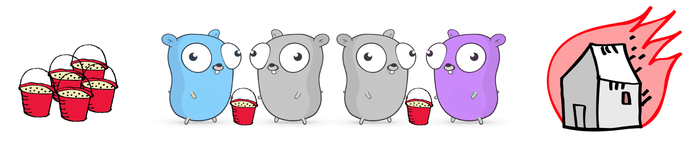
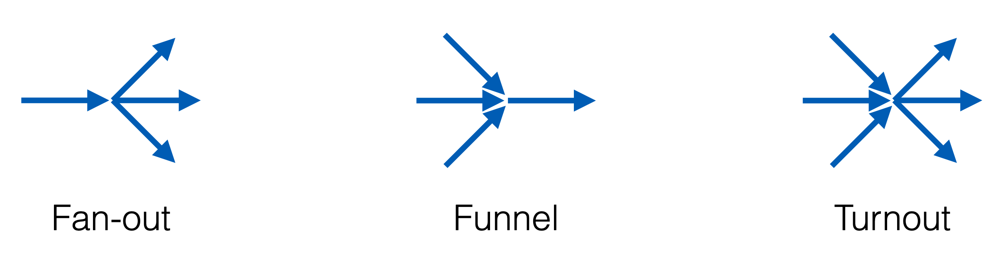

# Go 语言中的并发模式

## 并发关乎**设计**

- **设计**程序，使其成为一组独立的进程  
- **设计**这些进程，使它们最终可以并行运行  
- **设计**代码，以确保最终结果始终一致  

## 并发的细节

- 通过识别独立任务来组织代码（和数据）  
- 无竞争条件（race conditions）  
- 无死锁（deadlocks）  
- 增加 worker 数量 = 更快的执行速度  

## 通信顺序进程（CSP）

- Tony Hoare，1978  
1. 每个进程都是为顺序执行而构建的  
2. 进程之间通过通道（channel）进行数据通信，没有共享状态！  
3. 通过增加相同类型的进程来扩展  

## 通道（Channels）

- 可以将其想象为一条水桶传递链  
- 由 3 个部分组成：发送端、缓冲区、接收端  
- 缓冲区是可选的



### 阻塞通道（Blocking Channels）

```go
unbuffered := make(chan int)

// 1) 阻塞
a := <- unbuffered

// 2) 阻塞
unbuffered <- 1

// 3) 同步
go func() { <- unbuffered }()
unbuffered <- 1


buffered := make(chan int, 1)
// 4) 仍然阻塞
a := <- buffered

// 5) 正常
buffered <- 1

// 6) 阻塞（缓冲区已满）
buffered <- 2
```

#### 阻塞破坏并发

- 记住：
    - 无死锁  
    - 增加 worker 数量 = 更快的执行速度  
- 阻塞可能导致死锁  
- 阻塞可能阻碍程序的扩展  

### 关闭通道（Closing Channels）

- `close` 发送一个特殊的 `closed` 消息  
- 接收端在某个时刻会检测到 `closed`，表示无更多数据  
- 如果关闭后仍然尝试发送数据，会导致 **panic**！

```go
c := make(chan int)
close(c)

fmt.Println(<-c) // 接收并打印
// 输出是什么？

// 0, false

// - 接收操作总是返回两个值  
// - 0 是 int 类型的零值  
// - false 表示 `没有更多数据` 或 `返回值无效`
```

### `select` 语句

- 类似于 `switch` 语句，但用于通道操作  
- case 语句的顺序**无关紧要**  
- 也可以有 `default` 分支  
- `select` 语句会选择**第一个非阻塞的 case**（无论是发送还是接收）  

#### 使通道非阻塞

```go
func TryReceive(c <-chan int) (data int, more, ok bool) {
    select {
        case data, more = <- c:
            return data, more, true
        default: // 当 c 阻塞时执行
            return 0, true, false
    }
}
```

```go
func TryReceiveWithTimeout(c <-chan int, duration time.Duration) (data int, more, ok bool) {
    select {
        case data, more = <- c:
            return data, more, true
        case <- time.After(duration): // time.After 返回一个通道
            return 0, true, false
    }
}
```

#### 设计数据流

- 通道是数据流  
- 处理多个数据流是 `select` 的真正强大之处 



**Fan-out（扇出）**：Fan-out 指的是从一个输入通道，将数据分发到多个 goroutine 进行并发处理。

**Funnel（汇聚）**：Funnel 方式是多个输入通道的数据合并到一个通道中，通常用于多个数据源合并处理。

**Turnout（分流）**：Turnout 代表的是数据从一个输入通道，按照特定的规则被发送到不同的通道（可能是不同的 goroutine 进行不同的处理）。

##### 扇出（Fan-out）

```go
func Fanout(In <-chan int, OutA, OutB chan int) {
    for data := range In { // 直到通道关闭
        select { // 发送到第一个非阻塞的通道
            case OutA <- data:
            case OutB <- data:
        }
    }
}
```

##### 扇入（Turnout）

```go
func Turnout(InA, InB <-chan int, OutA, OutB chan int) {
    for {
        select { // 从第一个非阻塞的通道接收
            case data, more = <- InA:
            case data, more = <- InB:
        }

        if !more {
            return
        }

        select { // 发送到第一个非阻塞的通道
            case OutA <- data:
            case OutB <- data:
        }
    }
}
```

##### 退出通道（Quit Channel）

```go
func Turnout(Quit <-chan int, InA, InB, OutA, OutB chan int) {
    for {
        select {
            case data = <- InA:
            case data = <- InB:

            case <- Quit: // 关闭通道会发送一个消息
                close(InA) // 反模式（anti-pattern）
                close(InB)

                Fanout(InA, OutA, OutB) // 处理剩余数据
                Fanout(InB, OutA, OutB)
                return
        }
    }
}
```

### 通道的局限性

- 可能会导致死锁  
- 通道传递的是数据的 **副本**，可能影响性能  
- 传递指针的通道可能会引发竞争条件  
- 如何处理 **“天然共享”** 的数据结构（如缓存、注册表）？  

!!! note "如何理解“传递指针的通道可能会引发竞争条件”？"

    #### 📝 如何理解“传递指针的通道可能会引发竞争条件”？

    在 Go 语言的并发编程中，**通过通道传递指针（而非值）** 可能会导致多个 goroutine 共享并修改同一块内存，从而引发 **数据竞争（Race Condition）**。  

    **问题的根源：**

    - **通道传递的是指针，而不是数据的拷贝**
    - **多个 goroutine 可能同时访问和修改同一块内存**
    - **未正确同步时，会导致竞争条件，出现未定义行为**


    ##### 错误示例：传递指针导致数据竞争

    ```go
    package main

    import (
        "fmt"
        "sync"
        "time"
    )

    type Data struct {
        value int
    }

    func main() {
        ch := make(chan *Data)
        wg := sync.WaitGroup{}
        wg.Add(2)

        // 生产者
        go func() {
            defer wg.Done()
            data := &Data{value: 0} // 创建数据
            for i := 0; i < 5; i++ {
                data.value = i  // 修改值
                fmt.Println("Sending:", data.value)
                ch <- data // 发送指针
                time.Sleep(time.Millisecond * 100)
            }
            close(ch)
        }()

        // 消费者
        go func() {
            defer wg.Done()
            for data := range ch {
                fmt.Println("Received:", data.value) // 可能读取到不一致的数据
            }
        }()

        wg.Wait()
    }
    ```

    ##### 问题分析

    1. **通道传递的是指针 `*Data`**，生产者和消费者都指向同一块内存。
    2. **数据竞争发生**：
    - 生产者 `data.value = i` 在修改 `value` 后再发送指针。
    - 但 **消费者此时可能已经在读取 `data.value`**，导致接收到的数据是不确定的。
    3. **可能导致消费者读取到的数据与发送的不一致**，例如：
    ```
    Sending: 0
    Sending: 1
    Received: 1  // 本应收到 0，但收到 1，数据竞争导致的错误
    Sending: 2
    Received: 2
    ```
    这里，消费者本应按照 `0 -> 1 -> 2 ...` 顺序接收，但可能直接跳过某些值。

    ##### 正确示例：传递数据副本，而不是指针

    ```go
    package main

    import (
        "fmt"
        "sync"
        "time"
    )

    type Data struct {
        value int
    }

    func main() {
        ch := make(chan Data) // 传递值，而不是指针
        wg := sync.WaitGroup{}
        wg.Add(2)

        // 生产者
        go func() {
            defer wg.Done()
            for i := 0; i < 5; i++ {
                data := Data{value: i} // 创建数据
                fmt.Println("Sending:", data.value)
                ch <- data // 传递值的拷贝，而不是指针
                time.Sleep(time.Millisecond * 100)
            }
            close(ch)
        }()

        // 消费者
        go func() {
            defer wg.Done()
            for data := range ch {
                fmt.Println("Received:", data.value) // 读取到的数据不会被生产者修改
            }
        }()

        wg.Wait()
    }
    ```

    ##### 为什么这个版本不会有数据竞争？

    1. **通道传递的是 `Data` 结构体的值拷贝，而不是指针**，每个 goroutine 都有自己独立的数据副本。
    2. **生产者修改 `data.value` 不会影响消费者**，避免数据竞争。
    3. **保证数据的一致性**，消费者接收到的数据不会被生产者意外修改。


    ##### 总结

    ###### 为什么“传递指针的通道可能会引发竞争条件”？

    - **指针指向的内存是共享的**
    - **多个 goroutine 同时访问和修改同一块内存**
    - **导致数据竞争，出现未定义行为**

    ###### 如何避免？

    ✅ **推荐传递值，而不是指针**  
    ✅ **如果必须传递指针，需使用 `sync.Mutex` 或 `sync/atomic` 进行同步**  
    ✅ **在高并发场景下，尽可能减少共享状态，使用消息传递方式进行数据处理**

!!! note "如何理解“天然共享”的数据结构（如缓存、注册表）？"

    #### 📝 如何理解“天然共享”的数据结构（如缓存、注册表）？

    在并发编程中，**“天然共享”** 的数据结构指的是：

    - **多个 goroutine 需要同时访问和修改的数据结构**（如缓存、注册表、计数器等）。
    - **无法简单地用通道传递副本**，因为数据需要全局共享。
    - **如果没有正确的同步，可能会导致数据竞争（Race Condition）**。

    典型的例子：

    1. **缓存（Cache）**：多个 goroutine 读取和更新缓存中的数据。
    2. **注册表（Registry）**：存储全局配置信息，多个 goroutine 可能需要访问和修改。
    3. **全局计数器**：如请求数统计，需要多个 goroutine 并发增加计数。

    ##### 错误示例：多个 goroutine 访问共享 map，导致数据竞争

    ```go
    package main

    import (
        "fmt"
        "time"
    )

    var cache = make(map[string]int) // 共享 map

    func writeToCache(key string, value int) {
        cache[key] = value // 可能有数据竞争
    }

    func readFromCache(key string) int {
        return cache[key] // 可能读取到未同步的数据
    }

    func main() {
        go writeToCache("a", 1) // 并发写
        go fmt.Println(readFromCache("a")) // 并发读
        time.Sleep(time.Second) // 等待 goroutine 执行
    }
    ```

    **⚠ 问题：**

    - `cache` 是 **天然共享** 的数据结构，因为多个 goroutine 需要访问它。
    - **多个 goroutine 可能同时读写 map，导致数据竞争（Race Condition）**。
    - **Go 1.6 及以上版本在并发写 map 时会直接 panic**：
    ```
    fatal error: concurrent map writes
    ```

    **正确示例 1：使用 `sync.Mutex` 保护共享数据**

    使用 `sync.Mutex` 让多个 goroutine 依次访问共享数据，确保并发安全：
    ```go
    package main

    import (
        "fmt"
        "sync"
    )

    var (
        cache = make(map[string]int)
        mu    sync.Mutex
    )

    func writeToCache(key string, value int) {
        mu.Lock()
        cache[key] = value
        mu.Unlock()
    }

    func readFromCache(key string) int {
        mu.Lock()
        defer mu.Unlock()
        return cache[key]
    }

    func main() {
        var wg sync.WaitGroup
        wg.Add(2)

        go func() {
            defer wg.Done()
            writeToCache("a", 1)
        }()

        go func() {
            defer wg.Done()
            fmt.Println(readFromCache("a"))
        }()

        wg.Wait()
    }
    ```

    ✅ **为什么这个版本是安全的？**

    1. **`sync.Mutex` 确保同一时间只有一个 goroutine 访问 `cache`**。
    2. **避免了数据竞争，保证数据一致性**。

    **正确示例 2：使用 `sync.RWMutex` 允许多个 goroutine 并发读取**

    如果大部分操作是 **读取（读多写少）**，可以使用 `sync.RWMutex`：
    ```go
    package main

    import (
        "fmt"
        "sync"
    )

    var (
        cache = make(map[string]int)
        mu    sync.RWMutex
    )

    func writeToCache(key string, value int) {
        mu.Lock() // 只有写操作需要独占锁
        cache[key] = value
        mu.Unlock()
    }

    func readFromCache(key string) int {
        mu.RLock() // 读锁，允许多个 goroutine 同时读取
        defer mu.RUnlock()
        return cache[key]
    }

    func main() {
        var wg sync.WaitGroup
        wg.Add(3)

        go func() {
            defer wg.Done()
            writeToCache("a", 1)
        }()

        go func() {
            defer wg.Done()
            fmt.Println("Read 1:", readFromCache("a"))
        }()

        go func() {
            defer wg.Done()
            fmt.Println("Read 2:", readFromCache("a"))
        }()

        wg.Wait()
    }
    ```

    ✅ **`sync.RWMutex` 优势**

    - **多个 goroutine 可以同时读取数据，提高并发性能**。
    - **写入时仍然需要加锁，保证数据一致性**。

    **正确示例 3：使用 `sync.Map` 适用于高并发读写**

    Go 1.9 及以上提供了 `sync.Map`，适用于高并发场景：
    ```go
    package main

    import (
        "fmt"
        "sync"
    )

    var cache sync.Map

    func writeToCache(key string, value int) {
        cache.Store(key, value) // 并发安全的存储
    }

    func readFromCache(key string) (int, bool) {
        val, ok := cache.Load(key) // 并发安全的读取
        if !ok {
            return 0, false
        }
        return val.(int), true
    }

    func main() {
        var wg sync.WaitGroup
        wg.Add(3)

        go func() {
            defer wg.Done()
            writeToCache("a", 1)
        }()

        go func() {
            defer wg.Done()
            if val, ok := readFromCache("a"); ok {
                fmt.Println("Read:", val)
            } else {
                fmt.Println("Key not found")
            }
        }()

        go func() {
            defer wg.Done()
            if val, ok := readFromCache("a"); ok {
                fmt.Println("Read:", val)
            } else {
                fmt.Println("Key not found")
            }
        }()

        wg.Wait()
    }
    ```

    ✅ **`sync.Map` 优势**

    1. **内部已经实现了并发控制（无锁或少锁），适合高并发读写**。
    2. **比 `sync.Mutex` 方案更高效**，适用于 **频繁读写的共享数据**。

    ##### 总结

    | 方案 | 适用场景 | 读写性能 |
    |------|--------|--------|
    | `sync.Mutex` | 读写都很频繁的情况 | **读写都需要加锁，影响性能** |
    | `sync.RWMutex` | 读多写少的情况 | **允许多个读，写仍需加锁** |
    | `sync.Map` | 高并发访问的全局数据（如缓存、注册表） | **无锁或少锁，高效** |

    ##### 结论

    对于 **“天然共享”** 的数据结构（如缓存、注册表）：

    1. 不能简单用通道传递副本，因为数据是全局共享的。
    2. 需要使用 `sync.Mutex`、`sync.RWMutex` 或 `sync.Map` 进行同步：

    - **`sync.Mutex`**：适用于 **读写均衡** 的情况。
    - **`sync.RWMutex`**：适用于 **读多写少** 的情况。
    - **`sync.Map`**：适用于 **高并发读写**，是 **无锁或少锁方案**。
    
## 互斥锁（Mutex）不是最佳解决方案

- **互斥锁就像厕所**  
    - 使用时间越长，等待队列越长  
- 读/写锁只能 **减少** 问题，但不能完全避免  
- 使用多个互斥锁最终会导致死锁  
- 总体而言，不是最佳方案  

### 三种代码执行模式

- **阻塞（Blocking）** = 代码可能会长时间停滞  
- **无锁（Lock-free）** = 至少有一部分程序始终在执行  
- **无等待（Wait-free）** = 所有部分的程序始终在执行  

## 原子操作（Atomic Operations）

- `sync/atomic` 包  
- `Store`、`Load`、`Add`、`Swap`、`CompareAndSwap`  
- 底层映射到 CPU 级别的线程安全指令  
- 仅适用于整数类型  
- 仅比普通操作慢 10-60 倍（比互斥锁更高效）  

### 自旋 CAS（Spinning CAS）

- 需要一个 **状态变量** 和一个 **free** 常量  
- 在循环中使用 `CAS（CompareAndSwap）`：
    - 如果状态 **不是 free**，则继续尝试  
    - 如果状态 **是 free**，则修改状态，获取所有权  

```go
type Spinlock struct {
    state *int32
}

const free = int32(0)

func (l *Spinlock) Lock() {
    for !atomic.CompareAndSwapInt32(l.state, free, 42) {
        runtime.Gosched()
    }
}

func (l *Spinlock) Unlock() {
    atomic.StoreInt32(l.state, free)
}
```

### 票据存储（Ticket Store）

- 需要：
    - **索引化数据结构**
    - **票据（ticket）**
    - **完成（done）变量**  
- 每个新票据值递增，保证唯一性  
- 票据作为索引存储数据  
- `done` 变量表示可读范围  

```go
type TicketStore struct {
    ticket *uint64
    done   *uint64
    slots  []string
}

func (ts *TicketStore) Put(s string) {
    t := atomic.AddUint64(ts.ticket, 1) - 1
    slots[t] = s
    for !atomic.CompareAndSwapUint64(ts.done, t, t+1) {
        runtime.Gosched()
    }
}

func (ts *TicketStore) GetDone() []string {
    return ts.slots[:atomic.LoadUint64(ts.done)+1]
}
```

### 调试非阻塞代码

- 我称之为 “**指令指针游戏**”（The Instruction Pointer Game）。
- 规则如下：
    - 打开 **两个窗口**（即两个 Goroutine），它们运行相同的代码。
    - 你有 **一个指令指针**，它会依次执行你的代码。
    - 你可以在 **任何一条指令** 处 **切换** 窗口（即在不同 Goroutine 之间切换执行顺序）。
    - **观察** 变量的值，查找可能发生的数据竞争（Race Condition）。

### 调试以排除故障

```go
func (ts *TicketStore) Puts(s string) {
    ticket := atomic.AddUint64(ts.next, 1) -1
    slots[ticket] = s
    atomic.AddUint64(ts.done, 1)
}
```

### 非阻塞代码的指导原则

- 不要在**原子操作**和**非原子操作**之间切换
- 目标是**利用并强化唯一性**的情况
- 避免**同时更改两个变量**

    - 有时可以利用**位运算**来解决问题
    - 有时**合理的操作顺序**可以避免问题
    - 有时**根本无法避免**，需要另寻他法

!!! note "如何理解“目标是利用并强化唯一性的情况”？"

    #### 📝 如何理解“目标是利用并强化唯一性的情况”？

    在并发编程中，**唯一性（Uniqueness）** 指的是：

    - 每个资源或操作都应该有一个唯一的“所有者”或“处理者”。
    - 通过唯一性，避免竞争条件（Race Conditions），减少锁的使用，提高并发效率。

    - 典型的做法包括：

    - **使用唯一 ID（如自增计数器、UUID）**
    - **使用原子操作确保唯一性**
    - **确保某个任务只有一个 goroutine 在处理**

    ##### 示例：利用唯一性确保任务仅被一个 goroutine 处理

    ###### 错误示例：多个 goroutine 可能同时处理同一个任务

    ```go
    package main

    import (
        "fmt"
        "sync"
    )

    type TaskQueue struct {
        tasks []int
        mu    sync.Mutex
    }

    func (q *TaskQueue) GetTask() (int, bool) {
        q.mu.Lock()
        defer q.mu.Unlock()
        if len(q.tasks) == 0 {
            return 0, false
        }
        task := q.tasks[0]
        q.tasks = q.tasks[1:] // 取出任务
        return task, true
    }

    func worker(id int, q *TaskQueue, wg *sync.WaitGroup) {
        defer wg.Done()
        for {
            task, ok := q.GetTask()
            if !ok {
                return
            }
            fmt.Printf("Worker %d processing task %d\n", id, task)
        }
    }

    func main() {
        queue := &TaskQueue{tasks: []int{1, 2, 3, 4, 5}}
        wg := sync.WaitGroup{}

        for i := 0; i < 3; i++ { // 3 个 worker 并发处理
            wg.Add(1)
            go worker(i, queue, &wg)
        }

        wg.Wait()
    }
    ```

    **问题：**

    - 这里依赖 `sync.Mutex` 来保证任务的唯一性，但锁的开销较大，**每次获取任务时都要加锁**，可能会影响性能。

    ###### 正确示例：利用原子操作和唯一性标识符

    改进方法：用 **`sync/atomic`** 确保任务只会被一个 goroutine 处理，而不需要锁。

    ```go
    package main

    import (
        "fmt"
        "sync"
        "sync/atomic"
    )

    type TaskQueue struct {
        tasks   []int
        current int64 // 原子计数器，确保每个任务只被领取一次
    }

    func (q *TaskQueue) GetTask() (int, bool) {
        index := atomic.AddInt64(&q.current, 1) - 1
        if int(index) >= len(q.tasks) {
            return 0, false
        }
        return q.tasks[index], true
    }

    func worker(id int, q *TaskQueue, wg *sync.WaitGroup) {
        defer wg.Done()
        for {
            task, ok := q.GetTask()
            if !ok {
                return
            }
            fmt.Printf("Worker %d processing task %d\n", id, task)
        }
    }

    func main() {
        queue := &TaskQueue{tasks: []int{1, 2, 3, 4, 5}}
        wg := sync.WaitGroup{}

        for i := 0; i < 3; i++ { // 3 个 worker 并发处理
            wg.Add(1)
            go worker(i, queue, &wg)
        }

        wg.Wait()
    }
    ```

    ###### 为什么这段代码更优？

    1. **利用 `atomic.AddInt64` 生成唯一的任务索引**，避免竞争条件。
    2. **无锁（Lock-Free）方案**，比 `sync.Mutex` 版本性能更高，减少锁竞争。
    3. **任务唯一性得到保证**，每个任务只会被一个 worker 处理。

    ##### 总结

    **利用并强化唯一性**，就是在并发环境下确保某些资源、任务或数据只有一个 goroutine 访问或修改。  
    - **用原子操作生成唯一 ID（如 `atomic.AddInt64`）** 来确保任务唯一性。  
    - **减少锁的使用，提高并发性能**。  
    - **确保任务不会被多个 goroutine 重复处理**，避免竞争条件（Race Conditions）。

??? "“有时可以利用**位运算**来解决问题”，这句话如何理解？"

    #### 📝 如何理解“有时可以利用位运算来解决问题”？

    利用 **位运算** 来解决并发问题，主要是因为 **位运算是原子操作**，可以在 **不使用锁** 的情况下管理多个状态，确保线程安全。例如：

    - **使用位标志存储多个状态**，避免多个变量的竞争条件
    - **使用原子操作修改状态**，确保并发安全

    ##### 示例：使用位运算进行原子状态管理

    假设我们有一个并发应用程序，其中某个资源可能处于 **读中 (READING)**、**写中 (WRITING)** 或 **就绪 (READY)** 三种状态。我们可以使用一个 `int32` 变量的不同 **位** 来表示这些状态，而不是使用多个 `bool` 变量。

    ##### 示例代码

    ```go
    package main

    import (
        "fmt"
        "sync/atomic"
    )

    const (
        READY    = 1 << 0 // 0001 (表示就绪)
        READING  = 1 << 1 // 0010 (表示正在读取)
        WRITING  = 1 << 2 // 0100 (表示正在写入)
    )

    type Resource struct {
        state int32 // 使用 int32 存储状态
    }

    // 设置状态
    func (r *Resource) SetState(newState int32) {
        atomic.OrInt32(&r.state, newState) // 使用 OR 操作设置新状态
    }

    // 清除状态
    func (r *Resource) ClearState(oldState int32) {
        atomic.AndInt32(&r.state, ^oldState) // 使用 AND+取反 来清除某个状态
    }

    // 检查状态
    func (r *Resource) HasState(checkState int32) bool {
        return atomic.LoadInt32(&r.state)&checkState != 0 // 使用 AND 操作检查状态
    }

    func main() {
        r := &Resource{}

        r.SetState(READING) // 设置正在读取状态
        fmt.Println("Reading:", r.HasState(READING)) // true
        fmt.Println("Writing:", r.HasState(WRITING)) // false

        r.SetState(WRITING) // 同时设置正在写入状态
        fmt.Println("Reading:", r.HasState(READING)) // true
        fmt.Println("Writing:", r.HasState(WRITING)) // true

        r.ClearState(READING) // 清除读取状态
        fmt.Println("Reading:", r.HasState(READING)) // false
        fmt.Println("Writing:", r.HasState(WRITING)) // true
    }
    ```

    解释说明：

    1. **使用 `int32` 变量的不同位来存储多个状态**：

        - `READY = 0001`
        - `READING = 0010`
        - `WRITING = 0100`
    
    2. **使用 `atomic.OrInt32(&r.state, newState)` 来设置状态**：
    - `OR` 操作（`|`）可以在不影响其他位的情况下 **打开某个状态位**。

    3. **使用 `atomic.AndInt32(&r.state, ^oldState)` 来清除状态**：
    - `AND` 操作（`&`）结合 `^` 取反，可以 **只清除特定的状态位，而不影响其他位**。

    4. **使用 `atomic.LoadInt32(&r.state)&checkState != 0` 来检查状态**：

    - `AND` 操作（`&`）可以检测某个位是否被设置。

    ##### 为什么这样做？

    - **避免多个变量的竞争条件**，因为状态管理是**原子操作**，不会导致数据竞争。
    - **无锁状态管理**，相比于使用 `sync.Mutex` 可能提高性能。
    - **可扩展性强**，如果有新的状态，可以直接添加新的位，而不需要新增变量。

!!! note "“有时**合理的操作顺序**可以避免问题”，这句话如何理解？"

    #### 📝 合理的操作顺序如何避免并发问题？

    在并发编程中，**操作的顺序** 可能影响数据的正确性和程序的稳定性。合理安排操作顺序可以：

    1. **避免数据竞争（race condition）**  
    2. **确保内存可见性（memory visibility）**  
    3. **减少锁的使用，提高并发性能**  


    ##### 示例：合理的操作顺序避免数据竞争

    ##### 错误示例：先更新共享数据，再通知其他线程

    ```go
    package main

    import (
        "fmt"
        "sync"
    )

    type Data struct {
        value int
        mu    sync.Mutex
    }

    func main() {
        d := &Data{}
        wg := sync.WaitGroup{}
        wg.Add(2)

        // 线程 1：先更新数据，再解锁
        go func() {
            d.mu.Lock()
            d.value = 42 // 更新共享变量
            d.mu.Unlock()
            wg.Done()
        }()

        // 线程 2：读取数据
        go func() {
            d.mu.Lock()
            fmt.Println("Value:", d.value) // 可能读取到未更新的值
            d.mu.Unlock()
            wg.Done()
        }()

        wg.Wait()
    }
    ```

    **问题：**
    
    - 可能会导致 **数据竞争（Race Condition）**，因为另一个线程在数据完全更新之前就读取了 `value`。


    ##### 正确示例：先更新数据，再解锁，再通知其他线程

    ```go
    package main

    import (
        "fmt"
        "sync"
    )

    type Data struct {
        value int
        mu    sync.Mutex
    }

    func main() {
        d := &Data{}
        wg := sync.WaitGroup{}
        wg.Add(2)

        // 线程 1：先更新数据，再解锁
        go func() {
            d.mu.Lock()
            d.value = 42 // 更新共享变量
            d.mu.Unlock() // 先解锁
            wg.Done()
        }()

        // 线程 2：读取数据
        go func() {
            wg.Wait() // 等待线程 1 完成，确保数据已经更新
            d.mu.Lock()
            fmt.Println("Value:", d.value) // 读取到的是 42
            d.mu.Unlock()
        }()

        wg.Wait()
    }
    ```

    ##### 为什么正确的操作顺序能避免问题？

    1. **先加锁、修改数据，再解锁**：确保数据在修改过程中不会被其他线程读取。  
    2. **先更新数据，再通知其他线程（解锁）**：保证其他线程读取到的是正确的值。  
    3. **避免数据竞争**：多个线程不会同时访问不一致的数据。

## 并发实战

- **避免阻塞，避免竞争**  
- **优先使用通道避免共享状态**  
- **当通道不适用时**：
    - 先尝试 `sync` 包的工具  
    - 在简单场景或必要时，尝试无锁代码  