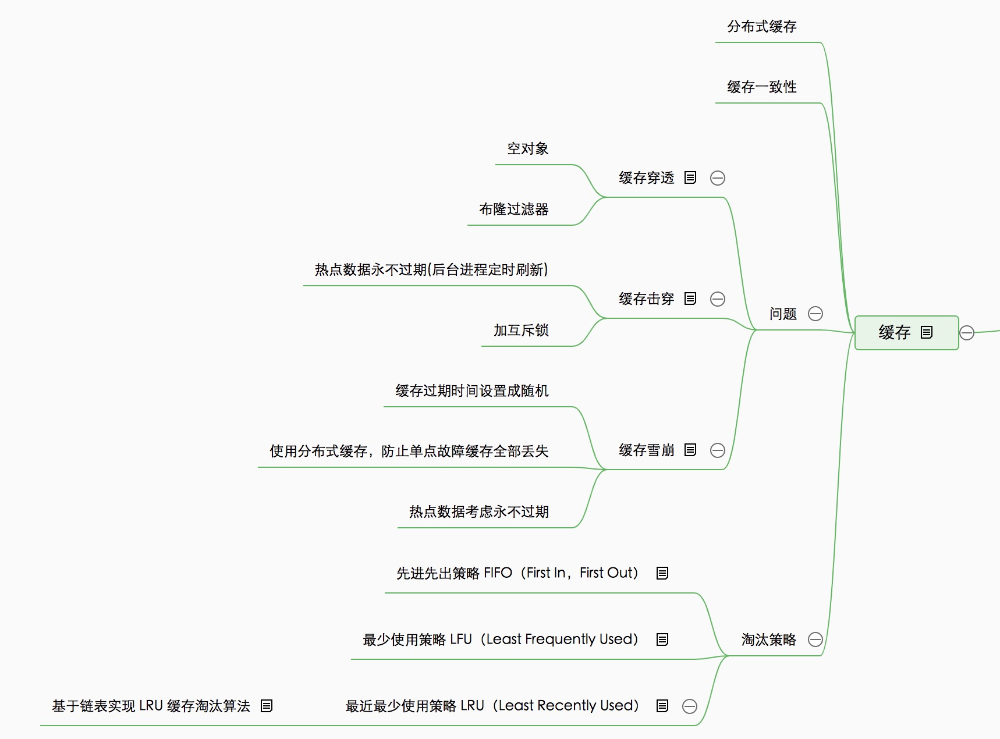
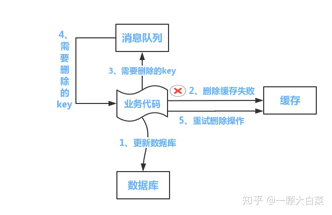
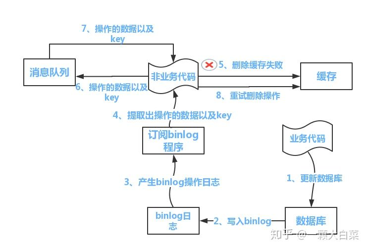
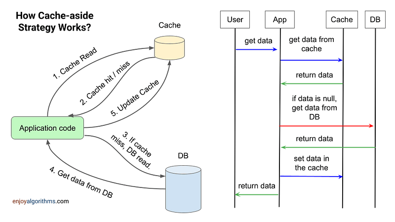

## 概览

## 缓存三大问题

### 缓存雪崩

缓存雪崩是指缓存中数据大批量到过期时间，而查询数据量巨大，引起数据库压力过大甚至down机。和缓存击穿不同的是， 缓存击穿指并发查同一条数据，缓存雪崩是不同数据都过期了，很多数据都查不到从而查数据库。

解决办法：

- 缓存过期时间设置成随机
- 热点数据考虑永不过期（定时刷新）
- 使用分布式缓存，防止单点故障缓存全部丢失

### 缓存穿透

缓存穿透是指缓存和数据库中都没有的数据，而用户不断发起请求，如发起为id为“-1”的数据或id为特别大不存在的数据。这时的用户很可能是攻击者，攻击会导致数据库压力过大。

解决办法：

- 空对象
- 布隆过滤器

### 缓存击穿

缓存击穿是指缓存中没有但数据库中有的数据（一般是缓存时间到期），这时由于并发用户特别多，同时读缓存没读到数据，又同时去数据库去取数据，引起数据库压力瞬间增大，造成过大压力

解决办法：

- 热点数据永不过期(后台进程定时刷新)
- 加互斥锁

## 缓存淘汰策略

- 先进先出策略 FIFO（First In，First Out）
    
    如果一个数据最先进入缓存中，则应该最早淘汰掉

- 最近最少使用策略 LRU（Least Recently Used）
 
    如果数据最近被访问过，那么将来被访问的几率也更高。对于循环出现的数据，缓存命中不高。实际实现时候一般可采用双向链表，将最近访问过得缓存key放在链表首部，删除尾部的缓存key，再加上hash表来记录key-value，实现快速访问缓存

- 最少使用策略 LFU（Least Frequently Used）
 
  如果一个数据在最近一段时间内使用次数很少，那么在将来一段时间内被使用的可能性也很小。对于交替出现的数据，缓存命中不高

#### 基于链表实现 LRU 缓存淘汰算法

维护一个有序单链表，越靠近链表尾部的结点是越早之前访问的。当有一个新的数据被访问时，我们从链表头开始顺序遍历链表。

如果此数据之前已经被缓存在链表中了，我们遍历得到这个数据对应的结点，并将其从原来的位置删除，然后再插入到链表的头部。

如果此数据没有在缓存链表中，又可以分为两种情况：

如果此时缓存未满，则将此结点直接插入到链表的头部；
如果此时缓存已满，则链表尾结点删除，将新的数据结点插入链表的头部。
现在我们来看下 m 缓存访问的时间复杂度是多少。因为不管缓存有没有满，我们都需要遍历一遍链表，所以这种基于链表的实现思路，缓存访问的时间复杂度为 O(n)。

实际上，我们可以继续优化这个实现思路，比如引入散列表（Hash table）来记录每个数据的位置，将缓存访问的时间复杂度降到 O(1)

## 缓存一致性

**对于读是不存在缓存与数据库不一致的的情况**。读的流程：

- 如果我们的数据在缓存里边有，那么就直接取缓存的。
- 如果缓存里没有我们想要的数据，我们会先去查询数据库，然后将数据库查出来的数据写到缓存中。
- 最后将数据返回给请求

对于数据库更新操作， 执行操作时候，两种选择：

- 先操作数据库，再操作缓存
- 先操作缓存，再操作数据库

操作缓存，两种方案选择：

- 更新缓存
- 删除缓存

一般我们都是采取删除缓存缓存策略的， 原因：

- 高并发环境下，无论是先操作数据库还是后操作数据库而言，如果加上更新缓存，那就更加容易导致数据库与缓存数据不一致问题。(删除缓存直接和简单很多)
- 如果每次更新了数据库，都要更新缓存【这里指的是频繁更新的场景，这会耗费一定的性能】，倒不如直接删除掉。等再次读取时，缓存里没有，那我到数据库找，在数据库找到再写到缓存里边 (体现懒加载)

**先删缓存，再更新数据库**

该方案会导致不一致的原因是。同时有一个请求A进行更新操作，另一个请求B进行查询操作。那么会出现如下情形:
（1）请求A进行写操作，删除缓存
（2）请求B查询发现缓存不存在
（3）请求B去数据库查询得到旧值
（4）请求B将旧值写入缓存
（5）请求A将新值写入数据库
上述情况就会导致不一致的情形出现。而且，如果不采用给缓存设置过期时间策略，该数据永远都是脏数据。

**先更新数据，再删除缓存：**

如果在高并发的场景下，出现数据库与缓存数据不一致的概率特别低，也不是没有：

- 缓存刚好失效
- 线程 A 查询数据库，得一个旧值
- 线程 B 将新值写入数据库
- 线程 B 删除缓存
- 线程 A 将查到的旧值写入缓存

解决办法：

- Cache-Aside模式

!!! info "什么是Cache-Aside模式？"

    **Cache-Aside(旁路缓存)模式** 是一种缓存策略，当缓存未命中时从数据库加载数据并更新缓存，以提高读取效率，同时在数据更新时同步更新缓存和数据库以保持一致性。

- binlog模式

## 缓存模式

### 旁路(cache-aside)模式

## 资料

- [链表（上）：如何实现LRU缓存淘汰算法?](https://jingbin.me/2019/04/13/list/)
- [Caching Strategy: Cache-Aside Pattern](https://www.enjoyalgorithms.com/blog/cache-aside-caching-strategy)
- [What is Read-Through vs Write-Through Cache?](https://www.designgurus.io/answers/detail/what-is-read-through-vs-write-through-cache)
- [Caching patterns](https://docs.aws.amazon.com/whitepapers/latest/database-caching-strategies-using-redis/caching-patterns.html)
- [A Hitchhiker’s Guide to Caching Patterns](https://hazelcast.com/blog/a-hitchhikers-guide-to-caching-patterns/)