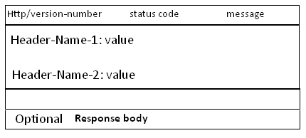
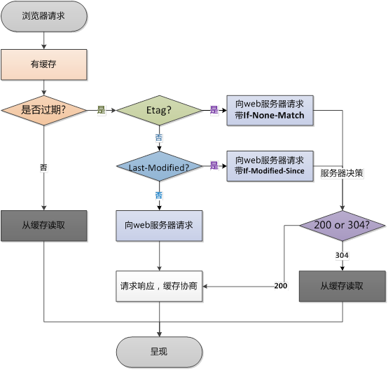
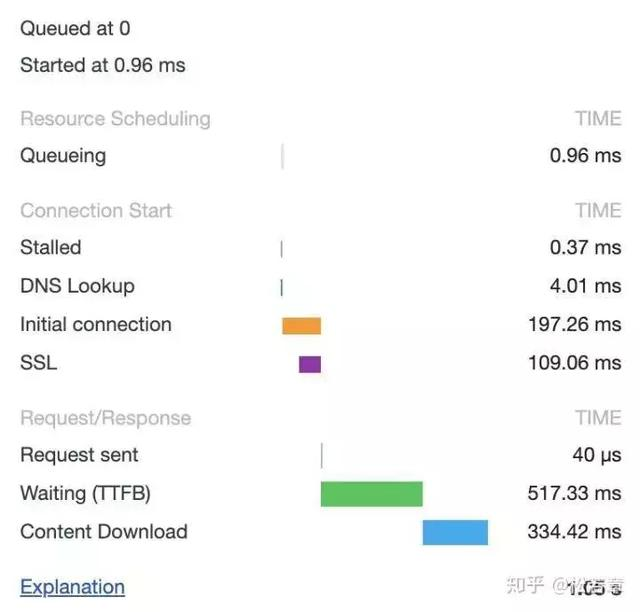
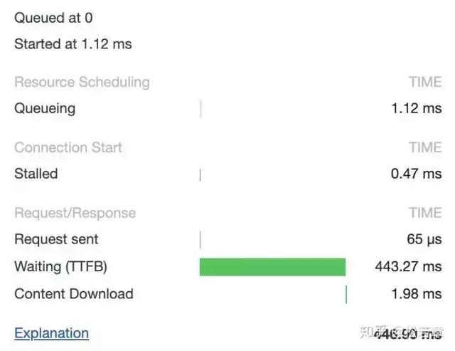
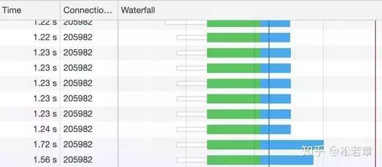

# HTTP协议

超文本传输协议(HTTP)是一种通信协议，它允许将超文本标记语言(HTML)文档从Web服务器传送到客户端的浏览器。目前广泛使用的是HTTP/1.1 版本

HTTP协议是无状态的

## HTTP消息的结构

### 请求消息

Request 消息分为3部分，第一部分叫Request line, 第二部分叫Request header, 第三部分是body. header和body之间有个空行， 结构如下图


**注意：** 请求头和请求体之间用换行隔开(\r\n)

### 响应消息

第一部分叫Response line, 第二部分叫Response header，第三部分是body. header字段之间要有空行（\r\n)，header和body之间也有个空行,  结构如下图



## HTTP Status Code


## HTTP cache



### cache相关的头

#### Cache-Control

选项值有：

- Public ：所有内容都将被缓存，在响应头中设置
- Private ：内容只缓存到私有服务器中，在响应头中设置
- no-cache ：**不是不缓存，而是缓存需要校验**。
- no-store ：所有内容都不会被缓存到缓存或Internet临时文件中，在响应头中设置
must-revalidation/proxy-revalidation ：如果缓存的内容失效，请求必须发送到服务器/代理以进行重新验证，在请求头中设置
- max-age=xxx ：缓存的内容将在xxx秒后失效，这个选项只在HTTP1.1中可用，和Last-Modified一起使用时优先级较高，在响应头中设置

#### Expires

它通常的使用格式是Expires:Fri ,24 Dec 2027 04:24:07 GMT，后面跟的是日期和时间，超过这个时间后，缓存的内容将失效，浏览器在发出请求之前会先检查这个页面的这个字段，查看页面是否已经过期，过期了就重新向服务器发起请求

#### Last-Modified / If-Modified

它一般用于表示一个服务器上的资源最后的修改时间，资源可以是静态或动态的内容，
通过这个最后修改时间可以判断当前请求的资源是否是最新的。
一般服务端在响应头中返回一个Last-Modified字段，告诉浏览器这个页面的最后修改时间，
浏览器再次请求时会在请求头中增加一个If-Modified字段，询问当前缓存的页面是否是最新的，
如果是最新的就返回304状态码，告诉浏览器是最新的，服务器也不会传输新的数据

#### Etag/If-None-Match

一般用于当Cache-Control:no-cache时，用于验证缓存有效性。

它的作用是让服务端给每个页面分配一个唯一 的编号，然后通过这个编号来区分当前这个页面是否是最新的，
这种方式更加灵活，但是后端如果有多台Web服务器时不太好处理，因为每个Web服务器都要记住网站的所有资源，否则浏览器返回这个编号就没有意义了


## 跨域分类

CORS跨域访问的请求分三种:
- simple request

    如果一个请求没有包含任何自定义请求头，而且它所使用HTTP动词是GET，HEAD或POST之一，那么它就是一个Simple Request。但是在使用POST作为请求的动词时，该请求的Content-Type需要是application/x-www-form-urlencoded，multipart/form-data或text/plain之一。

- preflighted request(预请求)

    如果一个请求包含了任何自定义请求头，或者它所使用的HTTP动词是GET，HEAD或POST之外的任何一个动词，那么它就是一个Preflighted Request。如果POST请求的Content-Type并不是application/x-www-form-urlencoded，multipart/form-data或text/plain之一，那么其也是Preflighted Request。

- requests with credential
    一般情况下，一个跨域请求不会包含当前页面的用户凭证。一旦一个跨域请求包含了当前页面的用户凭证，那么其就属于Requests with Credential。

对于simple request 只需要在后端程序处理时候设`Access-Control-Allow-Orgin`头就可以了。

对于preflighted request 每次都会请求2次，第一次options（firefox下看不到这次请求，chrome可以看见)。如果只能跟simple request 一样只设置access-control-allow-orgin是不行的。 还必须处理$_SERVER['REQUEST_METHOD'] == 'OPTIONS'，2者都必须处理

### Cors相关的HTTP响应头

- Access-Control-Allow-Origin

    ```
    Access-Control-Allow-Origin: <origin> | *
    ```
    origin参数指定一个允许向该服务器提交请求的URI.对于一个不带有credentials的请求,可以指定为'*',表示允许来自所有域的请求。

    如果服务器端指定了域名,而不是'*',那么响应头的Vary值里必须包含Origin.它告诉客户端: 响应是根据请求头里的Origin的值来返回不同的内容的.

- Access-Control-Expose-Headers

    设置浏览器允许访问的服务器的头信息的白名单

    ```
    Access-Control-Expose-Headers: X-My-Custom-Header, X-Another-Custom-Header
    ```
    这样, X-My-Custom-Header 和 X-Another-Custom-Header这两个头信息,都可以被浏览器得到.

- Access-Control-Max-Age

    这个头告诉我们这次预请求的结果的有效期是多久,如下:

    ```
    Access-Control-Max-Age: <delta-seconds>
    ```

    delta-seconds 参数表示,允许这个预请求的参数缓存的秒数,在此期间,不用发出另一条预检请求. 
    
- Access-Control-Allow-Credentials

    告知客户端,当请求的credientials属性是true的时候,响应是否可以被得到.当它作为预请求的响应的一部分时,它用来告知实际的请求是否使用了credentials。
    
    注意,简单的GET请求不会预检,所以如果一个请求是为了得到一个带有credentials的资源,而响应里又没有Access-Control-Allow-Credentials头信息,那么说明这个响应被忽略了.

    ```
    Access-Control-Allow-Credentials: true | false
    ```

- Access-Control-Allow-Methods

    指明资源可以被请求的方式有哪些(一个或者多个). 这个响应头信息在客户端发出预检请求的时候会被返回. 上面有相关的例子.

    ```
    Access-Control-Allow-Methods: <method>[, <method>]*
    ```

- Access-Control-Allow-Headers

    ```
    Access-Control-Allow-Headers: <field-name>[, <field-name>]*
    ```
    多个HTTP请求头， 用逗号分隔

### Cors相关的HTTP请求头

- Origin

    表明发送请求或者预请求的域

    ```
    Origin: <origin>
    ```

    参数origin是一个URI,告诉服务器端,请求来自哪里.它不包含任何路径信息,只是服务器名.

    **注意:** Origin的值可以是一个空字符串,这是很有用的. 注意,不仅仅是跨域请求,普通请求也会带有ORIGIN头信息.

- Access-Control-Request-Method

    在发出预检请求时带有这个头信息,告诉服务器在实际请求时会使用的请求方式

    ```
    Access-Control-Request-Method: <method>
    ```

- Access-Control-Request-Headers

    在发出预检请求时带有这个头信息,告诉服务器在实际请求时会携带的自定义头信息.如有多个,可以用逗号分开.

    ```
    Access-Control-Request-Headers: <field-name>[, <field-name>]*
    ```

## HTTPS的四次握手过程


https握手过程分为两步：

- 通过CA验证服务端的证书是否真实
- 交换客户端和服务端的对称加密秘钥，以后数据传输，靠这两个进行加密

引入CA目的是为了防止中间人攻击。即攻击者伪造成服务端，然后发送假的证书。

## FAQ

### 现代浏览器在与服务器建立了一个 TCP 连接后是否会在一个 HTTP 请求完成后断开?什么情况下会断开?

> 默认情况下建立 TCP 连接不会断开，只有在请求报头中声明 Connection: close 才会在请求完成后关闭连接。

在 **HTTP/1.0 中，一个服务器在发送完一个 HTTP 响应后，会断开 TCP 链接**。但是这样每次请求都会重新建立和断开 TCP 连接，代价过大。所以虽然标准中没有设定，**某些服务器对 Connection: keep-alive 的 Header 进行了支持**。意思是说，完成这个 HTTP 请求之后，不要断开 HTTP 请求使用的 TCP 连接。这样的好处是连接可以被重新使用，之后发送 HTTP 请求的时候不需要重新建立 TCP 连接，以及如果维持连接，那么 SSL 的开销也可以避免，两张图片是短时间内两次访问 https://www.github.com 的时间统计：



头一次访问，有初始化连接和 SSL 开销。


初始化连接和 SSL 开销消失了，说明使用的是同一个 TCP 连接。

持久连接：既然维持 TCP 连接好处这么多，HTTP/1.1 就把 Connection 头写进标准，并且默认开启持久连接，除非请求中写明 Connection: close，那么浏览器和服务器之间是会维持一段时间的 TCP 连接，不会一个请求结束就断掉。


### 一个 TCP 连接可以对应几个 HTTP 请求?

如果维持连接，一个 TCP 连接是可以发送多个 HTTP 请求的。

### 一个 TCP 连接中 HTTP 请求发送可以一起发送么(比如一起发三个请求，再三个响应一起接收)?

> 在 HTTP/1.1 存在 Pipelining 技术可以完成这个多个请求同时发送，但是由于浏览器默认关闭，所以可以认为这是不可行的。在 HTTP2 中由于 Multiplexing 特点的存在，多个 HTTP 请求可以在同一个 TCP 连接中并行进行


HTTP/1.1 存在一个问题，单个 TCP 连接在同一时刻只能处理一个请求，意思是说：两个请求的生命周期不能重叠，任意两个 HTTP 请求从开始到结束的时间在同一个 TCP 连接里不能重叠。

虽然 HTTP/1.1 规范中规定了 Pipelining 来试图解决这个问题，但是这个功能在浏览器中默认是关闭的。

但是，**HTTP2 提供了 Multiplexing 多路传输特性**，可以在一个 TCP 连接中同时完成多个 HTTP 请求。



绿色是发起请求到请求返回的等待时间，蓝色是响应的下载时间，可以看到都是在同一个 Connection，并行完成的。


### 为什么有的时候刷新页面不需要重新建立 SSL 连接?

TCP 连接有的时候会被浏览器和服务端维持一段时间。TCP 不需要重新建立，SSL 自然也会用之前的。


### 浏览器对同一 Host 建立 TCP 连接到数量有没有限制?

有。Chrome 最多允许对同一个 Host 建立六个 TCP 连接。不同的浏览器有一些区别。


## 资料

- [夺命连环问：一个TCP连接可以发多少个HTTP请求？](https://network.51cto.com/art/201905/597174.htm)