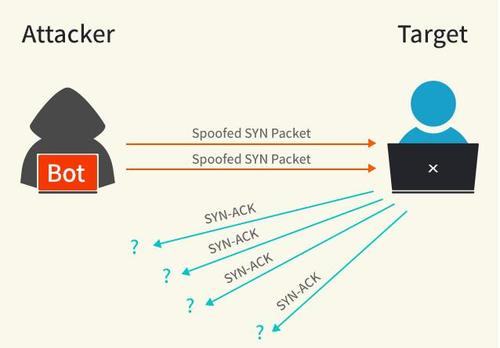
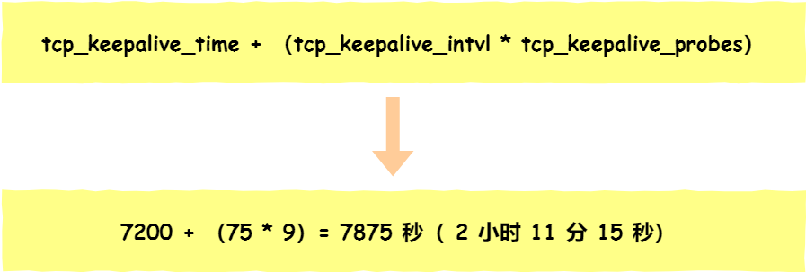

# TCP/IP 协议

## IP地址分类


所谓的“分类的IP地址”就是将IP地址划分为若干个固定类，每一类地址都由两个固定长度的字段组成，其中第一个字段是**网络号，它标志主机（或路由器）所连接到的网络**。一个网络号在整个因特网范围内必须是唯一的。第二个字段是**主机号，它标志该主机（或路由器）**。一个主机号在它前面的网络号所指明的网络范围内必须是唯一的。由此可见，一个IP地址在整个因特网范围内是唯一的。

A类、B类、C类地址都是单播地址，它们的网络号字段分别是1，2，和3字节长，而在网络号字段的最前面有1～3位的类别位，其数值分为规定为0，10，110。它们的地址的主机号分为3个、2个和1个字节长。

D类地址（前4位是1110）用于多播,地址的网络号取值于224~239之间。而E类地址（前4位为1111）保留为以后用。

### A类地址

A类地址的网络号字段占一个字节，只有7位可供使用，但**可指派的网络号是126个（即2的7次方－2）**。减2的原因是：第一，IP地址中的全0是个保留地址，意思是“本网络”。第二，网络号为127（即01111111）保留作为本地软件环回测试本主机的进程之间的通信之用。A类地址的主机号占3个字节，因此**每一个A类网络中的最大主机数是2的24次方－2**。减2的原因是：全0的主机号字段表示该IP地址是“本主机”所连接到的单个网络地址，而全1表示“所有的”，因此全1的主机号字段表示该网络上的所有主机。（主机号：全0代表网络地址，全1代表广播地址）。


A类地址默认子网掩码：255.0.0.0或 0xFF000000


### B类地址

B类地址的网络号字段有2个字节，当前面两位（10）已经固定了，只剩下14位可以进行分配。因为网络号字段后面的14位无论怎么取值也不可能出现使整个2字节的网络号字段成为全0或全1，因此这里不存在网络总数减2的问题。但实际上B类网络地址128.0.0.0是不指派的，而可以指派的B类最小网络地址是128.1.0.0。因此B类地址可指派的网络数为2的14次方－1。B类地址的每一个网络上的最大主机数是2的16次方－2（减去全0和全1的主机号）。


B类地址默认子网掩码：255.255.0.0或0xFFFF0000


### C类地址

C类地址有3个字节的网络号字段，最前面的3位是（110），还有21位可以进行分配。C类网络地址的192.0.0.0也是不指派的，可以指派的C类最小网络地址是192.0.1.0.因此，C类地址可指派的网络总数是2的21次方－1。每一个C类地址的最大主机数是2的8次方－2。


C类地址默认子网掩码：子网掩码：255.255.255.0或 0xFFFFFF00

**总结：** 所有类型的主机号都是－2。网络号，只有A类是－2，其余的都是－1。

### 局域网地址

局域网使用的网段（私网地址段）有三大段：

- 10.0.0.0~zhi10.255.255.255（A类）
- 172.16.0.0~172.31.255.255（B类）
- 192.168.0.0~192.168.255.255（C类）

### 子网掩码(subnet mask)

子网掩码(subnet mask)又叫网络掩码、地址掩码、子网络遮罩，它是一种用来指明一个IP地址的哪些位标识的是主机所在的子网，以及哪些位标识的是主机的位掩码。

子网掩码作用：

- 通过子网掩码，就可以判断两个IP在不在一个局域网内部。

    把子网掩码和IP地址进行逐位的“与”运算，就立即得出网络地址。若得出两个IP的网络地址一样，说明他们在一个局域网内部

- 子网掩码可以看出有多少位是网络号，有多少位是主机号：

比如255.255.255.0 二进制是：11111111 11111111 11111111 00000000， 其网络号24位，即全是1， 主机号8位，即全是0


### CIDR

CIDR还使用“斜线记法”或称为CIDR记法，即在IP地址后面加上斜线“/”，然后协商网络前缀所占的位数。

129.168.1.1/24中的24就是告诉我们网络号是24位，也就相当于告诉我们了子网掩码是：11111111 11111111 11111111 00000000即：255.255.255.0

172.16.10.33/27中的/27也就是说子网掩码是255.255.255.224 即27个全1 ，11111111 11111111 11111111 11100000

## tcpdump

tcpdump命名选项：

- -i 指定监听的网络接口，any表明所有接口
- -nn IP和端口均以数字形式显示
- -c 在收到指定的数量的分组后，tcpdump停止，如果没有这个参数，tcpdump会持续不断的监听直到用户输入 [ctrl]-c 为止
- -e 输出数据链路层的头部信息(显示MAC地址相关信息)。
- -t 在输出的每一行不打印时间戳
- -q 只输出较少的协议信息（仅输出协议名称，如TCP；而不输出封包标记信息，如F、P等标记）

- -w FILE直接将分组写入文件中，而不是到stdout
- -r FILE从后面接的文件将数据包数据读出来。那个「文件」是已经存在的文件，并且这个「文件」是由 -w 所制作出来的
- -s 设置tcpdump的数据包抓取长度为len，如果不设置默认将会是65535字节。对于要抓取的数据包较大时，长度设置不够可能会产生包截断，若出现包截断，输出行中会出现"[|proto]“的标志(proto实际会显示为协议名)。但是抓取len越长，包的处理时间越长，并且会减少tcpdump可缓存的数据包的数量，从而会导致数据包的丢失，所以在能抓取我们想要的包的前提下，抓取长度越小越好（-s 0 使用默认长度65535）。
- -D 列出可用于抓包的接口。将会列出接口的数值编号和接口名，它们都可以用于”-i"后
- -L 列出网络接口的已知数据链路。
- -F 从文件中读取抓包的过滤表达式。若使用该选项，则命令行中给定的其他表达式都将失效。

- -A 数据包的内容以 ASCII 显示，通常用来捉取WWW的网页数据包资料
- -X 数据包内容以十六进制 (hex)和ASCII显示，对于监听数据包内容很有用
- -XX 比-X输出更详细
- -S Print absolute, rather than relative, TCP sequence numbers

```bash
sudo tcpdump -D
sudo tcpdump -L
sudo tcpdump port 8080 -e -XX -S
sudo tcpdump src 10.5.2.3 and dst port 3389
```


1. option 可选参数：将在后边一一解释。
2. proto 类过滤器：根据协议进行过滤，可识别的关键词有： tcp, udp, icmp, ip, ip6, arp, rarp,ether,wlan, fddi, tr, decnet
3. type 类过滤器：可识别的关键词有：host, net, port, portrange，这些词后边需要再接参数。
4. direction 类过滤器：根据数据流向进行过滤，可识别的关键字有：src, dst，同时你可以使用逻辑运算符进行组合，比如 src or dst

示例：

1. 只抓取syn包

```
tcpdump -i eth0 "tcp[13] & 2 != 0" // 13代表第13个字节(字节数从0开始)，2是syc标志位置1时候的值
tcpdump -i eth0 "tcp[tcpflags] & tcp-syn != 0"  // tcpflags是13的别名，tcp-syn是2的别名
tcpdump -i eth0 "tcp[tcpflags] & 2 != 0"
tcpdump -i eth0 "tcp[13] & tcp-syn != 0" 
```

2. 同时抓取syn和ack包

```
tcpdump -i eth0 'tcp[13] == 2 or tcp[13] == 16'
tcpdump -i eth0 'tcp[tcpflags] == tcp-syn or tcp[tcpflags] == tcp-ack'
tcpdump -i eth0 "tcp[tcpflags] & (tcp-syn|tcp-ack) != 0"
tcpdump -i eth0 'tcp[13] = 18'     // 注意是等号。18（syn+ack） = 2（syn） + 16（ack）
tcpdump -i eth0 'tcp[tcpflags] = 18'
```

3. 抓取http GET 请求的包

```
sudo tcpdump -iany  -s 0 -A -vv 'tcp[((tcp[12:1] & 0xf0) >> 2):4] == 0x47455420'
```

tcp[12:1]&0xf0表示为第13个字节与0xf0(b11110000)进行与运算。第13个字节的前4位是tcp首部长度，且单位值是4字节（假如该4位的值是5，则表明tcp部首部长度为5 * 4字节）。tcp[12:1] & 0xf0 计算后的值相当于tcp部首部的4位的值乘以2^4 = 16，如果再除以4，即右移2位就是tcp部首部长度。所以(tcp[12:1] & 0xf0)) >> 2表示为tcp首部长度。

tcp[((tcp[12:1] & 0xf0) >> 2):4]表示数据部分前4个字节。0x47455420是`GET `的ASCII码。0x20是空格。两者部分相等就能抓取GET请求的包

## TCP/IP 的四层协议


OSI七层协议模型主要是：

应用层（Application）、表示层（Presentation）、会话层（Session）、传输层（Transport）、网络层（Network）、数据链路层（Data Link）、物理层（Physical）。

### 数据封装

当应用程序用TCP传送数据时，数据被送入协议栈中，然后逐个通过每一层直到被当作一串比特流送入网络。其中每一层对收到的数据都要增加一些首部信息（有时还要增加尾部信息），该过程如下图所示。TCP传给IP的数据单元称作TCP报文段或简称为TCP段（**TCP segment**）。IP传给网络接口层的数据单元称作IP数据报(**IP datagram**)。通过以太网传输的比特流称作帧(**Frame**)。


 


图来源： http://docs.52im.net/extend/docs/book/tcpip/vol1/1/

### 分用

当目的主机收到一个以太网数据帧时，数据就开始从协议栈中由底向上升，同时去掉各层协议加上的报文首部。每层协议盒都要去检查报文首部中的协议标识，以确定接收数据的上层协议。这个过程称作分用（Demultiplexing），下图显示了该过程是如何发生的。


## 链路层

在TCP/IP协议族中，链路层主要有三个目的：（1）为IP模块发送和接收IP数据报；（2）为ARP模块发送ARP请求和接收ARP应答；（3）为RARP发送RARP请求和接收RARP应答。TCP/IP支持多种不同的链路层协议，这取决于网络所使用的硬件，如以太网、令牌环网、FDDI（光纤分布式数据接口）及RS-232串行线路等

### 以太帧


48 bit（6字节）的目的地址和源地址

802.3标准定义的帧和以太网的帧都有最小长度要求。802.3规定数据部分必须至少为38字节，而对于以太网，则要求最少要有46字节。为了保证这一点，必须在不足的空间插入填充（pad）字节。在开始观察线路上的分组时将遇到这种最小长度的情况。

CRC字段用于帧内后续字节差错的循环冗余码检验（检验和）


## IP：网际协议

IP是TCP/IP协议族中最为核心的协议。所有的TCP、UDP、ICMP及IGMP数据都以IP数据报格式传输。IP提供不可靠、无连接的数据报传送服务。

**不可靠（unreliable）** 的意思是它不能保证IP数据报能成功地到达目的地。IP仅提供最好的传输服务。如果发生某种错误时，如某个路由器暂时用完了缓冲区，IP有一个简单的错误处理算法：丢弃该数据报，然后发送ICMP消息报给信源端。任何要求的可靠性必须由上层来提供（如TCP）。

**无连接（connectionless）** 这个术语的意思是IP并不维护任何关于后续数据报的状态信息。每个数据报的处理是相互独立的。这也说明，IP数据报可以不按发送顺序接收。如果一信源向相同的信宿发送两个连续的数据报（先是A，然后是B），每个数据报都是独立地进行路由选择，可能选择不同的路线，因此B可能在A到达之前先到达。

### IP首部

普通的IP首部长为20个字节，除非含有选项字段


- **版本号（Version）**：长度4比特。标识目前采用的IP协议的版本号。一般的值为0100（IPv4），0110（IPv6）

- **IP包头长度（Header Length）**：简写IHL。长度4比特。这个字段的作用是为了描述IP包头的长度，因为在IP包头中有变长的可选部分。该部分占4个bit位，单位为32bit（4个字节），即本区域值= IP头部长度（单位为bit）/(8*4)，因此，一个IP包头的长度最长为“1111”，即15*4＝60个字节。IP包头最小长度为20字节。

- **服务类型（Type of Service）**：简写TOC。长度8比特。8位按位被如下定义：
    > PPP DTRC0

    **PPP**：定义包的优先级，占用3bit， 取值越大数据越重要
     - 000 普通 (Routine)
     - 001 优先的 (Priority)
     - 010 立即的发送 (Immediate)
     - 011 闪电式的 (Flash)
     - 100 比闪电还闪电式的 (Flash Override)
     - 101 CRI/TIC/ECP(找不到这个词的翻译)
     - 110 网间控制 (Internetwork Control)
     - 111 网络控制 (Network Control)

    **D** 时延: 0:普通 1:延迟尽量小
    
    **T** 吞吐量: 0:普通 1:流量尽量大
    
    **R** 可靠性: 0:普通 1:可靠性尽量大
    
    **M** 传输成本: 0:普通 1:成本尽量小
    
    **0** 最后一位被保留，恒定为0

- **IP包总长（Total Length）**：长度16比特。 以字节为单位计算的IP包的长度 (包括头部和数据)，所以**IP包最大长度65535字节**。尽管可以传送一个长达65535字节的IP数据报，但是大多数的链路层都会对它进行分片。

- **标识符（Identifier）**：唯一地标识主机发送的每一份数据报。通常每发送一份报文它的值就会加1。长度16比特。该字段和Flags和Fragment Offest字段联合使用，对较大的上层数据包进行分段（fragment）操作。路由器将一个包拆分后，所有拆分开的小包被标记相同的值，以便目的端设备能够区分哪个包属于被拆分开的包的一部分

- **标记（Flags）**：长度3比特。该字段第一位不使用。第二位是DF（Don't Fragment）位，DF位设为1时表明路由器不能对该上层数据包分段。如果一个上层数据包无法在不分段的情况下进行转发，则路由器会丢弃该上层数据包并返回一个错误信息。第三位是MF（More Fragments）位，当路由器对一个上层数据包分段，则路由器会在除了最后一个分段的IP包的包头中将MF位设为1。

- **片偏移（Fragment Offset）**：长度13比特。表示该IP包在该组分片包中位置，接收端靠此来组装还原IP包。

- **生存时间（TTL）**：长度8比特。当IP包进行传送时，先会对该字段赋予某个特定的值（通常为32或64）。当IP包经过每一个沿途的路由器的时候，每个沿途的路由器会将IP包的TTL值减少1。如果TTL减少为0，则该IP包会被丢弃。这个字段可以防止由于路由环路而导致IP包在网络中不停被转发。

- **协议（Protocol）：** 长度8比特。标识了上层所使用的协议。以下是比较常用的协议号：
   协议号 | 协议
   --- | ---
    1   |  ICMP
    2  |  IGMP
    6  |  TCP
   17  |  UDP
   88  |  IGRP
   89  |  OSPF
- **头部校验（Header Checksum）**：校验和。长度16位。用来做IP头部的正确性检测，但不包含数据部分。 因为每个路由器要改变TTL的值， 所以路由器会为每个通过的数据包重新计算这个值。

    为了计算一份数据报的IP检验和，首先把检验和字段置为0。然后，对首部中每个16 bit进行二进制反码求和（整个首部看成是由一串16 bit的字组成），结果存在检验和字段中。当收到一份IP数据报后，同样对首部中每个16 bit进行二进制反码的求和。由于接收方在计算过程中包含了发送方存在首部中的检验和，因此，如果首部在传输过程中没有发生任何差错，那么接收方计算的结果应该为全1。如果结果不是全1（即检验和错误），那么IP就丢弃收到的数据报。但是不生成差错报文，由上层去发现丢失的数据报并进行重传。

- **起源和目标地址（Source and Destination Addresses）：** 这两个地段都是32比特。标识了这个IP包的起源和目标地址。要注意除非使用NAT，否则整个传输的过程中，这两个地址不会改变。

- **可选项（Options）：** 这是一个可变长的字段。该字段属于可选项，主要用于测试

### 如何计算UDP/TCP检验和checksum?

一个UDP的检验和所需要用到的所有信息，包括三个部分：
1. UDP伪首部
2. UDP首部
3. UDP的数据部分

伪首部包含IP首部一些字段。其目的是让UDP两次检查数据是否已经正确到达目的地。

计算检验和（checksum）的过程很关键，主要分为以下几个步骤：
1. 把伪首部添加到UDP上；
2. 计算初始时是需要将检验和字段添零的；
3. 把所有位划分为16位（2字节）的字

4. 把所有16位的字相加，如果遇到进位，则将高于16字节的进位部分的值加到最低位上，举例，0xBB5E+0xFCED=0x1 B84B，则将1放到最低位，得到结果是0xB84C
5. 将所有字相加得到的结果应该为一个16位的数，将该数取反则可以得到检验和checksum。

```c
unsigned short check_sum(unsigned short *a, int len)
{
    unsigned int sum = 0;
    while (len > 1) {
        sum += *a++;
        len -= 2;
    }
    if (len) {
        sum += *( unsigned char *)a;
    }
    while (sum >> 16) {
        sum = (sum >> 16) + (sum & 0xffff);
    }
        return ( unsigned short)(~sum);
}
```

## TCP：传输控制协议

TCP提供一种**面向连接的、可靠的字节流**服务。面向连接意味着两个使用TCP的应用（通常是一个客户和一个服务器）在彼此交换数据之前必须先建立一个TCP连接。TCP协议保证数据传输可靠性的方式主要有：

- 字节流

    应用数据被分割成TCP认为最适合发送的数据块。这和UDP完全不同，应用程序产生的数据报长度将保持不变。由TCP传递给IP的信息单位称为报文段或段（segment）

- 校验和
    
    TCP将保持它首部和数据的检验和。这是一个端到端的检验和，目的是检测数据在传输过程中的任何变化。如果收到段的检验和有差错，TCP将丢弃这个报文段和不确认收到此报文段（希望发端超时并重发）。
- 序列号
    
    既然TCP报文段作为IP数据报来传输，而IP数据报的到达可能会失序，因此TCP报文段的到达也可能会失序。如果必要，TCP将对收到的数据进行重新排序，将收到的数据以正确的顺序交给应用层。
- 确认应答
    
    当TCP收到发自TCP连接另一端的数据，它将发送一个确认。这个确认不是立即发送，通常将推迟几分之一秒。
- 超时重传
    当TCP发出一个段后，它启动一个定时器，等待目的端确认收到这个报文段。如果不能及时收到一个确认，将重发这个报文段。

- 连接管理

- 流量控制
   TCP还能提供流量控制。TCP连接的每一方都有固定大小的缓冲空间。TCP的接收端只允许另一端发送接收端缓冲区所能接纳的数据。这将防止较快主机致使较慢主机的缓冲区溢出。
   
- 拥塞控制


### TCP首部

TCP首部通常是20个字节。


- **16位源端口号**：告知主机该报文段来自哪里（源端口）
- **16位目的端口**： 告知传给哪个上层协议或应用程序的端口。进行tcp通信时，客户端通常使用系统自动选择的临时端口号，而服务器端口固定。
- **32位序号**：
    TCP 连接中，为传送的字节流（数据）中的每一个字节按顺序编号。也就是说，在一次 TCP 连接建立的开始，到 TCP 连接的断开，你要传输的所有数据的每一个字节都要编号。这个序号称为字节序号。

    当新连接建立的时候，第一个字节数据的序号称为 ISN(Initial Sequence Number)，即初始序号。ISN 一开始并不一定就是 1。该主机要发送数据的第一个字节序号为这个ISN加1，因为SYN标志消耗了一个序号。
    
    此处的32位序号是报文段序号。如果一个 TCP 报文段的序号为 301，它携带了 100 字节的数据，就表示这 100 个字节的数据的字节序号范围是 [301, 400]，该报文段携带的第一个字节序号是 301，最后一个字节序号是 400.

- **32位确认序号**：确认序号包含发送确认的一端所期望收到的下一个序号。因此，确认序号应当是上次已成功收到数据字节序号加1。**只有ACK标志为1时确认序号字段才有效**。发送ACK无需任何代价，因为32 bit的确认序号字段和ACK标志一样，总是TCP首部的一部分。**一旦一个连接建立起来，这个字段总是被设置，ACK标志也总是被设置为1**。

 在 TCP 协议中，一般采用累积确认的方式，即每传送多个连续 TCP 段，可以只对最后一个 TCP 段进行确认。

- **4位头部长度**：标识该tcp头部有多少个32bit字（4字节）因为4位最大能表示15，所以tcp头部最长是60字节。

- **6位标志位**：志位有如下几项

    - URG标志，表示紧急指针是否有效
    - ACK标志，表示确认号是否有效。称携带ACK标志的tcp报文段位确认报文段
    - PSH标志，提示接收端应用程序应该立即从tcp接受缓冲区中读走数据，为接受后续数据腾出空间（如果应用程序不将接收的数据读走，它们就会一直停留在tcp缓冲区中）
    - RST标志，表示要求对方重新建立连接。携带RST标志的tcp报文段为复位报文段。
    - SYN标志，表示请求建立一个连接。携带SYN标志的tcp报文段为同步报文段。
    - FIN标志，表示通知对方本端要关闭连接了。携带FIN标志的tcp报文段为结束报文段。

- **16位窗口大小**：tcp流量控制的一个手段。这里说的窗口，指的是接收通告窗口。它告诉对方本端的tcp接收缓冲区还能容纳多少字节的数据，这样对方就可以控制发送数据的速度。

- **16位校验和**：由发送端填充，接收端对tcp报文段执行CRC算法以校验tcp报文段在传输过程中是否损坏。注意，这个校验不仅包括tcp头部，也包括数据部分。这也是tcp可靠传输的一个重要保障。

- **16位紧急指针**：是一个正的偏移量。它和序号字段的值相加表示最后一个紧急数据的下一个字节的序号。因此，确切的说，这个字段是紧急指针相对当前序列号的偏移，称为紧急偏移。tcp的紧急指针是发送端向接收端发送紧急数据的方法。

- **16位选项**：TCP头部的最后一个选项字段是可变长的可选信息。这部分最多包含40字节，因为TCP头部最长是60字节（其中还包含前面讨论的20字节的固定部分）
    最常见的可选字段是最长报文大小，又称为MSS(Maximum Segment Size)。每个连接方通常都在通信的第一个报文段（为建立连接而设置SYN标志的那个段）中指明这个选项。它指明本端所能接收的最大长度的报文段。

### TCP连接建立与终止

#### 三次握手（three-way handshake）


1. (B) --> [SYN] --> (A)。请求端（通常称为客户）发送一个SYN段指明客户打算连接的服务器的端口，以及初始序号（ISN，在这个例子中为1415531521）。这个SYN段为报文段1。 一个 SYN包就是仅SYN标记设为1的TCP包。
2. (B) <-- [SYN/ACK] <--(A)。服务器发回包含服务器的初始序号的SYN报文段（报文段2）作为应答。同时，将确认序号设置为客户的ISN加1以对客户的SYN报文段进行确认。一个SYN将占用一个序号。
3. (B) --> [ACK] --> (A)。客户必须将确认序号设置为服务器的ISN加1以对服务器的SYN报文段进行确认（报文段3）。ACK包就是仅ACK 标记设为1的TCP包.


发送第一个SYN的一端将执行主动打开（active open）。接收这个SYN并发回下一个SYN的另一端执行被动打开（passive open）。**当三此握手完成、连接建立以后，TCP连接的每个包都会设置ACK位**。

#### 四次握手（Four-way Handshake）

一个TCP连接是全双工（即数据在两个方向上能同时传递），因此每个方向必须单独地进行关闭。**收到一个FIN只意味着在这一方向上没有数据流动。一个TCP连接在收到一个FIN后仍能发送数据**。而这对利用半关闭的应用来说是可能的。

- (B) --> [ACK/FIN] --> (A) 首先进行关闭的一方（即发送第一个FIN）将执行主动关闭，而另一方（收到这个FIN）执行被动关闭。
- (B) <-- [ACK] <-- (A) 当服务器收到这个FIN，它发回一个ACK，确认序号为收到的序号加1
- (B) <-- [ACK/FIN] <-- (A) 接着这个服务器程序就关闭它的连接，导致它的TCP端发送一个FIN
- (B) --> [ACK] --> (A) 客户必须发回一个确认，并将确认序号设置为收到序号加1

**注意：** ACK/FIN 包(ACK 和FIN 标记设为1)通常被认为是FIN(终结)包。因为由于连接还没有关闭, FIN包总是打上ACK标记. 没有ACK标记而仅有FIN标记的包不是合法的包，并且通常被认为是恶意的。


#### 连接复位Resetting a connection

四次握手不是关闭TCP连接的唯一方法. 有时,如果主机需要尽快关闭连接(或连接超时,端口或主机不可达),RST (Reset)包将被发送. 注意在，由于RST包不是TCP连接中的必须部分, 可以只发送RST包(即不带ACK标记). 但在正常的TCP连接中RST包可以带ACK确认标记。

**注意：** RST包是可以不要收到方确认的

```
sudo tcpdump  -i lo port 9011
telnet 127.0.0.1 9011
```

```
08:35:33.802391 IP homestead.20854 > homestead.9011: Flags [S], seq 630677314, win 43690, options [mss 65495,sackOK,TS val 6205701 ecr 0,nop,wscale 7], length 0
08:35:33.802415 IP homestead.9011 > homestead.20854: Flags [R.], seq 0, ack 630677315, win 0, length 0
```


#### 无效的TCP标记Invalid TCP Flags

到目前为止，你已经看到了 SYN, ACK, FIN, 和RST 标记. 另外，还有PSH (Push) 和URG (Urgent)标记.
最常见的非法组合是SYN/FIN 包. 注意:由于 SYN包是用来初始化连接的, 它不可能和 FIN和RST标记一起出现. 这也是一个恶意攻击.
由于现在大多数防火墙已知 SYN/FIN 包, 别的一些组合,例如SYN/FIN/PSH, SYN/FIN/RST, SYN/FIN/RST/PSH。很明显，当网络中出现这种包时，很你的网络肯定受到攻击了。
别的已知的非法包有FIN (无ACK标记)和"NULL"包。如同早先讨论的，由于ACK/FIN包的出现是为了关闭一个TCP连接，那么正常的FIN包总是带有 ACK 标记。"NULL"包就是没有任何TCP标记的包(URG,ACK,PSH,RST,SYN,FIN都为0)。
到目前为止，正常的网络活动下，TCP协议栈不可能产生带有上面提到的任何一种标记组合的TCP包。当你发现这些不正常的包时，肯定有人对你的网络不怀好意。

#### 最大传输单元 - MTU

MTU（Maximum Transmit Unit），最大传输单元，即物理接口（数据链路层）提供给其上层（通常是IP层）最大一次传输数据的大小；以普遍使用的以太网接口为例，缺省MTU=1500 Byte，这是以太网接口对IP层的约束，如果IP层有<=1500 byte 需要发送，只需要一个IP包就可以完成发送任务；如果IP层有> 1500 byte。数据需要发送，需要分片才能完成发送，这些分片有一个共同点，即IP Header ID相同。

各种网络设备的MTU列表

 网络	 | MTU
 --- | ---
 超通道 | 65535
 16Mb/s令牌环（IBM） | 17914
 4MB/s令牌环（IEEE802.5）| 4464
 FDDI | 4352
 <b>以太网</b> | <b>1500</b>
 IEEE802.3/2 | 1492
 x.25 | 576

）

#### 最大报文段长度 - MSS

MSS(Maximum Segment Size)，TCP提交给IP层最大分段大小，不包含TCP Header和 TCP Option，只包含TCP Payload ，MSS是TCP用来限制应用层层最大的发送字节数。


当TCP发送一个SYN时，或者是因为一个本地应用进程想发起一个连接，或者是因为另一端的主机收到了一个连接请求，它能将MSS值设置为外出接口上的MTU长度减去固定的IP首部和TCP首部长度。对于一个以太网，MSS值可达1460字节。使用IEEE 802.3的封装，它的MSS可达1452字节。

以太网的MSS1460 = 链路层(即网络设备)的协议的MTU（1500） - IP首部长度(20) - TCP首部长度(20)


对于不经过物理网卡之间的通讯（比如内部两个进程间进行连接)，其MTU能达到65535。减去IP和TCP首部长度长度，TCP最大报文MSS = 65535 - 20字节IP头 - 20字节TCP头 = 65495。


##### MSS分析示例


从上图packet 1和packet 2看出来客户端和服务端滑动窗口大小都是43690，MSS都是65495。从packet 6 和packet 7中可以看到实际传输内容大小并没有达到65495。而是21888。并且大概每2个TCP报文会设置P标志位（6也传输了数据，但仅设置了ACK标志，并没有设置Push标志）

packet 4 是客户端请求服务端peacan.txt文件，其Seq: 4180142910, Len: 86。packet 5是服务器确认应该4的请求，Seq: 2273561287, Ack: 4180142996, Len: 0，其中Ack 等于4中Seq + Len。

接下来packet 6,7,10,11,12,13,14,15为服务端响应信息。这个包由于内容过大进行拆包了，Ack都是4180142996，这是重组的一个完整包体的。最后看到的TCP segment of a reassembled PDU，字面意思是要重组的协议数据单元（PDU：Protocol Data Unit）的TCP段。比如由多个数据包组成的HTTP协议的应答包。这里的分段是指：上层协议HTTP的应答由多个分段组成，每个分段都是TCP协议的。TCP本身没有分段的概念，它的sequence number和acknowledge number 是使TCP是基于流的协议的支撑，**TCP segment of a reassembled PDU的出现是因为Wireshark分析了其上层的HTTP协议而给出的摘要**

TCP选项说明：

- TSval : 发送端时间, TS是时间戳缩写
- TSecr: 接收端时间
- sackOK：启用了 SACK 算法
- nop: 占位符，没任何选项
- wscale ：窗口因子 7

```
cat /proc/net/sockstat
```


#### 报文最大生存时间 - MSL

数据包在网络中是有生存时间的，超过这个时间还未到达目标主机就会被丢弃，并通知源主机。这称为报文最大生存时间（MSL，Maximum Segment Lifetime）。

RFC 793 [Postel 1981c]指出MSL为2分钟。然而，实现中的常用值是30秒，1分钟，或2分钟。

#### TCP的状态变迁


状态码 | 说明
--- | ---
CLOSED | 初始（无连接）状态。
LISTEN | 侦听状态，等待远程机器的连接请求。
<b color="green">SYN_SEND</b> | 在TCP三次握手期间，主动连接端发送了SYN包后，进入SYN_SEND状态，等待对方的ACK包。
SYN_RECV | 在TCP三次握手期间，主动连接端收到SYN包后，进入SYN_RECV状态。
ESTABLISHED | 完成TCP三次握手后，主动连接端进入ESTABLISHED状态。此时，TCP连接已经建立，可以进行通信。
FIN_WAIT_1 | 在TCP四次挥手时，主动关闭端发送FIN包后，进入FIN_WAIT_1状态。
FIN_WAIT_2 | 在TCP四次挥手时，主动关闭端收到ACK包后，进入FIN_WAIT_2状态。
TIME_WAIT  | 在TCP四次挥手时，主动关闭端发送了ACK包之后，进入TIME_WAIT状态，等待最多MSL时间，让被动关闭端收到ACK包。
CLOSING  | 在TCP四次挥手期间，主动关闭端发送了FIN包后，没有收到对应的ACK包，却收到对方的FIN包，此时，进入CLOSING状态。常见于[同时关闭连接情况](http://docs.52im.net/extend/docs/book/tcpip/vol1/18/)
CLOSE_WAIT | 在TCP四次挥手期间，被动关闭端收到FIN包后，进入CLOSE_WAIT状态。
LAST_ACK | 在TCP四次挥手时，被动关闭端发送FIN包后，进入LAST_ACK状态，等待对方的ACK包。


#### 客户端最后一次发送 ACK包后进入 TIME_WAIT 状态，而不是直接进入 CLOSED 状态关闭连接，这是为什么呢？

客户端最后一次向服务器回传ACK包时，有可能会因为网络问题导致服务器收不到，服务器会再次发送 FIN 包，如果这时客户端完全关闭了连接，那么服务器无论如何也收不到ACK包了，所以客户端需要等待片刻、确认对方收到ACK包后才能进入CLOSED状态。那么，要等待多久呢？

TIME_WAIT 要等待 2MSL 才会进入 CLOSED 状态。ACK 包到达服务器需要 MSL 时间，服务器重传 FIN 包也需要 MSL 时间，2MSL 是数据包往返的最大时间，如果 2MSL 后还未收到服务器重传的 FIN 包，就说明服务器已经收到了 ACK 包。


### TCP定时器与超时

两个时间概念：

- RTT(Round Trip Time)：一个连接的往返时间，即数据发送时刻到接收到确认的时刻的差值；
- RTO(Retransmission Time Out)：重传超时时间，即从数据发送时刻算起，超过这个时间便执行重传。

RTT和RTO 的关系是：由于网络波动的不确定性，每个RTT都是动态变化的，所以RTO也应随着RTT动态变化。

相关的内核参数可以通过`man 7 tcp`了解详细内容。

#### Connection-Establishment Timer

在TCP三次握手创建一个连接时，以下两种情况下会发生超时：

- client发送SYN后，进入SYN_SENT状态，等待server的SYN+ACK。

- server收到连接创建的SYN，回应SYN+ACK后，进入SYN_RECD状态，等待client的ACK。

在Linux实现中，并不是依靠超时总时间来判断是否终止连接。而是依赖重传次数。

第一种情况下超时重传次数是依赖内核配置`tcp_syn_retries`， 在内核`4.4.0-92-generic`中默认是6次。即超时127s(在[RFC 6298]中，推荐初始超时重传时间为1秒。超时等待是按照2的幂来backoff的，127 = 2^0 + 2^1 + ... + 2^6，注意第6次发送SYN之后还会等待2^6秒)会终止连接。

```
cat /proc/sys/net/ipv4/tcp_syn_retries
```

第二种情况超时重传次数依赖的内核配置是`tcp_synack_retries`

```
cat /proc/sys/net/ipv4/tcp_synack_retries
```

第一种超时重试实验：

```bash
iptables -A INPUT --protocol tcp --dport 5000 --syn -j DROP // 配置 iptables 来丢弃指定端口的 SYN 报文
tcpdump -i lo -Ss0 -n src 127.0.0.1 and dst 127.0.0.1 and port 5000 // 打开 tcpdump 观察到达指定端口的报文
date '+ %F %T'; telnet 127.0.0.1 5000; date '+ %F %T'; // 连接指定端口
```

#### Retransmission Timer

当Tcp连接建立之后，每次发送TCP segment，等待ACK确认。如果在指定时间内，没有得到ACK，就会重传，一直重传到放弃为止。Linux中也有相关变量来设置这里的重传次数的：`tcp_retries1`,`tcp_retries2`

#### Delayed ACK Timer

当一方接受到TCP segment，需要回应ACK。但是不需要 立即 发送，而是等上一段时间，看看是否有其他数据可以 捎带 一起发送。这段时间便是 Delayed ACK Timer ，一般为200ms。这种现象也称为数据捎带ACK。具体参见[TCP/IP详解第19章-经受时延的确认](http://docs.52im.net/extend/docs/book/tcpip/vol1/19/)

#### Persist Timer

如果某一时刻，一方发现自己的 socket read buffer 满了，无法接受更多的TCP data，此时就是在接下来的发送包中指定通告窗口的大小为0，这样对方就不能接着发送TCP data了。如果socket read buffer有了空间，可以重设通告窗口的大小在接下来的 TCP segment 中告知对方。可是万一这个 TCP segment 不附带任何data，所以即使这个segment丢失也不会知晓（ACKs are not acknowledged, only data is acknowledged）。对方没有接受到，便不知通告窗口的大小发生了变化，也不会发送TCP data。这样双方便会一直僵持下去。

TCP协议采用这个机制避免这种问题：对方即使知道当前不能发送TCP data，当有data发送时，过一段时间后，也应该尝试发送一个字节。这段时间便是 Persist Timer 。

#### Keepalive Timer

TCP socket 的 SO_KEEPALIVE option，主要适用于这种场景：连接的双方一般情况下没有数据要发送，仅仅就想尝试确认对方是否依然在线。

具体实现方法：TCP每隔一段时间（`tcp_keepalive_intvl`）会发送一个特殊的`Probe Segment` ，强制对方回应，如果没有在指定的时间内回应，便会重传，一直到重传次数达到` tcp_keepalive_probes `便认为对方已经crash了。


- tcp_keepalive_intvl

    探测消息发送的频率，默认值是75秒。若对方在tcp_keepalive_probes * tcp_keepalive_intvl，约11分钟没有任何响应，则认为对方已经crash

- tcp_keepalive_probes
  
   TCP发送keepalive探测以确定该连接已经断开的次数。默认值是9

- tcp_keepalive_time

    当keepalive打开的情况下，TCP发送keepalive消息的频率。在TCP开始发送保持活动的探测之前，连接需要空闲的秒数。

保活时间net.ipv4.tcp_keepalive_time、保活时间间隔net.ipv4.tcp_keepalive_intvl、保活探测次数net.ipv4.tcp_keepalive_probes，默认值分别是 7200 秒（2 小时）、75 秒和 9 次探测。如果使用 TCP 自身的 keep-Alive 机制，在 Linux 系统中，最少需要经过 2 小时 + 9*75 秒后断开。


Linux 4.1内核版本之前除了tcp_tw_reuse以外，还有一个参数tcp_tw_recycle，这个参数就是强制回收time_wait状态的连接，它会导致NAT环境丢包。

```
ss -napo | grep ip:port
```

####  FIN_WAIT_2 Timer

当主动关闭方想关闭TCP connection，发送FIN并且得到相应ACK，从FIN_WAIT_1状态进入FIN_WAIT_2状态，此时不能发送任何data了，只等待对方发送FIN。可以万一对方一直不发送FIN呢？这样连接就一直处于FIN_WAIT_2状态，也是很经典的一个DoS。因此需要一个Timer，超过这个时间，就放弃这个TCP connection了。

- tcp_fin_timeout

    默认值是60秒。这个参数决定了主动关闭方保持在FIN-WAIT-2状态的时间。

#### TIME_WAIT Timer

TIME_WAIT Timer存在的原因和必要性，主要是两个方面：

- 主动关闭方发送了一个ACK给对方，假如这个ACK发送失败，并导致对方重发FIN信息，那么这时候就需要TIME_WAIT状态来维护这次连接，因为假如没有TIME_WAIT，当重传的FIN到达时，TCP连接的信息已经不存在，所以就会重新启动消息应答，会导致对方进入错误的状态而不是正常的终止状态。假如主动关闭方这时候处于TIME_WAIT，那么仍有记录这次连接的信息，就可以正确响应对方重发的FIN了。
- 一个数据报在发送途中或者响应过程中有可能成为残余的数据报，因此必须等待足够长的时间避免新的连接会收到先前连接的残余数据报，而造成状态错误。

sysctl -a

### TCP内核参数调优

序号 | 参数 | 建议值 | ec2值 | 备注
--- | --- | --- | --- | ---
1.1	 | /proc/sys/net/ipv4/tcp_max_syn_backlog	 | 2048	
1.2	 | /proc/sys/net/core/somaxconn	 | 2048	
1.3	 | /proc/sys/net/ipv4/tcp_abort_on_overflow	 | 1	
2.1	 | /proc/sys/net/ipv4/tcp_tw_recycle	 | 0 | 	NAT环境必须为0
2.2	 | /proc/sys/net/ipv4/tcp_tw_reuse | 	1	
3.1	 | /proc/sys/net/ipv4/tcp_syn_retries | 	3	
3.2	 | /proc/sys/net/ipv4/tcp_retries2	 | 5	
3.3	 | /proc/sys/net/ipv4/tcp_slow_start_after_idle | 	0
- | tcp_fin_timeout  |
- | tcp_keepalive_time  | 
- | tcp_synack_retries | 
- | netdev_max_backlog  | 
- | tcp_max_tw_buckets | 
- | /proc/sys/net/ipv4/tcp_syncookies | 
- | /proc/sys/net/ipv4/ip_local_port_range | 


### Tcp协议抓包


```bash
ssh vagrant@192.168.33.10 'sudo tcpdump -i enp0s8 -e -XX -w - port 8080' | ./Wireshark.exe -k -i -

ssh vagrant@192.168.33.10 'sudo tcpdump -i lo -s0 -c 1000 -nn -w - port 8091' | /Applications/Wireshark.app/Contents/MacOS/Wireshark -k -i -
```

wireshark关掉相对序号和确认号：

关闭相对序列号/确认号，可以选择Wireshark菜单栏中的 Edit -> Preferences ->protocols ->TCP，去掉Relative sequence number

绘制流功能：

 Statistics ->Flow Graph...->TCP flow ->OK

### Tcp流量控制与拥塞控制

#### 流量控制

Sender won’t overflow receiver’s buffer by transmitting too much, too fast. （防止发送方发的太快，耗尽接收方的资源，从而使接收方来不及处理）

- **流量控制的目标是接收端**，是怕接收端来不及处理
- 接收端抑制发送端的依据：接收端缓冲区的大小
- 流量控制的机制是丢包


#### 流量控制实现-滑动窗口

**滑动窗口**是类似于一个窗口一样的东西，是用来告诉发送端可以发送数据的大小或者说是窗口标记了接收端缓冲区的大小，这样就可以实现。其中窗口指的是一次批量的发送多少数据。

在确认应答策略中，对每一个发送的数据段，都要给一个ACK确认应答，收到ACK后再发送下一个数据段，这样做有一个比较大的缺点，就是性能比较差，尤其是数据往返的时间长的时候。使用滑动窗口，就可以一次发送多条数据，从而就提高了性能。


- 接收端将自己可以接收的缓冲区大小放入TCP首部中的“窗口大小”字段，通过ACK来通知发送端
- 窗口大小字段越大，说明网络的吞吐率越高
- 窗口大小指的是无需等待确认应答而可以继续发送数据的最大值，即就是说不需要接收端的应答，可以一次连续的发送数据
- 操作系统内核为了维护滑动窗口，需要开辟发送缓冲区，来记录当前还有那些数据没有应答，只有确认应答过的数据，才能从缓冲区删掉
- 接收端一旦发现自己的缓冲区快满了，就会将窗口大小设置成一个更小的值通知给发送端，发送端收到这个值后，就会减慢自己的发送速度
- 如果接收端发现自己的缓冲区满了，就会将窗口的大小设置为0，此时发送端将不再发送数据，但是需要定期发送一个窗口探测数据段，使接收端把窗口大小告诉发送端
- 滑动窗口中的数据包含`已发送，但是还没有收到确认的`和`可以发送但是还没发送的`


#### 拥塞控制

too many sources sending too much data too fast for network to handle
防止发送方发的太快，使得网络来不及处理，从而导致网络拥塞


##### 拥塞控制机制

AIMD\slow start

- slow start: 慢启动
- A-I: additive（加法的）- increase（增加）

    是指执行拥塞避免算法后，在收到对所有报文段的确认后（即经过一个往返时间），就把拥塞窗口cwnd增加一个MSS大小，使拥塞窗口缓慢增大，以防止网络过早出现拥塞
- M-D: multiplicative（乘法的） -  decrease（减少）

    出现一次超时（即出现一次网络拥塞），就把慢开始门限值ssthresh设置为当前的拥塞窗口值乘以0.5


**为什么会有拥塞控制？**

流量控制虽然可以高效可靠的传送大量的数据，但是如果在刚开始阶段就发送大量的数据，可能会导致网络拥堵，因为网络上的计算机太多了。

当网络频繁出现拥塞时，ssthresh值就下降的很快，以大大减少注入到网络中的分组数

**发送端如何知道已经丢包？**

- 定时器超时
- 收到三个重复Ack

如果在超时重传定时器溢出之前，接收到连续的三个重复冗余ACK（其实是收到4个同样的ACK，第一个是正常的，后三个才是冗余的），发送端便知晓哪个报文段在传输过程中丢失了，于是重发该报文段，不需要等待超时重传定时器溢出，大大提高了效率。这便是**快速重传机制**。

#### 流量控制和拥塞控制的区别

1.相同点

（1）现象都是丢包；
（2）实现机制都是让发送方发的慢一点，发的少一点

2.不同点

（1）丢包位置不同
流量控制丢包位置是在接收端上
拥塞控制丢包位置是在路由器上
（2）作用的对象不同
流量控制的对象是接收方，怕发送方发的太快，使得接收方来不及处理
拥塞控制的对象是网络，怕发送发发的太快，造成网络拥塞，使得网络来不及处理
3.联系

拥塞控制
     拥塞控制通常表示的是一个全局性的过程，它会涉及到网络中所有的主机、
     所有的路由器和降低网络传输性能的所有因素
流量控制
     流量控制发生在发送端和接收端之间，只是点到点之间的控制


#### 停止等待协议和滑动窗口


#####  停止等待ARQ协议（stop and wait）

当发送窗口和接收窗口都等于1时，就是停止等待协议。发送端给接收端发送数据，等待接收端确认回复ACk，并停止发送新的数据包，开启计时器。数据包在计时器超时之前得到确认，那么计时器就会关闭，并发送下一个数据包。如果计时器超时，发送端就认为数据包丢失或被破坏，需要重新发送之前的数据包，说明数据包在得到确认之前，发送端需要存储数据包的副本。
停止等待协议是发出一个帧后得到确认才发下一个，降低了信道的利用率。


##### 滑动窗口


1.发送端和接收端分别设定发送窗口和接收窗口。
2.三次握手的时候，客户端把自己的缓冲区大小也就是窗口大小发送给服务器，服务器回应是也将窗口大小发送给客户端，服务器客户端都知道了彼此的窗口大小。
3.比如主机A的发送窗口大小为5，主机A可以向主机B发送5个单元，如果B缓冲区满了，A就要等待B确认才能继续发送数据。
4.如果缓冲区中有1个报文被进程读取，主机B就会回复ACK给主机A，接收窗口向前滑动，报文中窗口大小为1，就说明A还可以发送1个单元的数据，发送窗口向前滑动，之后等待主机B的确认报文。
只有接收窗口向前滑动并发送了确认时，发送窗口才能向前滑动。


## 资料

- [30张图解： TCP 重传、滑动窗口、流量控制、拥塞控制](https://www.cnblogs.com/xiaolincoding/archive/2020/04/19/12732052.html)
- [全网最详细的 tcpdump 使用指南](https://www.cnblogs.com/wongbingming/archive/2020/06/30/13212306.html)
- [Linux上TCP的几个内核参数调优](https://www.cnblogs.com/alchemystar/p/13175276.html)

- [Linux TCP/IP 协议栈调优](https://colobu.com/2014/09/18/linux-tcpip-tuning/)

- [Tuning TCP and NGINX on EC2](chrome-extension://ikhdkkncnoglghljlkmcimlnlhkeamad/pdf-viewer/web/viewer.html?file=https%3A%2F%2Fwww.cnxct.com%2Ftools%2FTuning-TCP-and-nginx-on-ec2.pdf)

### FAQ

**为什么需要 TCP 协议？ TCP 工作在哪一层？**


IP 层是「不可靠」的，它不保证网络包的交付、不保证网络包的按序交付、也不保证网络包中的数据的完整性。

如果需要保障网络数据包的可靠性，那么就需要由上层（传输层）的 TCP 协议来负责。

因为 TCP 是一个工作在传输层的可靠数据传输的服务，它能确保接收端接收的网络包是无损坏、无间隔、非冗余和按序的。

**什么是 TCP ？**

TCP 是**面向连接的、可靠的、基于字节流**的传输层通信协议。


- **面向连接：** 一定是「一对一」才能连接，不能像 UDP 协议 可以一个主机同时向多个主机发送消息，也就是一对多是无法做到的；
**可靠的：**无论的网络链路中出现了怎样的链路变化，TCP 都可以保证一个报文一定能够到达接收端；
**字节流：** 消息是「没有边界」的，所以无论我们消息有多大都可以进行传输。并且消息是「有序的」，当「前一个」消息没有收到的时候，即使它先收到了后面的字节已经收到，那么也不能扔给应用层去处理，同时对「重复」的报文会自动丢弃。

**什么是 TCP 连接？**

我们来看看 RFC 793 是如何定义「连接」的：

> Connections: The reliability and flow control mechanisms described above require that TCPs initialize and maintain certain status information for each data stream. The combination of this information, including sockets, sequence numbers, and window sizes, is called a connection.

简单来说就是，**用于保证可靠性和流量控制维护的某些状态信息，这些信息的组合，包括Socket、序列号和窗口大小称为连接**。


所以我们可以知道，建立一个 TCP 连接是需要客户端与服务器端达成上述三个信息的共识。

- Socket：由 IP 地址和端口号组成
- 序列号：用来解决乱序问题等
- 窗口大小：用来做流量控制

**如何唯一确定一个 TCP 连接呢？**

- 源地址
- 源端口
- 目的地址
- 目的端口


源地址和目的地址的字段（32位）是在 IP 头部中，作用是通过 IP 协议发送报文给对方主机

源端口和目的端口的字段（16位）是在 TCP 头部中，作用是告诉 TCP 协议应该把报文发给哪个进程

**有一个 IP 的服务器监听了一个端口，它的 TCP 的最大连接数是多少？**

服务端最大并发 TCP 连接数远不能达到理论上限:

- 首先主要是文件描述符限制，Socket 都是文件，所以首先要通过 ulimit 配置文件描述符的数目；
- 另一个是内存限制，每个 TCP 连接都要占用一定内存，操作系统是有限的。

**UDP 和 TCP 有什么区别呢？分别的应用场景是？**

UDP 不提供复杂的控制机制，利用 IP 提供面向「无连接」的通信服务。

UDP 协议真的非常简，头部只有 8 个字节（ 64 位），UDP 的头部格式如下：


- 目标和源端口：主要是告诉 UDP 协议应该把报文发给哪个进程。
- 包长度：该字段保存了 UDP 首部的长度跟数据的长度之和。
- 校验和：校验和是为了提供可靠的 UDP 首部和数据而设计。

TCP 和 UDP 区别：

1. 连接

    - TCP 是面向连接的传输层协议，传输数据前先要建立连接。
    - UDP 是不需要连接，即刻传输数据。
2. 服务对象
    - TCP 是一对一的两点服务，即一条连接只有两个端点。
    - UDP 支持一对一、一对多、多对多的交互通信
3. 可靠性

    - TCP 是可靠交付数据的，数据可以无差错、不丢失、不重复、按需到达。
    - UDP 是尽最大努力交付，不保证可靠交付数据。

4. 拥塞控制、流量控制

    - TCP 有拥塞控制和流量控制机制，保证数据传输的安全性。
    - UDP 则没有，即使网络非常拥堵了，也不会影响 UDP 的发送速率。

5. 首部开销
    - TCP 首部长度较长，会有一定的开销，首部在没有使用「选项」字段时是 20 个字节，如果使用了「选项」字段则会变长的。
    - UDP 首部只有 8 个字节，并且是固定不变的，开销较小。

**TCP 和 UDP 应用场景分布有哪些？**

由于 TCP 是面向连接，能保证数据的可靠性交付，因此经常用于：

-  FTP 文件传输
- HTTP / HTTPS

由于 UDP 面向无连接，它可以随时发送数据，再加上UDP本身的处理既简单又高效，因此经常用于：

- 包总量较少的通信，如 DNS 、SNMP 等
- 视频、音频等多媒体通信
- 广播通信

**为什么 UDP 头部没有「首部长度」字段，而 TCP 头部有「首部长度」字段呢？**

原因是 TCP 有可变长的「选项」字段，而 UDP 头部长度则是不会变化的，无需多一个字段去记录 UDP 的首部长度。

**为什么 UDP 头部有「包长度」字段，而 TCP 头部则没有「包长度」字段呢？**

先说说 TCP 是如何计算负载数据长度：


其中 IP 总长度 和 IP 首部长度，在 IP 首部格式是已知的。TCP 首部长度，则是在 TCP 首部格式已知的，所以就可以求得 TCP 数据的长度。

大家这时就奇怪了问：“ UDP 也是基于 IP 层的呀，那 UDP 的数据长度也可以通过这个公式计算呀？ 为何还要有「包长度」呢？”

这么一问，确实感觉 UDP 「包长度」是冗余的。

因为为了网络设备硬件设计和处理方便，首部长度需要是 4字节的整数倍。

如果去掉 UDP 「包长度」字段，那 UDP 首部长度就不是 4 字节的整数倍了，所以这可能是为了补全 UDP 首部长度是 4 字节的整数倍，才补充了「包长度」字段。

## 二  TCP连接建立

TCP 是面向连接的协议，所以使用 TCP 前必须先建立连接，而建立连接是通过三次握手而进行的。


- 一开始，客户端和服务端都处于 CLOSED 状态。先是服务端主动监听某个端口，处于 LISTEN状态


- 客户端会随机初始化序号（client_isn），将此序号置于 TCP 首部的「序号」字段中，同时把 SYN 标志位置为 1 ，表示 SYN 报文。接着把第一个 SYN 报文发送给服务端，表示向服务端发起连接，该报文不包含应用层数据，之后客户端处于 SYN-SENT 状态。


- 服务端收到客户端的 SYN 报文后，首先服务端也随机初始化自己的序号（server_isn），将此序号填入 TCP 首部的「序号」字段中，其次把 TCP 首部的「确认应答号」字段填入 client_isn + 1, 接着把 SYN 和 ACK 标志位置为 1。最后把该报文发给客户端，该报文也不包含应用层数据，之后服务端处于 SYN-RCVD 状态。


- 客户端收到服务端报文后，还要向服务端回应最后一个应答报文，首先该应答报文 TCP 首部 ACK 标志位置为 1 ，其次「确认应答号」字段填入 server_isn + 1 ，最后把报文发送给服务端，这次报文可以携带客户到服务器的数据，之后客户端处于 ESTABLISHED 状态。

- 服务器收到客户端的应答报文后，也进入 ESTABLISHED 状态。

从上面的过程可以发现**第三次握手是可以携带数据的，前两次握手是不可以携带数据的**，这也是面试常问的题。

一旦完成三次握手，双方都处于 ESTABLISHED 状态，此致连接就已建立完成，客户端和服务端就可以相互发送数据了。

** 如何在 Linux 系统中查看 TCP 状态？**

TCP 的连接状态查看，在 Linux 可以通过`netstat -napt`命令查看。

**初始序列号 ISN 是如何随机产生的？**

起始 ISN 是基于时钟的，每 4 毫秒 + 1，转一圈要 4.55 个小时。

RFC1948 中提出了一个较好的初始化序列号 ISN 随机生成算法。

> ISN = M + F (localhost, localport, remotehost, remoteport)

- M 是一个计时器，这个计时器每隔 4 毫秒加 1。
- F 是一个 Hash 算法，根据源 IP、目的 IP、源端口、目的端口生成一个随机数值。要保证 Hash 算法不能被外部轻易推算得出，用 MD5 算法是一个比较好的选择。

**既然 IP 层会分片，为什么 TCP 层还需要 MSS 呢？**

我们先来认识下 MTU 和 MSS:


- MTU：一个网络包的最大长度，以太网中一般为 1500 字节；
- MSS：除去 IP 和 TCP 头部之后，一个网络包所能容纳的 TCP 数据的最大长度；

如果在 TCP 的整个报文（头部 + 数据）交给 IP 层进行分片，会有什么异常呢？

当 IP 层有一个超过 MTU 大小的数据（TCP 头部 + TCP 数据）要发送，那么 IP 层就要进行分片，把数据分片成若干片，保证每一个分片都小于 MTU。把一份 IP 数据报进行分片以后，由目标主机的 IP 层来进行重新组装后，在交给上一层 TCP 传输层。

这看起来井然有序，但这存在隐患的，那么**当如果一个 IP 分片丢失，整个 IP 报文的所有分片都得重传**。

因为 IP 层本身没有超时重传机制，它由传输层的 TCP 来负责超时和重传。

当接收方发现 TCP 报文（头部 + 数据）的某一片丢失后，则不会响应 ACK 给对方，那么发送方的 TCP 在超时后，就会重发「整个 TCP 报文（头部 + 数据）」。

因此，可以得知由 IP 层进行分片传输，是非常没有效率的。

所以，**为了达到最佳的传输效能 TCP 协议在建立连接的时候通常要协商双方的 MSS 值**，当 TCP 层发现数据超过 MSS 时，则就先会进行分片，当然由它形成的 IP 包的长度也就不会大于 MTU ，自然也就不用 IP 分片了。


经过 TCP 层分片后，**如果一个 TCP 分片丢失后，进行重发时也是以 MSS 为单位，而不用重传所有的分片，大大增加了重传的效率**。

**什么是 SYN 攻击？如何避免 SYN 攻击？**

我们都知道 TCP 连接建立是需要三次握手，假设攻击者短时间伪造不同 IP 地址的 SYN 报文，服务端每接收到一个 SYN 报文，就进入SYN_RCVD 状态，但服务端发送出去的 ACK + SYN 报文，无法得到未知 IP 主机的 ACK 应答，久而久之就会占满服务端的 SYN 接收队列（未连接队列），使得服务器不能为正常用户服务。



避免 SYN 攻击方式一:

其中一种解决方式是通过修改 Linux 内核参数，控制队列大小和当队列满时应做什么处理

- 当网卡接收数据包的速度大于内核处理的速度时，会有一个队列保存这些数据包。控制该队列的最大值如下参数：
    > net.core.netdev_max_backlog

- SYN_RCVD 状态连接的最大个数：
    > net.ipv4.tcp_max_syn_backlog

- 超出处理能时，对新的 SYN 直接回报 RST，丢弃连接：
    > net.ipv4.tcp_abort_on_overflow

避免 SYN 攻击方式二:

我们先来看下Linux 内核的 SYN （未完成连接建立）队列与 Accpet （已完成连接建立）队列是如何工作的？


正常流程：

- 当服务端接收到客户端的 SYN 报文时，会将其加入到内核的「 SYN 队列」；
- 接着发送 SYN + ACK 给客户端，等待客户端回应 ACK 报文；
- 服务端接收到 ACK 报文后，从「 SYN 队列」移除放入到「 Accept 队列」；
- 应用通过调用 accpet() socket 接口，从「 Accept 队列」取出的连接。


应用程序过慢：

如果应用程序过慢时，就会导致「 Accept 队列」被占满。


受到 SYN 攻击：

如果不断受到 SYN 攻击，就会导致「 SYN 队列」被占满。

tcp_syncookies 的方式可以应对 SYN 攻击的方法：
> net.ipv4.tcp_syncookies = 1


- 当 「 SYN 队列」满之后，后续服务器收到 SYN 包，不进入「 SYN 队列」；
- 计算出一个 cookie 值，再以 SYN + ACK 中的「序列号」返回客户端，
- 服务端接收到客户端的应答报文时，服务器会检查这个 ACK 包的合法性。如果合法，直接放入到「 Accept 队列」。
- 最后应用通过调用 accpet() socket 接口，从「 Accept 队列」取出的连接。

## 三 TCP连接断开

TCP 四次挥手过程和状态变迁：

TCP 断开连接是通过四次挥手方式。双方都可以主动断开连接，断开连接后主机中的「资源」将被释放。


- 客户端打算关闭连接，此时会发送一个 TCP 首部 FIN 标志位被置为 1 的报文，也即 FIN 报文，之后客户端进入 FIN_WAIT_1 状态。
- 服务端收到该报文后，就向客户端发送 ACK 应答报文，接着服务端进入 CLOSED_WAIT 状态。
- 客户端收到服务端的 ACK 应答报文后，之后进入 FIN_WAIT_2 状态。
- 等待服务端处理完数据后，也向客户端发送 FIN 报文，之后服务端进入 LAST_ACK 状态。
- 客户端收到服务端的 FIN 报文后，回一个 ACK 应答报文，之后进入 TIME_WAIT 状态
- 服务器收到了 ACK 应答报文后，就进入了 CLOSE 状态，至此服务端已经完成连接的关闭。
- 客户端在经过 2MSL 一段时间后，自动进入 CLOSE 状态，至此客户端也完成连接的关闭。

**每个方向都需要一个 FIN 和一个 ACK，因此通常被称为四次挥手**。这里一点需要注意是：**主动关闭连接的，才有 TIME_WAIT 状态**。

**为什么挥手需要四次？**

- 关闭连接时，客户端向服务端发送 FIN 时，仅仅表示客户端不再发送数据了但是还能接收数据。
- 服务器收到客户端的 FIN 报文时，先回一个 ACK 应答报文，而服务端可能还有数据需要处理和发送，等服务端不再发送数据时，才发送 FIN 报文给客户端来表示同意现在关闭连接。

从上面过程可知，服务端通常需要等待完成数据的发送和处理，所以服务端的 ACK 和 FIN 一般都会分开发送，从而比三次握手导致多了一次。

**为什么 TIME_WAIT 等待的时间是 2MSL？**

**MSL 是 Maximum Segment Lifetime，报文最大生存时间**，它是任何报文在网络上存在的最长时间，超过这个时间报文将被丢弃。因为 TCP 报文基于是 IP 协议的，而 IP 头中有一个 TTL 字段，是 IP 数据报可以经过的最大路由数，每经过一个处理他的路由器此值就减 1，当此值为 0 则数据报将被丢弃，同时发送 ICMP 报文通知源主机。

MSL 与 TTL 的区别： MSL 的单位是时间，而 TTL 是经过路由跳数。所以 MSL 应该要大于等于 TTL 消耗为 0 的时间，以确保报文已被自然消亡。

TIME_WAIT 等待 2 倍的 MSL，比较合理的解释是： 网络中可能存在来自发送方的数据包，当这些发送方的数据包被接收方处理后又会向对方发送响应，所以**一来一回需要等待 2 倍的时间**。

**2MSL 的时间是从客户端接收到 FIN 后发送 ACK 开始计时的**。如果在 TIME-WAIT 时间内，因为客户端的 ACK 没有传输到服务端，客户端又接收到了服务端重发的 FIN 报文，那么 2MSL 时间将重新计时。

在 Linux 系统里 2MSL 默认是 60 秒，那么一个 MSL 也就是 30 秒。Linux 系统停留在 TIME_WAIT 的时间为固定的 60 秒。

** 为什么需要 TIME_WAIT 状态？**

主动发起关闭连接的一方，才会有 TIME-WAIT 状态。需要 TIME-WAIT 状态，主要是两个原因：

- 防止具有相同「四元组」的「旧」数据包被收到；
- 保证「被动关闭连接」的一方能被正确的关闭，即保证最后的 ACK 能让被动关闭方接收，从而帮助其正常关闭；

原因一：防止旧连接的数据包

假设 TIME-WAIT 没有等待时间或时间过短，被延迟的数据包抵达后会发生什么呢？


- 如上图黄色框框服务端在关闭连接之前发送的 SEQ = 301 报文，被网络延迟了。
- 这时有相同端口的 TCP 连接被复用后，被延迟的 SEQ = 301 抵达了客户端，那么客户端是有可能正常接收这个过期的报文，这就会产生数据错乱等严重的问题。

所以，TCP 就设计出了这么一个机制，经过 2MSL 这个时间，足以让两个方向上的数据包都被丢弃，使得原来连接的数据包在网络中都自然消失，再出现的数据包一定都是新建立连接所产生的。

原因二：保证连接正确关闭

在 RFC 793 指出 TIME-WAIT 另一个重要的作用是：

> TIME-WAIT - represents waiting for enough time to pass to be sure the remote TCP received the acknowledgment of its connection termination request.

也就是说，**TIME-WAIT 作用是等待足够的时间以确保最后的 ACK 能让被动关闭方接收，从而帮助其正常关闭**。

假设 TIME-WAIT 没有等待时间或时间过短，断开连接会造成什么问题呢？


- 如上图红色框框客户端四次挥手的最后一个 ACK 报文如果在网络中被丢失了，此时如果客户端 TIME-WAIT 过短或没有，则就直接进入了 CLOSE 状态了，那么服务端则会一直处在 LASE-ACK 状态。
- 当客户端发起建立连接的 SYN 请求报文后，服务端会发送 RST 报文给客户端，连接建立的过程就会被终止。

如果 TIME-WAIT 等待足够长的情况就会遇到两种情况：

- 服务端正常收到四次挥手的最后一个 ACK 报文，则服务端正常关闭连接。
- 服务端没有收到四次挥手的最后一个 ACK 报文时，则会重发 FIN 关闭连接报文并等待新的 ACK 报文。

所以客户端在 TIME-WAIT 状态等待 2MSL 时间后，就可以保证双方的连接都可以正常的关闭。

**TIME_WAIT 过多有什么危害？**

如果服务器有处于 TIME-WAIT 状态的 TCP，则说明是由服务器方主动发起的断开请求。

过多的 TIME-WAIT 状态主要的危害有两种：

- 第一是内存资源占用；
- 第二是对端口资源的占用，一个 TCP 连接至少消耗一个本地端口；


第二个危害是会造成严重的后果的，要知道，端口资源也是有限的，一般可以开启的端口为 32768～61000，也可以通过如下参数设置指定
> net.ipv4.ip_local_port_range

如果服务端 TIME_WAIT 状态过多，占满了所有端口资源，则会导致无法创建新连接。

**如何优化 TIME_WAIT？**

方式一：net.ipv4.tcp_tw_reuse 和 tcp_timestamps

如下的 Linux 内核参数开启后，则可以复用处于 TIME_WAIT 的 socket 为新的连接所用。

> net.ipv4.tcp_tw_reuse = 1

使用这个选项，还有一个前提，需要打开对 TCP 时间戳的支持，即

> 
net.ipv4.tcp_timestamps=1（默认即为 1）
这个时间戳的字段是在 TCP 头部的「选项」里，用于记录 TCP 发送方的当前时间戳和从对端接收到的最新时间戳。

由于引入了时间戳，我们在前面提到的 2MSL 问题就不复存在了，因为重复的数据包会因为时间戳过期被自然丢弃。

**注意：** net.ipv4.tcp_tw_reuse要慎用，因为使用了它就必然要打开时间戳的支持 net.ipv4.tcp_timestamps，当客户端与服务端主机时间不同步时，客户端的发送的消息会被直接拒绝掉

方式二：net.ipv4.tcp_max_tw_buckets

这个值默认为 18000，当系统中处于 TIME_WAIT 的连接一旦超过这个值时，系统就会将所有的 TIME_WAIT 连接状态重置。

这个方法过于暴力，而且治标不治本，带来的问题远比解决的问题多，不推荐使用

方式三：程序中使用 SO_LINGER

我们可以通过设置 socket 选项，来设置调用 close 关闭连接行为。

```c
struct linger so_linger;
so_linger.l_onoff = 1;
so_linger.l_linger = 0;
setsockopt(s, SOL_SOCKET, SO_LINGER, &so_linger,sizeof(so_linger));
```

但这为跨越TIME_WAIT状态提供了一个可能，不过是一个非常危险的行为，不值得提倡

**如果已经建立了连接，但是客户端突然出现故障了怎么办？**

TCP 有一个机制是保活机制。这个机制的原理是这样的：

定义一个时间段，在这个时间段内，如果没有任何连接相关的活动，TCP 保活机制会开始作用，每隔一个时间间隔，发送一个探测报文，该探测报文包含的数据非常少，如果连续几个探测报文都没有得到响应，则认为当前的 TCP 连接已经死亡，系统内核将错误信息通知给上层应用程序。

在 Linux 内核可以有对应的参数可以设置保活时间、保活探测的次数、保活探测的时间间隔，以下都为默认值：

```
net.ipv4.tcp_keepalive_time=7200
net.ipv4.tcp_keepalive_intvl=75  
net.ipv4.tcp_keepalive_probes=9
```

- tcp_keepalive_time=7200：表示保活时间是 7200 秒（2小时），也就 2 小时内如果没有任何连接相关的活动，则会启动保活机制
- tcp_keepalive_intvl=75：表示每次检测间隔 75 秒；
- tcp_keepalive_probes=9：表示检测 9 次无响应，认为对方是不可达的，从而中断本次的连接。

也就是说在 Linux 系统中，最少需要经过 2 小时 11 分 15 秒才可以发现一个「死亡」连接。



这个时间是有点长的，我们也可以根据实际的需求，对以上的保活相关的参数进行设置。

如果开启了 TCP 保活，需要考虑以下几种情况：

- 第一种，对端程序是正常工作的。当 TCP 保活的探测报文发送给对端, 对端会正常响应，这样 TCP 保活时间会被重置，等待下一个 TCP 保活时间的到来。

- 第二种，对端程序崩溃并重启。当 TCP 保活的探测报文发送给对端后，对端是可以响应的，但由于没有该连接的有效信息，会产生一个 RST 报文，这样很快就会发现 TCP 连接已经被重置。

- 第三种，是对端程序崩溃，或对端由于其他原因导致报文不可达。当 TCP 保活的探测报文发送给对端后，石沉大海，没有响应，连续几次，达到保活探测次数后，TCP 会报告该 TCP 连接已经死亡。

## Socket 编程

**针对 TCP 应该如何 Socket 编程？**


- 服务端和客户端初始化 socket，得到文件描述符；
- 服务端调用 bind，将绑定在 IP 地址和端口;
- 服务端调用 listen，进行监听；
- 服务端调用 accept，等待客户端连接；
- 客户端调用 connect，向服务器端的地址和端口发起连接请求；
- 服务端 accept 返回用于传输的 socket 的文件描述符；
- 客户端调用 write 写入数据；服务端调用 read 读取数据；
- 客户端断开连接时，会调用 close，那么服务端 read 读取数据的时候，就会读取到了 EOF，待处理完数据后，服务端调用 close，表示连接关闭。

** listen 时候参数 backlog 的意义？**

Linux内核中会维护两个队列：

- 未完成连接队列（SYN 队列）：接收到一个 SYN 建立连接请求，处于 SYN_RCVD 状态；
- 已完成连接队列（Accpet 队列）：已完成 TCP 三次握手过程，处于 ESTABLISHED 状态；


> int listen (int socketfd, int backlog)

- 参数一 socketfd 为 socketfd 文件描述符
- 参数二 backlog，这参数在历史有一定的变化

在 早期 Linux 内核 backlog 是 SYN 队列大小，也就是未完成的队列大小。

在 Linux 内核 2.2 之后，backlog 变成 accept 队列，也就是已完成连接建立的队列长度，所以现在通常认为 backlog 是 accept 队列。

**accept 发送在三次握手的哪一步？**

我们先看看客户端连接服务端时，发送了什么？


- 客户端的协议栈向服务器端发送了 SYN 包，并告诉服务器端当前发送序列号 client_isn，客户端进入 SYNC_SENT 状态；
- 服务器端的协议栈收到这个包之后，和客户端进行 ACK 应答，应答的值为 client_isn+1，表示对 SYN 包 client_isn 的确认，同时服务器也发送一个 SYN 包，告诉客户端当前我的发送序列号为 server_isn，服务器端进入 SYNC_RCVD 状态；
- 客户端协议栈收到 ACK 之后，使得应用程序从 connect 调用返回，表示客户端到服务器端的单向连接建立成功，客户端的状态为 ESTABLISHED，同时客户端协议栈也会对服务器端的 SYN 包进行应答，应答数据为 server_isn+1；
- 应答包到达服务器端后，服务器端协议栈使得 accept 阻塞调用返回，这个时候服务器端到客户端的单向连接也建立成功，服务器端也进入 ESTABLISHED 状态。

从上面的描述过程，我们可以得知客户端 connect 成功返回是在第二次握手，服务端 accept 成功返回是在三次握手成功之后。

**客户端调用 close 了，连接是断开的流程是什么？**

我们看看客户端主动调用了 close，会发生什么？


- 客户端调用 close，表明客户端没有数据需要发送了，则此时会向服务端发送 FIN 报文，进入 FIN_WAIT_1 状态；
- 服务端接收到了 FIN 报文，TCP 协议栈会为 FIN 包插入一个文件结束符 EOF 到接收缓冲区中，应用程序可以通过 read 调用来感知这个 FIN 包。这个 EOF 会被放在已排队等候的其他已接收的数据之后，这就意味着服务端需要处理这种异常情况，因为 EOF 表示在该连接上再无额外数据到达。此时，服务端进入 CLOSE_WAIT 状态；
- 接着，当处理完数据后，自然就会读到 EOF，于是也调用 close 关闭它的套接字，这会使得会发出一个 FIN 包，之后处于 LAST_ACK 状态；
- 客户端接收到服务端的 FIN 包，并发送 ACK 确认包给服务端，此时客户端将进入 TIME_WAIT 状态；
- 服务端收到 ACK 确认包后，就进入了最后的 CLOSE 状态；
- 客户端进过 2MSL 时间之后，也进入 CLOSED 状态；


## TCP全连接队列占满问题分析及优化


从图中明显可以看出建立 TCP 连接的时候，有两个队列：syns queue（半连接队列）和accept queue（全连接队列），分别在第一次握手和第三次握手。

### 半连接队列

保存 SYN_RECV 状态的连接。

控制参数：

- 半连接队列的大小：min(backlog, 内核参数 net.core.somaxconn，内核参数tcp_max_syn_backlog).
- net.ipv4.tcp_max_syn_backlog：能接受 SYN 同步包的最大客户端数量，即半连接上限；
- tcp_syncookies：当出现SYN等待队列溢出时，启用cookies来处理，可防范少量SYN攻击，默认为0，表示关闭；

### accept队列-全连接队列

保存 ESTABLISHED 状态的连接。

控制参数：

- 全连接队列的大小：min(backlog, /proc/sys/net/core/somaxconn)，意思是取backlog 与 somaxconn 两值的最小值，net.core.somaxconn 定义了系统级别的全连接队列最大长度，而 backlog 只是应用层传入的参数，所以 backlog 值尽量小于net.core.somaxconn;
- net.core.somaxconn(内核态参数，系统中每一个端口最大的监听队列的长度);
- net.core.netdev_max_backlog(每个网络接口接收数据包的速率比内核处理这些包的速率快时，允许送到队列的数据包的最大数目);
- ServerSocket(int port, int backlog) 代码中的backlog参数
- net.ipv4.tcp_abort_on_overflow = 0，此值为 0 表示握手到第三步时全连接队列满时则扔掉 client 发过来的 ACK，此值为 1 则说明握手到第三步时全连接队列满时则返回 reset 给客户端。


全连接队列容量不足导致大量单边连接产生。查看TCP连接溢出情况统计：

```
# 查看TCP半连接队列溢出：
netstat -s | grep LISTEN

# 查看TCPaccept队列溢出：
netstat -s | grep overflow
```

如果看出overflow 的值一直在增加，那么说明 server 的TCP 全连接队列的确是满了。接下来全连接队列占用情况：


上图参数说明：
- Recv-Q：全连接当前长度
- Send-Q：如果连接不是在建立状态，则是当前全连接最大队列长度

从上面可以看到8123端口应用的全连接队列大小128。这是我们查看

```
sudo sysctl -a | grep net.core.somaxconn
```

发现somaxconn的值是65535，是足够大的，那说明应用代码中的 backlog 的值是128，这个值太小了，应该在程序代码中加大全连接队列的长度。

此外我们还可以查看应用程序的网络队列阻塞情况：

```
netstat -ano | grep 192.168.33.10:8123 | grep ESTABLISHED | more
```


参数说明：

- Send-Q：发送队列中没有被远程主机确认的 bytes 数;
- Recv-Q：指收到的数据还在缓存中，还没被进程读取，这个值就是还没被进程读取的bytes；一般是CPU处理不过来导致的。


### 全连接队列满了，会造成说明问题呢？

全连接队列容量不足导致大量单边连接产生。accept queue 已满，服务端会直接丢弃后续ACK请求；客户端误以为连接已建立，开始调用等待至超时；服务器则会等待ACK超时，会重传SYN+ACK 给客户端，重传次数为net.ipv4.tcp_synack_retries。若在重传过程中，accept queue队列一直满的情况下，那么次数达到net.ipv4.tcp_synack_retries后，服务端会直接丢弃此连接接。由于客户端意味连接已连接，那么客户端push数据时候，就会接收到服务端应答的RST，此时服务器方日志抛出“Connection reset by peer”错误。具体流程可以参加下面流程：


## 资料

- [TCP硬核面试题！35 张图解被问千百遍的 TCP 三次握手和四次挥手面试题](https://zhuanlan.zhihu.com/p/165497660)
- [Netty之解决TCP粘包拆包](https://blog.csdn.net/zbw18297786698/article/details/53691915)
- [TCP粘包，拆包及解决方法](https://blog.csdn.net/wxy941011/article/details/80428470)
- [15 张图， 把TCP/IP 讲得一清二楚！](https://juejin.cn/post/6903817984608272398)
- [网络篇：朋友面试之TCP/IP，回去等通知吧](https://juejin.cn/post/6900439208641921038)
- [工商银行分布式服务 C10K 场景解决方案](https://cloud.tencent.com/developer/article/1844151?from=article.detail.1558493)
- [性能分析之TCP全连接队列占满问题分析及优化过程](https://cloud.tencent.com/developer/article/1558493)

