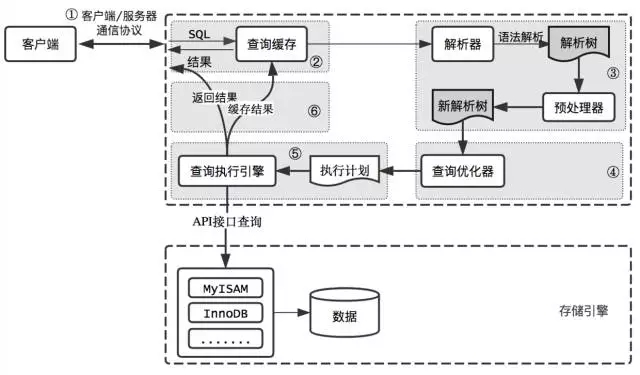

# 概览

MySQL 是一个关系型数据库管理系统，由瑞典 MySQL AB 公司开发，目前属于 Oracle 公司。MySQL 是一种关联数据库管理系统，将数据保存在不同的表中，而不是将所有数据放在一个大仓库内，这样就增加了速度并提高了灵活性。

## 逻辑架构介绍

从上到下，连接层，服务层，引擎层，存储层

 ## Mysql安装部署

 安装、部署略

 **配置文件说明**

 

 ## MySQL查询过程

 当向MySQL发送一个请求的时候，MySQL到底做了些什么呢？

 

 ## 存储引擎

 ### 查看

 查看支持哪些引擎？

 > show engines;

 查看当前默认引擎？

> show variables like '%storage_engine%';

### MyISAM和InnoDB对比

