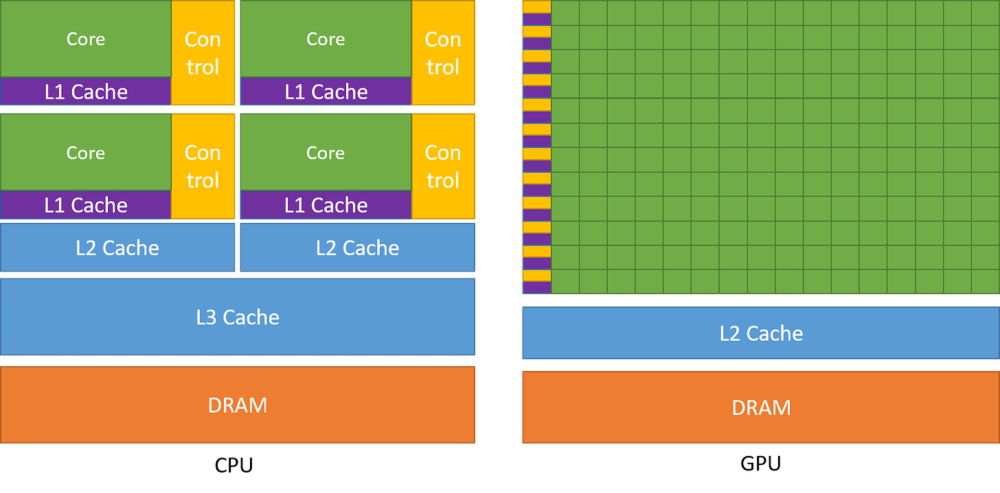
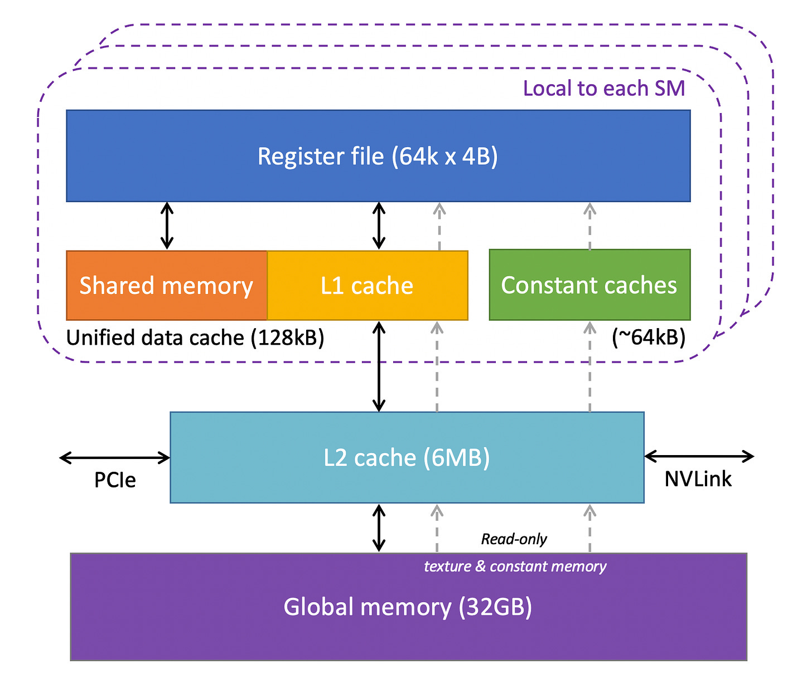
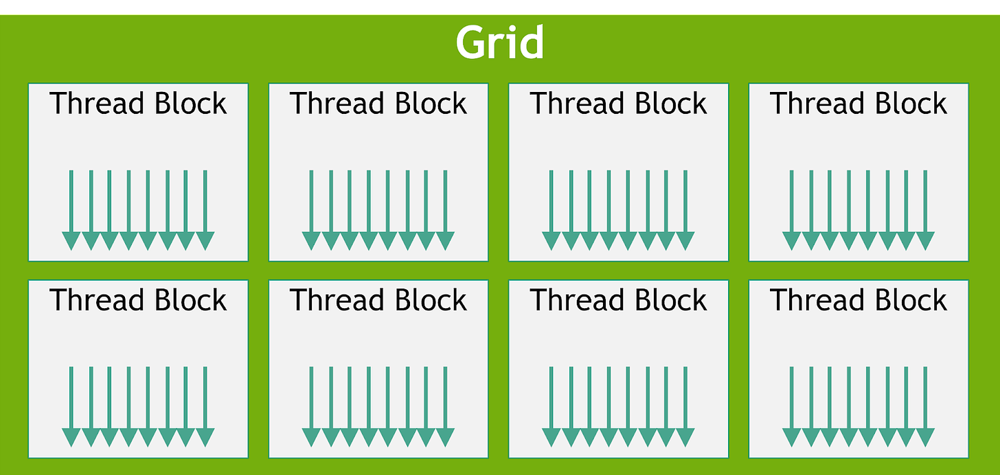
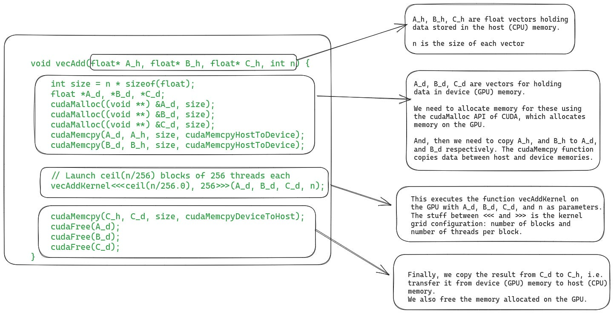
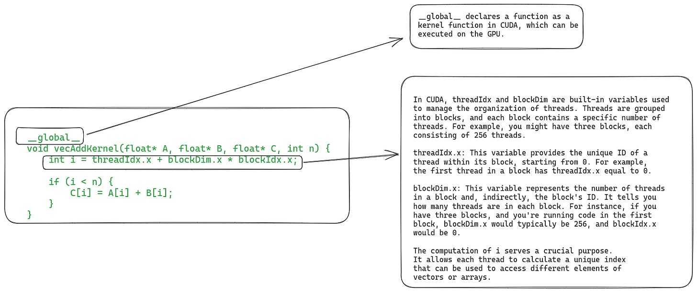
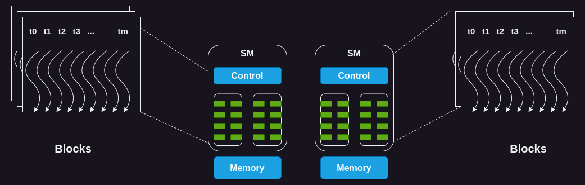

# 每个开发人员都应该了解 GPU 计算的知识

原文：[What Every Developer Should Know About GPU Computing](https://blog.codingconfessions.com/p/gpu-computing?continueFlag=ed0644a2dff425e748fc85d335b1e037)

译文：[每个开发人员都应该了解 GPU 计算的知识](https://www.mingliumengshao.com/2023/10/23/%E6%AF%8F%E4%B8%AA%E5%BC%80%E5%8F%91%E4%BA%BA%E5%91%98%E9%83%BD%E5%BA%94%E8%AF%A5%E4%BA%86%E8%A7%A3-gpu-%E8%AE%A1%E7%AE%97%E7%9A%84%E7%9F%A5%E8%AF%86/)

大多数程序员对 CPU 和顺序编程都有深入的了解，因为他们是在为 CPU 编写代码的过程中长大的，但许多程序员不太熟悉 GPU 的内部工作原理以及它们如此特别的原因。在过去的十年中，GPU 由于在深度学习中的广泛使用而变得异常重要。如今，每个软件工程师都必须对其工作方式有基本的了解。我写这篇文章的目的是为您提供背景知识。

本文的大部分内容基于 Hwu 等人所著的《[Programming Massively Parallel Processors](https://shop.elsevier.com/books/programming-massively-parallel-processors/hwu/978-0-323-91231-0)》第四版。由于本书涵盖了 Nvidia GPU，因此我还将讨论 Nvidia GPU 并使用 Nvidia 特定术语。然而，GPU 编程的基本概念和方法也适用于其他供应商。

## CPU 和 GPU 的比较

我们将首先对 CPU 和 GPU 进行比较，这将使我们更好地了解 GPU 领域。然而，这是一个单独的主题，我们不可能将所有内容都压缩在一个章节中。因此，我们将坚持几个关键点。

CPU 和 GPU 之间的主要区别在于它们的设计目标。CPU 被设计为执行顺序指令-。为了提高顺序执行性能，多年来 CPU 设计中引入了许多功能。重点是减少指令执行延迟，以便 CPU 能够尽快执行指令序列。这包括[指令流水线](https://en.wikipedia.org/wiki/Instruction_pipelining)、[乱序执行](https://en.wikipedia.org/wiki/Out-of-order_execution)、[推测执行](https://en.wikipedia.org/wiki/Speculative_execution)和多级缓存等功能 (仅列出一些) 。

另一方面，GPU 专为大规模并行性和高吞吐量而设计，但代价是中等到高指令延迟。这设计方向受到了它们在视频游戏、图形、数值计算和现在深度学习中的使用的影响。所有这些应用程序都需要以非常快的速度执行大量线性代数和数值计算，因此人们对提高这些设备的吞吐量投入了大量注意力。

让我们考虑一个具体的例子。由于指令延迟较低，CPU 可以比 GPU 更快地添加两个数字。他们将能够以比 GPU 更快的速度连续执行多项此类计算。然而，当进行数百万或数十亿次此类计算时，GPU 由于其巨大的并行性而比 CPU 更快地完成这些计算。

如果你喜欢数字，我们就来谈谈数字吧。数值计算硬件的性能是根据每秒可以执行多少次浮点运算(FLOPS) 来衡量的。Nvidia Ampere A100 在 32 位精度下提供 19.5TFLOPS 的吞吐量。相比之下，英特尔 24 核处理器的 32 位精度吞吐量为 0.66TFLOPS (这些数字来自 2021 年)。而且，GPU 和 CPU 之间的吞吐量性能差距逐年扩大。

下图比较了CPU和GPU的架构:

正如您所看到的，CPU 将大量芯片面积专门用于可减少指令延迟的功能，例如大缓存.更少的 ALU 和更多的控制单元。相比之下，GPU 使用大量 ALU 来最大化其计算能力和吞吐量。它们使用非常少量的芯片区域作为缓存和控制单元，从而减少 CPU 的延迟。

## 延迟容忍、高吞吐量和利特尔定律

您可能想知道，GPU 如何容忍高延迟并提供高性能。我们可以借助排队论中的利特尔定律来理解这一点。它指出系统中的平均请求数(队列深度 Qd)等于请求的平均到达率(吐量 T)乘以服务请求的平均时间 (延迟 L)

在GPU 的背景下，这基本上意味着可以容忍系统中给定级别的延迟，以通过维护正在执行或等待的指令队列来实现目标吞吐量。GPU 中的大量计算单元和高效的线程调度使GPU 能够在内核执行时间内维护此队列，并在内存延迟较长的情况下实现高吞吐量。

## GPU架构

因此，我们知道 GPU 偏爱高吞吐量，但它们的架构是什么样的才能实现这一目标，让我们在本节中讨论。

### GPU计算架构

GPU 由一系列流式多处理器(SM) 组成。每个 SM 又由多个流处理器或核心或线程组成。例如，Nvidia H100 GPU 有132个SM，每个 SM有64 个核心，总共有 8448 个核心。

每个 SM都有有限数量的片上存储器，通常称为共享存储器或暂存器，在所有内核之间共享。同样，SM 上的控制单元资源由所有核共享。此外，每个 SM 都配备了基于硬件的线程调度程序来执行线程。

除此之外，每个 SM 还具有多个功能单元或其他加速计算单元，例如张量核心或光线追踪单元，以满足 GPU 所满足的工作负载的特定计算需求。

接下来，我们来分解一下 GPU 内存，看看里面的情况。

### GPU内存架构

GPU 有多层不同类型的存储器，每层都有其特定的用例。下图显示了 GPU 中一个 SM 的内存层次结构。

让我们来分解一下。

- **寄存器**: 我们将从寄存器开始。GPU中的每个SM都有大量的寄存器。例如，Nvidia A100 和 H100 型号的每个 SM有65,536 个寄存器。这些寄存器在内核之间共享，并根据线程的要求动态分配给它们。在执行期间，分配给线程的寄存器是该线程私有的，即其他线程不能读/写这些寄存器。

- **常量缓存**: 接下来，我们在芯片上有常量缓存。它们用于缓存 SM 上执行的代码所使用的常量数据。为了利用这些缓存，程序员必须在代码中显式地将对象声明为常量，以便 GPU 可以缓存并将它们保存在常量缓存中。

- **共享内存**: 每个 SM 还具有共享内存或暂存器，它是少量快速且低延迟的片上可编程 SRAM 内存。它被设计为由运行在 SM 上的线程块共享。共享内存背后的想法是，如果多个线程需要处理同一块数据，则只有其中一个线程应该从全局内存加载它，而其他线程则共享它。谨慎使用共享内存可以减少全局内存的几余加载操作提高内核执行性能。共享内存的另一个用途是作为块内执行的线程之间的同步机制。

- **L1 Cache**: 每个 SM 还具有一个 L1 缓存，可以缓存L2 缓存中经常访问的数据。

- **L2 Cache**: 有一个L2 Cache，由所有SM 共享。它缓存全局内存中经常访问的数据以减少延迟。注意，L1和L2高速缓存对于SM来说都是透明的，即SM不知道它正在从L1或L2获取数据。对于SM来说，它是从全局内存中获取数据。这类似于 CPU 中L1/L2/L3 缓存的工作方式。

- **全局内存**: GPU还有一个片外全局内存，它是一种高容量、高带宽的DRAM。例如，Nvidia H100 拥有 80 GB 高带宽内存(HBM)，带宽为 3000 GB/秒。由于距离SM较远，全局内存的延迟相当高。然而，片上存储器的几个附加层和大量计算单元有助于隐藏这种延迟 (请参阅 CPU 与GPU 部分中的利特尔定律讨论)。

现在我们已经了解了 GPU 硬件的关键组件，让我们更深入地了解这些组件在执行代码时如何发挥作用。

## 理解GPU的执行模型

要了解 GPU 如何执行内核，我们首先需要了解什么是内核以及它的配置是什么。

### CUDA 内核和线程块简介

CUDA 是 Nvidia 提供的编程接口，用于为其 GPU 编写程序。在 CUDA 中，您以类似于 C/C++ 函数的形式表达要在 GPU 上运行的计算，该函数称为内核。内核对数字向量进行并行操作，这些向量作为函数参数提供给它。一个简单的例子是执行向量加法的内核，即，一个内核将两个数字向量作为输入，将它们按元素相加并将结果写入第三个向量。

为了在 GPU 上执行内核，我们需要启动许多线程，这些线程统称为网格。但网格还有更多结构。网格由一个或多个线程块（有时简称为块）组成，每个块由一个或多个线程组成。

块和线程的数量取决于数据的大小和我们想要的并行度。例如，在我们的向量加法示例中，如果我们要添加维度为 256 的向量，那么我们可能会决定配置一个包含 256 个线程的线程块，以便每个线程都对向量的一个元素进行操作。对于更大的问题，我们可能在 GPU 上没有足够的可用线程，并且我们可能希望每个线程处理多个数据点。

就实现而言，编写内核需要两个部分。一种是在 CPU 上执行的主机代码。这是我们加载数据、在 GPU 上分配内存以及使用配置的线程网格启动内核的地方。第二部分是编写在 GPU 上执行的设备 (GPU) 代码。

对于我们的向量加法示例，下图显示了主机代码。

下面是设备代码，它定义了实际的内核函数。

## GPU 上执行内核的步骤

### 1. 将数据从主机复制到设备

在调度内核执行之前，必须将其所需的所有数据从主机 (CPU)的内存复制到 GPU (设备)的全局内存。尽管如此，在最新的 GPU 硬件中，我们还可以使用统一虚拟内存直接从主机内存中读取数据 (请参阅论文第 2.2 节:[EMOGI: GPU 中内存外图遍历的高效内存访问](https://arxiv.org/pdf/2006.06890.pdf))。

### 2. SM上线程块的调度

当 GPU 的内存中拥有所有必要的数据后，它会将线程块分配给 SM。块内的所有线程同时由同一个 SM 处理。为了实现这一点，GPU 必须在 SM 上为这些线程预留资源然后才能开始执行它们。实际中，多个线程块可以分配给同一个SM同时执行。

由于 SM 的数量有限，并且大内核可能具有大量块，因此并非所有块都可以立即分配执行。GPU 维护一个等待分配和执行的块列表。当任何块完成执行时，GPU 会分配等待列表中的块之一来执行。

### 3. 单指令多线程（SIMT）和扭曲

我们知道一个block的所有线程都被分配到同一个SM。但在此之后还有另一个级别的线程划分。这些线进一步分为32个尺寸，称为经线(称为经线)-) ，并一起分配在一组称为处理块的核心上执行。

SM 通过获取并向所有线程发出相同的指令来一起执行 warp 中的所有线程。然后，这些线程同时执行该指令，但针对数据的不同部分。在我们的向量加法示例中，，warp 中的所有线程可能都在执行加法指令，但它们将在向量的不同索引上进行操作。

这种 warp 的执行模型也称为单指令多线程(SIMT)，因为多个线程正在执行同一指令它类似于CPU 中的[单指令多数据](https://en.wikipedia.org/wiki/Single_instruction,_multiple_data)(SIMD)指。

从 Volta 开始，新一代GPU 提供了一种替代指令调度机制，称为独立线程调度。它允许线程之间完全并发，而不管扭曲如何。它可以用来更好地利用执行资源，或者作为线程之间的同步机制。我们不会在这里讨论独立线程调度，但您可以在[CUDA 编程指南](https://docs.nvidia.com/cuda/cuda-c-programming-guide/index.html#simt-architecture)中阅读相关内容

### 4. Warp调度和延迟容忍

关于扭曲的工作原理，有一些有趣的细节值得讨论。

即使 SM 中的所有处理块 (核心组)都在处理扭曲，但在任何给定时刻，只有少数块正在主动执行指令。发生这种情况是因为 SM 中可用的执行单元数量有限。

但有些指令需要更长的时间才能完成，导致等待结果时出现扭曲。在这种情况下，SM会将等待的 warp 置于睡眠状态，并开始执行另一个不需要等待任何操作的 warp。这使得 GPU 能够最大限度地利用所有可用的计算并提供高吞吐量 (利特尔定律在这里再次发挥作用)。

零开销调度: 由于每个线程束中的每个线程都有自己的一组寄存器，因此 SM 从执行一个线程束切换到执行另一个线程束时没有开销。

这与 CPU 上进程之间的上下文切换方式形成对比。如果一个进程正在等待长时间运行的操作，CPU 会同时在该核心上调度另一个进程。然而，CPU 中的上下文切换是昂贵的，因为 CPU 需要将寄存器保存到主存中，并恢复其他进程的状态。

### 5. 将结果数据从设备复制到主机内存

最后，当内核的所有线程都执行完毕后，最后一步是将结果复制回主机内存。

尽管我们涵盖了有关典型内核执行的所有内容，但还有一件事需要单独的部分: 动态资源分区。

## 资源划分和占用概念

我们通过称为“占用的指标来衡量 GPU 资源的利用率，该指标表示分配给 SM 的 warp数量与其可支持的最大数量的比率。为了实现最大吞吐量，我们希望拥有 100% 的占用率。然而，在实践中，由于各种限制，这并不总是可行。

那么，为什么我们总是不能达到100%的入住率呢? SM具有一组固定的执行资源，包括寄存器、共享内存、线程块槽和线程槽。这些资源根据线程的要求和 GPU 的限制在线程之间动态分配。例如，在Nvidia H100上，每个SM可以处理32个块，64个扭曲 (即2048个线程)，每个块1024个线程。如果我们启动块大小为 1024 个线程的网格，GPU会将 2048 个可用线程槽分成 2 个块。

动态分区与固定分区:动态分区可以更有效地利用 GPU 中的计算资源。如果我们将其与固定分区方案进行比较，其中每个线程块接收固定数量的执行资源，那么它可能并不总是最有效的。在某些情况下，可能会为线程分配比其需要更多的资源，从而导致资源浪费和吞吐量降低。

现在，我们通过一个例子来看看资源分配如何影响SM的占用。如果我们使用 32 个线程的块大小并且总共需要 2048 个线程，那么我们将有 64 个这样的块。然而，每个 SM一次只能处理 32 个区块。因此，即使 SM 可以运行 2048 个线程，但它一次只能运行1024 个线程，从而导致 50% 的占用率。

同样，每个SM有65536个寄存器。要同时执行 2048 个线程，每个线程最多可以有 32个寄存器(65536/2048 = 32)。如果内核每个线程需要 64 个寄存器，那么每个 SM 只能运行 1024 个线程，同样会导致 50% 的占用率。

次优占用的挑战在于，它可能无法提供必要的延迟容忍度或达到硬件峰值性能所需的计算吞吐量。

高效创建 GPU 内核是一项复杂的任务。我们必须明智地分配资源，以保持高占用率同时最大限度地减少延迟。例如，拥有许多寄存器可以使代码运行得更快，但可能会减少占用率，因此仔细的代码优化很重要。

## 总结

我知道理解这么多新术语和概念是令人畏惧的。让我们总结一下要点，以便快速回顾。

- GPU 由多个流式多处理器(SM) 组成，其中每个 SM 具有多个处理核心。
- 有一个片外全局存储器，它是 HBM 或 DRAM。距离芯片上的SM较远，延迟较高。
- 有一个片外 L2 缓存和一个片内 L1 缓存。这些 L1和L2 高速缓存的运行方式与CPU 中 L1/L2 高速缓存的运行方式类似。
- 每个 SM 上都有少量可配置的共享内存。这是核心之间共享的。通常，线程块内的线程将一段数据加载到共享内存中，然后重用它，而不是从全局内存中再次加载它。
- 每个 SM 都有大量寄存器，这些寄存器根据线程的要求在线程之间进行分区Nvidia H100 每个SM 有 65,536 个寄存器
- GPU 根据资源可用性分配一个或多个块在 SM 上执行。一个块的所有线程都在同-个SM上分配和执行。这是为了利用数据局部性和线程之间的同步。
- 分配给 SM 的线程进一步分为 32 个大小，称为扭曲。warp 内的所有线程同时执行相同的指令，但在数据的不同部分(SIMT)。 (尽管新一代 GPU 也支持独立线程调度。)
- GPU根据每个线程的需求和SM的限制在线程之间执行动态资源划分。程序员需要仔细优化代码，以确保执行期间SM占用率达到最高水平

## 致谢

我要感谢Nvidia 的高级研究科学家Vikram Sharma Mailthody审阅了本文的各个部分并提供了见解。他的反馈极大地提高了文章的质量。我很感激。Vikram 对提高 GPU编程的认识非常感兴趣，因此，如果您有兴趣了解有关该领域的更多信息，请通过Twitter或LinkedIn与他联系。

## 更多资源

如果您想更深入地了解 GPU，可以参考以下一些资源:

- 《编程大规模并行处理器: 第四版》是最新的参考资料，但早期版本也很好[大规模并行处理器编程](https://www.youtube.com/channel/UC2Y6MNqiTwTrh-qPQHGIUyg): Hwu 教授的在线课程
- [Nvidia的 CUDA C++ 编程指南](https://docs.nvidia.com/cuda/cuda-c-programming-guide/index.html)
- [GPU 计算的工作原理(YouTube)](https://www.youtube.com/watch?v=3l10o0DYJXg)
- [GPU 编程: 何时、为何以及如何?](https://enccs.github.io/gpu-programming/)
- 有关利特尔定律，请参阅论文“ BaM System Architecture 中 GPU-Initiated OnDemand High-Throughput Storage Access”的第2.2节