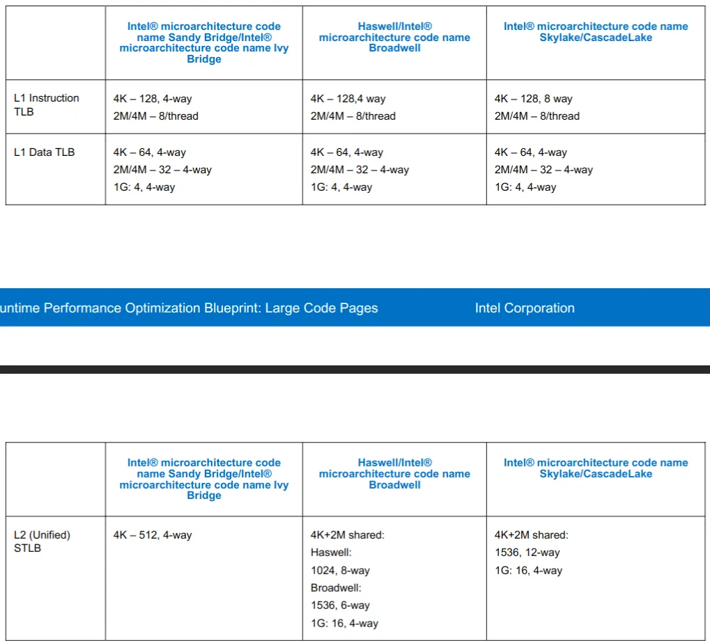

# 每个程序员都应该了解的内存知识


来源：[每个程序员都应该了解的内存知识（What every programmer should know about memory）](https://zhuanlan.zhihu.com/p/611133924)

原文作者：[Ulrich Drepper](https://link.zhihu.com/?target=https%3A//research.redhat.com/blog/project_member/ulrich-drepper/)

原文：

1. [RAM](https://link.zhihu.com/?target=https%3A//lwn.net/Articles/250967/)
2. [CPU caches](https://link.zhihu.com/?target=http%3A//lwn.net/Articles/252125/)
3. [Virtual memory](https://link.zhihu.com/?target=http%3A//lwn.net/Articles/253361/)
4. [NUMA systems](https://link.zhihu.com/?target=http%3A//lwn.net/Articles/254445/)
5. [What programmers can do - cache optimization](https://link.zhihu.com/?target=http%3A//lwn.net/Articles/255364/)
6. [What programmers can do - multi-threaded optimizations](https://link.zhihu.com/?target=http%3A//lwn.net/Articles/256433/)
7. [Memory performance tools](https://link.zhihu.com/?target=http%3A//lwn.net/Articles/257209/)
8. [Future technologies](https://link.zhihu.com/?target=https%3A//lwn.net/Articles/258154/)
9. [Appendices and bibliography](https://link.zhihu.com/?target=https%3A//lwn.net/Articles/258188/)

原文写于 2007 年，全文 PDF 有 114 页。我写这篇文章不是对原文的翻译，而是以原文的结构，对每部分，结合其他材料，进行解释与拓展；此外，原文有一些关于电路实现的内容，我认为对程序员而言理解到 ISA 级别即可，因此跳过了电路的内容。

内容若有错误、纰漏，还望您不吝赐教。

## RAM 与 总线

在进行这部分之前，我想先说明一些名词（x86 平台）

- socket（插槽）：固定 CPU 的插座，如下图。一般个人电脑主板上只有一个 socket，服务器主板可能有多个 socket。


- processor（处理器）：封装了 core 以及其他电路的物理实体芯片。通常把两个或更多独立 core 封装在一个单一[集成电路](https://zh.wikipedia.org/wiki/%E9%9B%86%E6%88%90%E7%94%B5%E8%B7%AF)（IC）中的方案会称为多核心处理器。如图就是 1 个处理器。


- core（核心）：“物理核心”，多核处理器上的独立处理单元实例。
- thread（线程）：“逻辑核心”，在硬件角度上来说，实际上是添加了计算单元和逻辑单元，但是没有分配缓存和控制器的逻辑核心。这个逻辑核心可以进行独立的计算，但是缓存【无论是指令缓存还是数据缓存】是和“物理核心 core”共享的，也就是说“物理核心”分出了一部分 L1 和 L2 给超线程的逻辑核心。任务管理器里的框框就是 thread。一般来说 1 个 core 有 2 个 thread。[^1]


The following resources are shared between two threads running in the same core:

- Cache
- Branch prediction resources
- Instruction fetch and decoding
- Execution units


- CPU ：一个模糊的概念，可以指 processor, core, thread. 本文 p1 中的 CPU 指 processor.

该部分详细描述了随机存取存储器 (RAM) 的技术细节，包括 SRAM，DRAM 的电路实现，访问时序等细节。对于这些细节，程序员简单了解即可，更值得关注的是 CPU 访问内存，外部设备的模型，即 CPU-总线模型。


如图，是一个典型的南桥，北桥结构。

所有 CPU（在示例中是两个，但可以有更多）都通过公共总线（前端总线，FSB）连接到北桥。北桥包含内存控制器。

要访问所有其他系统设备，北桥必须与南桥通信。南桥，通常称为 I/O 桥，通过各种不同的总线处理与设备的通信。如今，PCI、PCI Express、SATA 和 USB 总线最为重要，但南桥也支持 PATA、IEEE 1394、串行和并行端口。

但如今的 x86 机器已经发生了一些变化，以上的模型已经不够准确了。以 Intel 为例，简要介绍 CPU 与总线系统的变化，仅介绍模型，忽略具体细节。图片来自 An Introduction to the Intel® QuickPath Interconnect[^2]。

### 共享前端总线 (FSB)，2004 年之前


和最初的模型一致，所有处理器共享 FSB 总线连接到南桥；而南桥与内存，外部设备（通过北桥）通信。

### 双独立总线，大约 2005 年


和上一个模型的变化就是，单共享总线变成了双独立总线（DIB），其余大致相同。

### 处理器独占总线，2007 年


Intel 的官方的叫法是 Dedicated High-speed Interconnects（DHSI，专用高速互联）。实际就是每个处理器独占一条 FSB 总线与南桥相连。

### QPI 时代，2009 年


Intel® QuickPath Interconnect（QPI）技术最早发布于 2009 年 3 月的代号为 Nehalem 的 Xeon 处理器上。可以把 QPI 也理解为一种总线，总线本身怎么变化我们不关心，我们关注的是模型的变化。图二是 X58 平台的结构图，请结合以上两张图进行理解[^3]。

最重要的变化是，**内存控制器被集成进了 CPU 里，不再由北桥负责**。北桥仅负责 PCI-E 以及和南桥通讯（图二）。而每个 CPU 都有一个内存控制器，都可以独立的访存，互相之间通过 QPI 进行通讯，**架构变成了明显的非统一内存访问架构（NUMA[^4]）**，这也带来了数据一致性等额外的问题。

### 后 QPI 时代，2012 年


从 E5 处理器开始（Q2'12），又发生了一些变化。

**CPU 同时集成内存控制器和 PCI-E 控制器，传统意义的北桥消失**，QPI 只负责 CPU 之间的通信；芯片组（传统意义的南桥）和 CPU 的通信使用 DMI 总线。

自 2017 年起，Intel Ultra Path Interconnect (UPI) 代替了 QPI 总线技术[^5]。但 CPU-总线模型没有变化。

虽然 CPU-总线模型在不断变化，但有一个特点没有变：CPU 运行速度远高于访问内存，外部设备的速度。

基于这个不变，后文关于 Cache 等内容的叙述依旧成立。

## 虚拟内存

处理器的虚拟内存子系统实现提供给每个进程的虚拟地址空间，这使得每个进程都认为它独占系统的全部内存。

虚拟内存的优点列表在别处有详细描述，这里不再重复。相反，本节将重点放在虚拟内存子系统的实际实现细节和相关成本上。

虚拟地址空间由 CPU 的内存管理单元 (MMU) 实现。操作系统填写页表 (page table) 数据结构，但查找过程由 CPU 自己完成（x86 体系如此）。MMU 执行地址转换的输入是虚拟地址 (VA,virtual address), 输出是物理地址 (PA,physical address)。

在介绍页表之前，先来说一下现代大多体系结构的访存粒度：

- 字节 (byte) 编址；在表示地址时，0x100 与 0x104 相隔了 4 个字节，此外，CPU 能直接操作的最小单元也是字节，你可以 mov byte ptr [ebx], 10，若要操作某一 bit ，则无法直接进行，要通过移位等操作。
- 字 (word) 作为基本处理单位；
    - 字长并非一个十分严格的概念。在一个 CPU 指令集中，每条指令都可以处理长度不同的操作数。这时就把大多数指令能处理的最长长度但是又不花费额外周期的操作数长度称为字长（32 位处理器为 4 字节，64 位处理器为 8 字节）。
    - 当处理器从存储器子系统读取数据至寄存器，或者，写寄存器数据到存储器，传送的数据通常是字。
    - 虽然从逻辑上，你可以单独操作某一个字节，但通常实际存取通常都是以字为单位的。这也带来的字节对齐的问题[^6]。

- 在引入 cache 之后，处理器访问主存首先通过 cache ，而 cache 与主存存取的单位通常为 1 cache line (通常为 64 Bytes)


- MMU 进行虚拟内存地址映射时，单位为 page （通常为 4 KiB）。例如 0x10000 虚拟地址映射到 0xF0000, 指的是 0x10000-0x1FFFF 这连续的 1 page（假设为 4 KiB）地址空间映射到 0xF0000-0xFFFFF。以 page 为单位进行映射，也以 page 为单位进行管理，但 page 的大小是可以设置的。

### 最简单的一级页表


通常，VA 的低位部分作为 offset ，用于在 page 内进行偏移，假设 offset 字段长 bits，那 1 page 的大小就是

bytes。VA 的高位部分作为索引，用于在页表中确定页表项。页表项说明了 VA 与 PA 的映射关系，以及其他的一些访问权限管理。

注意，页表本身存放在内存中，由操作系统进行初始化，并更新维护，但 VA 到 PA 的翻译查找过程由 CPU 硬件完成。

### 多级页表

对于 4 KiB 页面，虚拟地址 VA 的偏移量 offset 部分只有 12 位大小。这留下 20 位作为页表的索引。但包含2<sup>20</sup>个条目的页表是不切实际的。即使每个条目只有 4 个字节，表的大小也将是 4 MiB。由于每个进程都可能有自己不同的页表，系统的大部分物理内存都将被这些页面目录占用。

解决方案是使用多级页表。通过多级页表可以表示一个稀疏的大页面目录，其中实际未使用的区域不需要分配内存。因此，表示更加紧凑，可以在内存中拥有许多进程的页表，而不会对性能产生太大影响。


如图，VA 被分为六个部分。

- Sign Extend： 对于 4 级页表无用。
    - 4 级页表下，x64 仅使用 48 位地址空间。5 级页表也正在路上[^7]。
- Page-Map Level-4 Offset (PML4) : 4 级页表索引
- Page-Directory Pointer Offset：3 级页表索引
- Page-Directory Offset：2 级页表索引
- Page-Table Offset：1 级页表索引
- Physical-page Offset：用于在 page 页内的偏移，不参与转换过程

CPU 有一个专用的寄存器（x86-64 上为 CR3），保存着最高级（即 4 级）页表（PML4）的物理地址。

从 PML4 到 Page-Table Offset 的四个部分是各级页表的索引。第 4 级到第 2 级目录的内容是对下一级目录的引用。如果一个目录条目被标记为空，它显然不需要指向任何较低的目录。这样页表树就可以稀疏紧凑。每一级页表中，最多可以有 2<sup>9</sup> = 512 个页表项。

为了确定对应于虚拟地址的物理地址，处理器首先确定最高级别页表的物理地址。该地址通常存储在寄存器中。然后 CPU 获取与该目录对应的虚拟地址的索引部分，并使用该索引来选择适当的条目。此条目是下一个目录的物理地址，它使用虚拟地址的下一部分进行索引。这个过程一直持续到它到达一级目录，此时页表目录项的值是物理地址的高位部分，物理地址的低位部分是虚拟地址的低位部分，二者组合得到了此 VA 对应的 PA 。这个过程称为页表树遍历。大部分架构的处理器（如 x86 和 amd64，arm，risc-v）在硬件中执行此操作。

一个小程序可能只使用第 2、3 和 4 级每个目录中的一个目录和所有 1 级目录。在具有 4KiB page 和每个页表目录 512 个条目的 x86-64 上，这允许寻址 2MiB 地址。

下图是 x64 平台，每一级页表项的详细信息。


### Huge page

通常，page 大小为 4 KiB，我们也可以把 page 设置的更大，以减少地址翻译的过程，这就是 huge page（或 large page）。

Windows 和 Linux 都允许服务器应用程序建立大页面内存区域。使用较大的2 MB 页面，只需10个页面就可以映射20 MB 的内存; 而使用4KB 页面则需要5120个页面。这意味着需要更少的 TLB 条目，从而减少 TLB miss 的发生。

在 64 位的 x86-64 中，支持 2MiB（4KB * 2^9= 2MB，PD（2 级页表）跳过 PT（1 级页表） 直接指向 page）和 1GiB（2MB * 2^9 = 1GB，PDPT（3 级页表） 跳过 PD 和 PT（2 级和 1 级页表） 直接指向 page）的 large page[^8]。


下图[^9]，分别是 1 GiB，2 MiB，4 KiB 页表项的 Entry 说明。


关于 huge page 的更多资料，可以参考 [Java, MySql increased performance with Huge Pages](https://zzzoot.blogspot.com/2009/02/java-mysql-increased-performance-with.html)

### TLB

为了完成 VA 到 PA 的转换，我们需要用到页表。但页表本身放在内存中，对于多级页表而言，完成这一转换需要进行多次访存，其开销很大。

下表说明了在 i7 与 Xeon 处理器上[^10]，Cache 访问以及内存访问所需的大概时间，可以看到访存所需的时间大概是 L1 Cache 的 30～50 倍，L3 Cache 的 3～5 倍。

```
Core i7 / Xeon 5500 Series Data Source Latency (approximate)               [Pg. 22]

local  L1 CACHE hit,                              ~4 cycles (   2.1 -  1.2 ns )
local  L2 CACHE hit,                             ~10 cycles (   5.3 -  3.0 ns )
local  L3 CACHE hit, line unshared               ~40 cycles (  21.4 - 12.0 ns )
local  L3 CACHE hit, shared line in another core ~65 cycles (  34.8 - 19.5 ns )
local  L3 CACHE hit, modified in another core    ~75 cycles (  40.2 - 22.5 ns )

remote L3 CACHE (Ref: Fig.1 [Pg. 5])        ~100-300 cycles ( 160.7 - 30.0 ns )

local  DRAM                                                   ~60 ns
remote DRAM                                                  ~100 ns
```

为了加快这一过程，我们可以将 VA 到 PA 的映射关系缓存到高速器件中，而不需要再一层层访存查询，TLB（Translation lookaside buffer）便应运而生。

TLB 也是一块的高速缓存，与常规意义的 Cache 物理实现类似，不过 Cache 缓存的是内存中的任意内容，而 TLB 仅缓存页表项的内容。

#### TLB 的工作过程

虚拟地址转换过程是以 page 为单位的，因此 VA 的低位部分不变成为 PA 的低位部分，VA 的高位部分需要转换成 PA 的高位部分，组合得到 PA。由此产生了4个概念：VPN（virtual page number），PPN（physical page number），VPO（virtual page offset）和 PPO（physical page offset）。


为了在 TLB 中搜索，VPN 部分又被分为两部分 TLB tag 和 TLB Index.


使用 TLB Index 部分（不需要存在 TLB 中，就像数组的下标）在 TLB 中索引，使用 TLB Tag 部分比对，以确定是否为对应的 VA 。TLB 中真正缓存的是页表项的内容（Page Table Entry），包括 VA 对应的 PA ，权限控制位，valid 标志等。图源[^11]，该图只是简单的说明，并不代表现 X86 TLB entry 内容。


#### TLB flush

这篇文章 TLB之flush操作 讲的十分清晰，明了。

关于 TLB flush 涉及优化的点:

- 内核页表相对不变，我们希望它不要总被 flush 掉
    - 现代处理器（ARM 和 x86）采用一个名为 G(Global)的 bit，来代表那些在系统运行中不常变化的映射关系。以 x86为例，当 CR3寄存器中的内容被更新（因为 CR3是指向进程页表的首地址的，这意味是发生了进程切换），默认会 flush 整个 TLB。
    - 如果在 CR4寄存器里置位了 PGE（page global enable），则 TLB 里的 G 标志位就生效了，含有 G 的 TLB entries 就不会被 flush 了，成了钉子户了。当然，reset 的时候，钉子户也是会被清掉的。
    - 利用此机制也可以在进程间方便的共享内存


- 进程切换频繁，从 A 进程切换成 B 进程时，TLB flush 掉 A 的页表，当又切换回 A 进程时，A 面临一个空的 TLB，这个过程频繁发生，会降低性能
    - linux 里采用 PID（Process ID）来区别和管理不同的进程，类似的，我们也可以在 TLB 中加上这样一个 tag，如果虚拟地址的 tag 相同，就再比较这个标识进程的 tag，这样就可以分清了，不会冲突了。在 x86里这叫PCID （Process Context Identifiers），在 ARM 里这叫ASID（Address Space Identifiers）。
    - 那 TLB 在缓存页表 PTE 的时候，怎么知道该 PTE 所属进程的 PCID/ASID 呢？以 intel 的 x64为例，CR3寄存器了存储了当前进程对应的 PCID
    
- 置位 CR4寄存器的 PCIDE（PCID Enable）位后，PCID 就生效了，进程切换的时候就不需要 flush TLB 了。但是 CR3中的 PCID 只占12个 bits，也就是说，它最多能表达4096个 process。

#### TLB 层级

普通的 Cache 分为 L1，L2 等多级缓存，TLB 也存在这个分层结构。

- TLB
    - L1 TLB (per core)
        - L1 Instruction TLB
        - L1 Data TLB
- L2 TLB (Unified)


Intel 的 TLB 层级及大小具体如下[^12]。



### PTI（Page Table Isolation）

如果没有 PTI，每当执行用户空间代码（应用程序）时，Linux 会在其分页表中保留整个内核内存的映射，并保护其访问。

但这带来了 Meltdown & Spectre 漏洞。

```
我们把CPU比做学校食堂，把黑客比作两个男生A，B，用户则是女神。

这天，男生A，B总要想办法获得女神的一点私密信息——比如，女神今天午饭吃的啥~

中午，女神来到食堂打饭，点了一份小笼包。
男生A在女神后面跟食堂大娘说：我也来一份，跟她一样的~
然而这会食堂大娘表示，你等会，你前面还有人哦。
好吧，虽然说是这么说，但是后面的厨房师傅已经听到了对话，已经提前开始准备好了另一份小笼包.....
后来女神点好走了，轮到男生A点，他表示，我要一个跟她一样的...

然而这会，
食堂大娘表示，人家是人家，你是你，我们不能透露女神隐私喔，你可以走了，下一个！ （这就是目前CPU的内置的安全防线）

然而！
当下一个男生B走到食堂大娘面前，直接说：随便，哪道菜最快给我上哪道...
于是乎，既然之前厨房师傅已经提前多准备好了一份小笼包，就干脆直接把小笼包给了男生B....
这下男生知道了，女神中午吃了小笼包......

https://blog.csdn.net/pwl999/article/details/112686914
```

PTI通过完全分离用户空间与内核空间页表来解决页表泄露。但 PTI 也带来了更多的性能开销。

## CPU caches

在 TLB 那一节我们介绍了，CPU 访问 L1 Cache 的花费大概是 2ns ，L2 Cache 大概是 4ns ，DRAM 大概是 60 ns，访问 Cache 比访问内存快得多。


### Cache 层级

- CPU Cache
    - L1 Cache
        - L1 i-cache
        - L1 d-cache
    - L2 Cache
    - L3 Cache


如图为酷睿 i7 - 9xx 的缓存层级图，该 CPU 为 4c8t，每个 core 独占 L1 i-cache 缓存指令（如 .text 段），L1 d-cache 缓存数据（如 .data .bss 段等），i-cache 与 d-cache 共用一个 L2 Cache。L3 Cache 为所有 cores 共用。

其中, L1 Cache 分别为 32KiB，L 2 Cache 为 256KiB，L 3 Cache 为 8MB。

在 Linux 上，可以通过 dmidecode -t cache 或 lscpu 获取你本机的 Cache 信息。

### Cache 读策略

参考：[CPU Cache and Memory Ordering](../computer-system/CPU-Cache-and-Memory-Ordering.pdf)


通常来说，L1 ⊂L2 ⊂L3 ⊂main memory

如图，来自 Intel 的 White paper[^13]。


每个物理核心都包含自己的私有 L1和 L2 缓存。然而，L3 是共享的，可以被系统中的所有内核完全访问和利用。在英特尔 Xeon v3处理器上，L3 是一个 Inclusive 的高速缓存 (一个包容性的高速缓存包括所有存储在低级别的高速缓存中的数据)。如果对数据的请求错过了一个内核的 L1和 L2，那么这个请求就会继续到 L3 去接受服务。如果 L3 hit，那么可能需要窥探 (snooping)以保持与另一个可能拥有该数据的核的一致性。否则，在 L3 miss 的情况下，请求将在内存中得到服务。

在几乎所有的情况下，当内核从内存中请求数据时，每个缓存中也会有一个副本。因此，当一个请求错过了 L1 时，它可能会在 L2 或 L3 中找到。然而，当 L3 的 cache line 被驱逐时，如果 L1和 L2 存在的话，该 cache line 也必须被废止。这种情况可能会发生，例如，当一个核在它的 L1中有数据而它已经有一段时间没有使用了。当其他内核使用 L3 时，LRU 可能最终会从 L3 中驱逐该 Cache line 。因此，该核的 L1和 L2 缓存中对应的 cache line 将变得无效。

### Cache 写策略


通过 dmidecode -t cache 命令，同样可以知道本机的 Cache 写策略，我的如下，均为 Write Back 。

```
Handle 0x000C, DMI type 7, 27 bytes
Cache Information
        Socket Designation: L1 - Cache
        Configuration: Enabled, Not Socketed, Level 1
        Operational Mode: Write Back
        Location: Internal
        Installed Size: 512 kB
        Maximum Size: 512 kB
        Supported SRAM Types:
                Pipeline Burst
        Installed SRAM Type: Pipeline Burst
        Speed: 1 ns
        Error Correction Type: Multi-bit ECC
        System Type: Unified
        Associativity: 8-way Set-associative

Handle 0x000D, DMI type 7, 27 bytes
Cache Information
        Socket Designation: L2 - Cache
        Configuration: Enabled, Not Socketed, Level 2
        Operational Mode: Write Back
        Location: Internal
        Installed Size: 4 MB
        Maximum Size: 4 MB
        Supported SRAM Types:
                Pipeline Burst
        Installed SRAM Type: Pipeline Burst
        Speed: 1 ns
        Error Correction Type: Multi-bit ECC
        System Type: Unified
        Associativity: 8-way Set-associative

Handle 0x000E, DMI type 7, 27 bytes
Cache Information
        Socket Designation: L3 - Cache
        Configuration: Enabled, Not Socketed, Level 3
        Operational Mode: Write Back
        Location: Internal
        Installed Size: 8 MB
        Maximum Size: 8 MB
        Supported SRAM Types:
                Pipeline Burst
        Installed SRAM Type: Pipeline Burst
        Speed: 1 ns
        Error Correction Type: Multi-bit ECC
        System Type: Unified
        Associativity: 16-way Set-associative
```

### Cache 结构

直接映射，全相联映射，N-路组相联映射，这三个听起来令人困惑，下面这张图很好的进行了解释。图中右下方的表为 2 路组相联，共有 16 组。


Cache 是对内存进行的缓存，其单位为 Cache line，1 Cache line 通常为 64 KiB。

- 读 1 字节，但不在 Cache 中 -> 需要从内存中读 1 Cache line.
- 仅修改了 1 字节，写回内存 -> 需要把 1 Cache line 全部写回（通常如此）


如图展示了 Cache 的查找过程。


#### VIPT, PIPT

进一步阅读：[Cache组织方式](https://zhuanlan.zhihu.com/p/107096130)

根据 Cache 使用什么做 index，什么做 tag，一共有四种：PIPT, PIVT, VIVT, VIVT.

同时，要考虑避免两个问题：

- 歧义(ambiguity)：不同的数据在 cache 中具有相同的 tag 和 index。cache 控制器判断是否命中 cache 的依据就是 tag 和 index，因此这种情况下，cache 控制器根本没办法区分不同的数据。
- 别名(alias)：当不同的虚拟地址映射相同的物理地址，而这些虚拟地址的index不同，此时就发生了别名现象(多个虚拟地址被称为别名)

具体而言，有很多细节问题需要考虑，请看上面链接里的文章。

PIPT：Physical Index Physical Tag。物理地址做 index，物理地址做 tag。

在 Cache 中查找需要等到 VA 转化为 PA 之后。


VIPT:Virtual Index Physical Tag。虚拟地址做 index，物理地址做 tag。

在 Cache 中查找与 VA 转化为 PA 的过程同时进行，性能有所提升。


Intel 没有公布过他们的实现方法，下图是 ARM 系列的。


### 缓存一致性

缓存一致性是最终存储在多个本地缓存中的共享资源数据的一致性。当系统中的客户端维护公共内存资源的缓存时，可能会出现数据不一致的问题，在多处理系统中，CPU 尤其如此。

为实现缓存一致性，常见的协议有 MESI ，MOESI 等，在此不讨论。为了达到一致性，core 需要监听总线（Bus snooping），一切都是有代价的。

但提到 cache coherence, 一般人都会有以下两个疑问[^14]:

- 两个 core 试图“同时”修改同一个 cache line . Who will win？Can both lose ？ Intel 的实现如何处理这种情况？
- 一个 core 尝试从一个不在 cache 的内存位置读取，而另一个 core 拥有一个具有该内存位置的 cache line 的独占所有权，并尝试(同时)向其中写入一些值。谁会赢？Cache line 状态将首先转移到一个共享状态，然后无效或修改，然后共享？(提到的状态是 MESI 的内容)

这个东西很难, 但是看起来这两个问题对 Intel 来说很轻松就做到了? 这是一个专家对以上问题的解答([how intel cache coherence works](http://gavinchou.github.io/summary/c++/memory-ordering/#how%20intel%20cache%20coherence%20works))

对 #1 的简短回答是，一致性处理将序列化操作。例如，如果两个 core 在同一周期内执行一个存储指令，并且都在其 L1和 L2 Cache miss，那么该事务将转到负责该地址的 L3片，该片将按顺序处理传入的请求。其中一个将 "win"，并将被授予对 cache line 的独家访问权，以执行存储。在这期间，来自 "lose "核心的请求将被搁置或拒绝，直到最终第一个核心完成其一致性事务。

> The short answer to #2 is that also that the transactions will be serialized. Either the owning processor will complete the store, then the line will be transferred to the reading processor, or the cache line will be transferred away from the owning processor to the reading processor first, then returned to the (original) owning processor to complete the store.

---“Dr. Bandwidth”

Cache 一致性解决了核之间数据可见性以及顺序的问题, 本质上可以把 cache 当做内存系统的一部分, 有没有 cache 对各个 CPU 来说都是一样的, 只要写到了 cache(所以可以有很多级 cache), 其他核就可以看到该数据, 并且顺序是确定的，至于具体的实现细节 Intel 并没有公布过。

#### Load/Store Buffer

其实在 Core 与 L1 Cache 之间还有器件，即 Load Buffer 和 Sotre Buffer，见下图中圈起来的位置。

这两个 buffer 是下图中② out of order engine 中的一部分, 顾名思义就是跟乱序执行有关系.


数据读取(load buffer)跟不影响数据对外的可见性, 但是 store buffer 会, 数据从 CPU 的 store buffer 出来到 cache, 上其他核就可以看到该数据.

store buffer类似于一个队列, 但是大小是按照entry计算不是按照bits计算的. 上图的例子是56 entries, 一般来说 store buffer的size 是load buffer的 2/3, 因为大 多数程序读别写多.

开了超线程(hyper-threading), store buffer 这些资源就要等分成两份, 分别给两个逻辑核（thread）使用.

CPU 操作数据变更之后并不会立即写到 L1d 上, 而是先写到 store buffer 上, 然后尽快写到 L1d cache。

举一个例子, store buffer 会引起”乱序”的问题：

```c
// global int
int a = 0;
int b = 0;

// thread 1                  |           // thread 2
t1:                          |           t2:
a = 1;                       |           b = 1;
if (b == 0) {                |           if (a == 0) {
  // do something            |             // do something
} else {                     |           } else {
  goto t1; // retry          |             goto t2; // retry
}                            |           }

// http://gavinchou.github.io/summary/c++/memory-ordering/
```

上述代码执行完之后, 两个线程都能同时走到 “do something” 的逻辑里, 因为 thread 1 在写 a = 1之后, 数据在 store buffer 里, 对 thread 2其实是不可见的, 这个时候 thread 2看到的还是 a == 0, 同理, thread 2写完 b = 1 会在 store buffer 里停留一段时间, thread 1 也看到 b == 0, 这样两个线程都认为自己可以进入到”do something” 的逻辑里.

这个其实是著名的”Peterson’s and Dekker’s algorithm”(互斥锁), 上述例子也阐述了这个算法在现代CPU架构上这么做是不可行的.

Store buffer 是指令重排的一部分，具体请见文章：[内存屏障今生之Store Buffer, Invalid Queue](https://blog.csdn.net/wll1228/article/details/107775976)

### 完整访存过程

至此，我们可以梳理一下完整的访存过程了（PIPT）。


## NUMA (non-uniform memory access)

见本文 P1 。

## 程序员可以做什么

### 绕过 Cache

当生成数据而没有(立即)再次使用时（违背时间局部性），然后修改缓存数据的事实对性能是有害的。这个操作将可能需要的数据从 cache 中逐出，以支持不会很快使用的数据。对于像矩阵这样的大型数据结构尤其如此，这些结构需要填充，以便在之后使用。在填充矩阵的最后一个元素之前，第一个元素就会因为矩阵太大被踢出 cache ，使 cache 效率降低。

对于这类情况，処理器提供了对 非暂存（non-temporal） 写入操作的支持。这个情境下的非暂存指的是数据在短期内不会被使用，所以没有任何缓存它的必要。这些非暂存的写入操作不会先读 cache line 然后再修改；反之，新的内容会被直接写进内存。

这听来代价高昂，但并非如此。処理器会尝试使用写合并（write combining ）来填充整个 cache line 。如果成功，则根本不需要内存读取操作。对于 x86和 x86-64体系结构，gcc 提供了许多内部特性:

```c
#include <emmintrin.h>
void _mm_stream_si32(int *p, int a);
void _mm_stream_si128(int *p, __m128i a);
void _mm_stream_pd(double *p, __m128d a);

#include <xmmintrin.h>
void _mm_stream_pi(__m64 *p, __m64 a);
void _mm_stream_ps(float *p, __m128 a);

#include <ammintrin.h>
void _mm_stream_sd(double *p, __m128d a);
void _mm_stream_ss(float *p, __m128 a);
```

如果这些指令一次性处理大量数据，则效率最高。数据从内存加载，在一个或多个步骤中处理，然后写回内存。数据“流”通过处理器，因此函数得名“stream”。

内存地址必须分别对齐8或16字节。在支持 [MMX](https://en.wikipedia.org/wiki/MMX) 的编译器中，_mm_store_* 函数可以被编译成 non-temporal 指令。

处理器的写合并 buffer 只能将部分写入到 cache line 的请求保存一段时间。通常来说，需要指令连续，这些指令一个接一个地修改单个 cache line ，以便实际进行写合并。这方面的一个例子如下:

```c
#include <emmintrin.h>
void setbytes(char *p, int c)
{
  __m128i i = _mm_set_epi8(c, c, c, c,
                           c, c, c, c,
                           c, c, c, c,
                           c, c, c, c);
  _mm_stream_si128((__m128i *)&p[0], i);
  _mm_stream_si128((__m128i *)&p[16], i);
  _mm_stream_si128((__m128i *)&p[32], i);
  _mm_stream_si128((__m128i *)&p[48], i);
}

// https://godbolt.org/z/T46z8hnfc
```


假设指针 p 对齐到正确的地址，对此函数的调用将把 cache line 的所有字节（64B）设置为 c。写合并逻辑将看到四条生成的 movntdq 指令，并且只在最后一条指令执行完毕后才发出内存的 write 命令。总之，这个代码序列不仅可以避免在写入 cache line 之前读取 cache line，还避免了用可能不需要的数据污染 cache line。在某些情况下，这会带来巨大的好处。使用这种技术的日常代码的一个例子是 C 运行时中的 memset 函数，它应该对大块使用类似上面的代码序列。

有些体系结构提供专门的解决方案。PowerPC 体系结构定义了 dcbz 指令，可用于清除整个 cache line。该指令并没有真正绕过缓存，因为其为结果分配了 cache line，但是不会从内存中读取数据。它比 non-temporal 指令更有限，因为 cache line 只能设置为全零，并且它会污染缓存(如果数据是 non-temporal 的) ，但是不需要写合并逻辑来达到目标。

[MOVNTQ](https://www.felixcloutier.com/x86/movntq) — Store of Quadword Using Non-Temporal Hint 使用 Non-Temporal Hint 将源操作数（第二个操作数）中的四字移动到目标操作数（第一个操作数，以最大限度地减少写入内存期间的缓存污染。
在将数据写入内存时，使用写合并(WC)内存类型协议实现 Non-Temporal Hint。使用此协议，处理器不会将数据写入缓存层次结构，也不会从内存中提取相应的缓存行到缓存层次结构中。

什么是 Non-temporal 操作？简单说就是不符合时间局部性的操作 (data will be referenced once and not reused in the immediate future)。
x86 提供了类似 movntdq 的指令，能够以最小化缓存污染的方式将 Non-temporal 数据写入内存，但这只是 hint ，这些 hint 也可以被忽略。
写合并是实现 Non-temporal 操作的方式，写组合（WC）用于允许数据被组合并临时存储在缓冲区（写组合缓冲区（WCB））中，以便稍后以突发模式一起释放，而不是（立即）作为单个位或小块写入[^15]。
Non-temporal 操作约等同于写合并+ no-write-allocate + no-fetch-on-write-miss [^16]。

为了了解 Non-Temporal 指令的作用，我们将看一个新的测试，该测试用于测量对矩阵的写入，矩阵被组织为二维阵列。编译器在内存中布置矩阵，以便最左边的（第一个）索引寻址具有在内存中顺序布置的所有元素的行。右侧（第二个）索引寻址行中的元素。测试程序以两种方式对矩阵进行迭代：行优先访问和列优先访问。


我们测量[初始化3000×3000矩阵所需的时间](https://quick-bench.com/q/_IyZEMUqWjPXMYtWtdFI_FG4PcA)。


对于使用缓存的普通写入，我们看到了预期的结果：如果按顺序使用内存（行优先），我们会得到更好的结果，与或多或少的随机访问（列优先）相比，行优先比列优先快 11 倍。

我们在这里主要感兴趣的部分是绕过缓存的写入。
行优先，Non-temporal 写入略快于普通写入，快了 1.9 倍。
列优先，情况有所不同。结果明显慢于经过缓存的普通访问的情况（是普通列访问的 3.3 倍）。在这里我们可以看到不可能进行写合并，因为相邻操作的内存地址不在同一 cache line 中，每个存储单元都必须单独寻址。这需要不断地选择 RAM 芯片中的新行，并伴随所有相关的延迟。

在读取方面，带有 SSE4.1 扩展的 Intel 引入了 NTA（Non-temporal access） load。它们是使用少量的流加载缓冲区实现的；每个缓冲区包含一个 cache line 。 movntdqa 会将 cache line 加载到其 stream 缓冲区中，这可能会替换另一个 cache line 。对同一 cache line 的后续访问（要求 16 字节对齐）将从加载缓冲区以很小的成本提供服务。除非有其他原因，否则不会将 cache line 加载到 cache 中，从而可以在不污染 cache 的情况下加载大量内存（这里 cache line 为单位，可能等于 64 B）。编译器为此指令提供了一个内在函数：

```c
#include <smmintrin.h>
__m128i _mm_stream_load_si128 (__m128i *p);
```

该函数应被连续多次调用，将 16 字节块的地址作为参数传递，直到 cache line 都被读完，然后再去读下个 cache line 。由于流式读取缓冲区不止一个，因此可以同时从两个内存位置读取。

[MOVNTDQA](https://www.felixcloutier.com/x86/movntdqa) — Load Double Quadword Non-Temporal Aligned Hint
如果内存源是 WC（写组合）内存类型[…]，则使用 Non-temporal hint 将双四字从源操作数（第二个操作数）加载到目标操作数。
[…]处理器不会将数据读取到缓存层次结构中，也不会将相应的 cache line 从内存提取到缓存层次中。

我们应该从这个实验中得到的是，现代 CPU 非常好地优化了未缓存的写和 （最近）读访问 ，只要它们是连续的。当处理仅使用一次的大型数据结构时，这些知识非常有用。第二，缓存可以帮助掩盖随机内存访问的部分但不是全部成本。由于 RAM 访问的实现，本例中的随机访问速度慢了 11 倍。在实现更改之前，应尽可能避免随机访问。

### Cache 访问

程序员可以对缓存进行的最重要的改进是那些影响1级缓存的改进。在包括其他级别的 Cache 之前，我们将先讨论它。显然，对 L1 Cache 的所有优化也会影响其他缓存。所有内存访问的主题都是相同的：改进局部性（空间和时间）并对齐代码和数据。

### 优化 L1 Cache 访问

在本节中，我们将展示哪些类型的代码更改可以帮助提高性能。继续前面的部分，我们首先关注顺序访问内存的优化。当按顺序访问内存时，处理器会自动预取数据。

使用的示例代码是矩阵乘法。我们使用两个1000×1000 double 方阵。


一个简单的 C 实现可以是这样的:

```c
  for (i = 0; i < N; ++i)
    for (j = 0; j < N; ++j)
      for (k = 0; k < N; ++k)
        res[i][j] += mul1[i][k] * mul2[k][j];
```

两个输入矩阵是 mul1和 mul2。假设结果矩阵 res 被初始化为所有零。这是一个漂亮而简单的实现。但是，当 mul1被顺序访问时，内部循环增加 mul2的行数。这意味着 mul1的处理方式是行优先访问，mul2 是列优先访问（近似于随机访问），这可不好。

有一种可能的补救办法。由于矩阵中的每个元素都被多次访问，因此在使用第二个矩阵 mul2之前，可能需要重新排列（用数学术语“转置”）。


转置后(传统上用上标‘ T’表示) ，我们现在按顺序迭代两个矩阵。就 C 代码而言，它现在看起来是这样的:

```c
double tmp[N][N];
  for (i = 0; i < N; ++i)
    for (j = 0; j < N; ++j)
      tmp[i][j] = mul2[j][i];
  for (i = 0; i < N; ++i)
    for (j = 0; j < N; ++j)
      for (k = 0; k < N; ++k)
        res[i][j] += mul1[i][k] * tmp[j][k];
```

我们创建一个临时变量来包含转置矩阵。这需要更多的内存，但由于每列1000次非顺序访问更昂贵（至少在现代硬件上如此）。


上图来源：见[https://quick-bench.com/q/6AjzV23SWKj5125Z9WulIaEST-Q](https://quick-bench.com/q/6AjzV23SWKj5125Z9WulIaEST-Q)

通过简单的矩阵变换我们快了 1.4 倍（降低优化等级还能快的更多）。1000 次非顺序访问真的很痛苦。

无论如何，我们当然需要一种不需要额外副本的替代方法。我们并不总是能够执行复制：矩阵可能太大或可用内存太小。

寻找替代实现应该从仔细检查所涉及的数学和原始实现执行的操作开始。简单的数学知识可以让我们看到，只要每个加数恰好出现一次，对结果矩阵的每个元素执行加法的顺序是无关紧要的。{ 我们在这里忽略可能改变上溢、下溢或舍入发生的算术效应。 这种理解使我们能够寻找重新排序在原始代码的内部循环中执行的加法的解决方案。

现在让我们检查原始代码执行中的实际问题。mul2 的元素被访问的顺序是：(0,0), (1,0), …, (N-1,0), (0,1), (1,1), …。元素 (0,0) 和 (0,1) 在同一个缓存行中，但是当内部循环完成一轮时，该缓存行早已被驱逐。对于这个例子，对于三个矩阵中的每一个，内循环的每一轮都需要 1000 个缓存行（Core 2 处理器为 64 字节）。这加起来远远超过可用的 32k L1d。

但是如果我们在执行内部循环时同时处理中间循环的两次迭代呢? 在这种情况下，我们使用来自缓存行的两个 double 值，这些值保证在 L1d 中。我们将 L1d miss 率降低了一半。这当然是一种改进，但是，根据缓存行的大小，它可能仍然还不够好。Core 2处理器的 L1d 高速缓存行大小为64字节，实际值可以通过运行时使用 sysconf (_SC_LEVEL1_DCACHE_LINESIZE) 或者命令行工具 getconf LEVEL1_DCACHE_LINESIZE 获得，程序可以根据特定的高速缓存行大小进行编译。sizeof(double)是8个字节的情况下，充分利用缓存行，我们应该对中间循环展开8次。继续这个思路，为了有效地使用 res 矩阵，即同时写8个结果，我们也应该展开外循环8次。我们假设缓存行的大小是64B，但是代码在32字节缓存行的系统上也可以很好地工作，因为两条高速缓存行也都被100％使用。代码如下:

```c
// gcc -DCLS=$(getconf LEVEL1_DCACHE_LINESIZE) ...

#define SM (CLS / sizeof (double))

for (i = 0; i < N; i += SM)
  for (j = 0; j < N; j += SM)
    for (k = 0; k < N; k += SM)
      for (i2 = 0, rres = &res[i][j],rmul1 = &mul1[i][k];
           i2 < SM; ++i2, rres += N, rmul1 += N)
        for (k2 = 0, rmul2 = &mul2[k][j];
             k2 < SM; ++k2, rmul2 += N)
          for (j2 = 0; j2 < SM; ++j2)
            rres[j2] += rmul1[k2] * rmul2[j2];
```

这看起来很吓人。在某种程度上，它的确如此，但仅仅是因为它包含了一些技巧。最明显的变化是我们现在有6个嵌套循环。外循环以 SM 为间隔进行迭代（缓存行大小除以 sizeof（double））。这将乘法分为几个较小的问题，可以用更多的缓存局部性来处理。内部三个循环遍历外部三个循环间隔部分的索引。这里唯一棘手的部分是 k2和 j2循环的顺序不同。这样做是因为在实际计算中，只有一个表达式取决于 k2，而两个表达式取决于 j2。

这里的其他复杂性来自这样一个事实：gcc 在优化数组索引方面不是很聪明。额外变量 rres、rmul1和 rmul2的引入通过将公共表达式从内部循环中尽可能地提取出来优化代码。C 和 c++语言的默认别名规则不能帮助编译器做出这些决定(除非使用了 restrict 如何理解C语言关键字restrict？，否则所有指针访问都是潜在的别名来源)。这就是为什么 Fortran 仍然是数字编程的首选语言：它使编写快速代码更容易。从理论上讲，1999年修订版中引入的 restrict 关键字应该可以解决这个问题。然而，编译器还没有赶上来。主要原因是现存的错误代码太多，会误导编译器，导致编译器生成错误的目标代码。

> 作者这里提到的是 Strict Aliasing Rule，具体可以见 [严格别名（Strict Aliasing）规则是什么，编译器为什么不做我想做的事？](https://zhuanlan.zhihu.com/p/595286568)


通过避免复制，相比转置，我们又快了 1.8 倍。另外，我们不需要任何额外的内存。只要结果矩阵也适合内存，输入矩阵就可以任意大。这是我们现在实现的普遍解决办法的要求。

现在，大多数现代处理器都包含对向量化（Vectorized）的特殊支持。通常被称为多媒体扩展，这些特殊指令允许同时处理2、4、8或更多的值。这些操作通常是 SIMD(单指令，多数据)操作，通过其他操作来获得正确形式的数据。英特尔处理器提供的 SSE2指令可以在一次操作中处理两个 double 类型的值。指令参考手册列出了使用这些 SSE2指令的内部函数。具体在后文会提到。

应该注意的是，在最新版本的代码中，mul2仍然存在一些缓存问题。预取仍然无法进行。但是，如果不对矩阵进行转置，这是无法解决的。也许缓存预取单元会变得更聪明以识别我们的访问模式，那么就不需要进行其他更改。

在矩阵乘法示例中，我们优化的方法是使用已加载的缓存行。已加载缓存行的所有字节都被用到。我们只是确保在逐出缓存行之前就使用它们。这当然是个特例。

事实上，更常见的情况是，数据结构占据一个或多个高速缓存行，且程序运行时在任意时间点只使用其中的几个成员。


上图显示了一组基准测试的结果，这个基准使用了目前广泛使用的程序，我们将一个列表中的两个元素值进行相加。第一种情况是两个元素都在同一个缓存行中；另一种情况，一个元素位于列表元素的第一行缓存中，第二个元素位于最后一个缓存行中。该图显示了我们记录下的性能下降程度。

毫不奇怪，当 L1d 能容纳工作集时，在所有情况下都不会产生负面影响。而一旦 L1d 不再足够，将在处理中使用两条高速缓存行而不是一条，这会带来性能下降惩罚。
红线表示测试数据列表在内存中顺序排列时的测试数据。我们看到了通常的两步模式：使用 L2高速缓存时大约17％的性能损失，而必须使用内存时大约27％的性能损失。

随机内存访问测试用例的测试结果看起来有些不同。随机访存用例下，使用 L2高速缓存的工作集的性能相比 L1降低了25％至35％。在这之后，它性能下降的幅度降低到大约10％。这不是因为性能惩罚变小了，而是因为实际内存访问的变得格外昂贵。测试结果还表明，在某些情况下，元素之间的距离也会对性能产生影响。Random 4 CLs 曲线显示出更高的惩罚，因为一个元素位于第一 cache line，一个位于第四 cache line ，距离更远了。

使用工具 pahole 可以知道结构体的内存布局，关于结构体对齐，字节对齐等内容，请见文章[字节对齐与填充（Data Alignment and Padding In C）](https://zhuanlan.zhihu.com/p/598708950)。

本节前面提到的 MMX 几乎总是要求对齐内存访问。即内存地址应该是16字节对齐的。x86和 x86-64处理器的内存操作的支持处理未对齐的访问，但速度较慢。在大多数 RISC 体系结构中，要求对所有内存的访问都是完全对齐的，上述的严苛对齐要求对于它们来说并不是什么新鲜事。即使架构支持不对齐的访问，这有时也比使用适当的对齐要慢，特别是如果不对齐导致装入或存储使用两条缓存行而不是一条缓存行。


上图显示了未对齐内存访问的影响。我们的测试方法是，（顺序或随机）访问内存中的列表数据元素，并增加数据元素的值，先测试列表元素对齐时的性能，再测试列表元素故意不对齐时的性能。该图显示了由于未对齐访问而导致的程序速度下降。对于顺序访问的情况，其影响要比对随机情况的影响更为显着，因为随机访问的内存访问开销太大了，一定程度上掩盖了未对齐访问的开销。在顺序情况下，对于需要使用 L2高速缓存的工作集大小，性能降低了大约300％，这是因为此时 L1缓存的有效性降低了。现在，某些增加操作涉及两条高速缓存行，并且在列表元素上工作通常需要读取两条高速缓存行。L1和 L2之间的连接太拥挤了。

根据我自己的[测试](https://quick-bench.com/q/RNsJVQ3Hjyn6aASqWJIc9CDWba4)，非对齐的内存访问并没有十分明显的性能劣势。原文写于 2007 年，具体的性能测试部分多少有些过时。

对于大型工作集，尽可能使用可用的缓存非常重要。为此，可能需要重新安排数据结构。虽然程序员更容易将概念上属于同一类的所有数据放到同一个数据结构中，但这可能不是实现最佳性能的方法。假设我们的数据结构如下：

```c
struct order {
  double price;
  bool paid;
  const char *buyer[5];
  long buyer_id;
};
```

进一步假设这些记录存储在一个很大的数组中，并且有一个频繁运行的任务计算所有未支付的账单的总金额。在这种情况下，buyer 和 buyer_id 字段的内存应该不必加载到缓存中。

更好的方法是将订单数据结构一分为二，前两个字段存储在一个结构中，其他字段存储在另一个结构中。这种变化肯定会增加程序的复杂性，但是性能的提高可能能够证明这一成本是合理的。

### 优化 L1 Instruction Cache 访问

为优化 L1i 的使用需要用到优化 L1d 类似的技术。但问题是，除非程序员用汇编语言编写代码，否则程序员通常不能直接影响 L1i 的使用方式。如果使用编译器，程序员还是可以通过引导编译器创建更好的代码布局来间接确定 L1i 的使用。

代码相比于数据有一个优势是代码在发生跳转（jump）之间是线性存储的。处理器可以有效地预取指令，但跳转会扰乱这番和谐的场景，因为：

- 跳转的目标可能不能被静态确定；
- 即便可以静态确定跳转目标，如果所有缓存都未命中，那么获取内存可能需要很长时间。

这些问题会在执行过程中造成停顿，并可能严重影响性能。这就是为什么当今的处理器在分支预测（BP，branch prediction）上投入大量资金进行研发的原因。高度专业化的 BP 单元试图在跳转发生之前，尽可能早的时间确定跳转的目标，以便处理器可以开始将新位置的指令加载到缓存中。它们使用静态和动态规则，并且越来越善于确定执行模式。

对于指令高速缓存而言，尽快将数据放入高速缓存更为重要。在执行指令之前必须先对其进行解码，并且为了加快执行速度（在 x86和 x86-64上非常重要），指令在高速缓存中实际上以已解码形式，而不是以内存中读出来的字节或字（byte/word）形式存放。

为了实现最佳的 L1i 使用，程序员至少应注意代码生成的以下三个方面：

1. 尽可能减少代码占用量。这个与诸如循环展开和内联（inlining）之类的优化方法存在 trade off。
2. 代码执行应该是线性的，没有 bubbles 。{bubble 形象的描述了处理器流水线（pipeline）在执行过程中的遇到的空洞（hole），当执行必须等待资源时会出现这些空洞。有关详细信息，请参阅有关处理器设计的文献。
3. 在适当的时候对齐代码。

下面我们来看一些可从这三个方面帮助程序优化的编译器技术。

编译器具有一个选项用来选择优化级别，特定的优化级别也可以单独使用。在高优化级别（比如 gcc 为-O2和-O3）启用的许多优化都涉及循环优化和函数内联。通常，这些优化都很好。如果以这些方式优化的代码占程序总执行时间的很大一部分，则可以提高整体性能。特别地，函数内联允许编译器一次优化更大的代码块，从而可以使生成的机器代码更好地利用处理器的流水线体系结构。当可以将程序的较大部分视为一个单元时，对代码和数据的处理（通过消除无效代码或值域传播以及其他方法）效果更好。

更长的代码意味着对 L1i（以及 L2和更高级别）高速缓存的压力更高。这会导致性能降低。更短的代码可以运行得更快。幸运的是，gcc 有一个优化选项可以指定此项。如果使用-Os，则编译器将优化代码大小。使用后，能够增加代码大小的哪些优化将被禁用。使用此选项通常会产生令人惊讶的结果。特别是循环展开和内联没有实质优势时，那么此选项将是一个很好的选择。

内联会增大代码的大小，又是不利于 L1i。但是，在某些情况下，内联总是有意义的。如果一个函数仅被调用一次，则最好内联。这使编译器有机会执行更多优化（例如值域传播，这可能会大大改善代码）。在这种情况下，gcc 具有一个选项，用于指定函数始终作为内联函数。给函数添加 always_inline 函数属性可使编译器的行为完全按照这个属性的名字描述的那样。

在相同的上下文中，如果函数在足够小时也不想使用内联，则可以使用 noinline 函数属性。如果函数经常从不同地方调用，那么对小型函数使用此属性也是有意义的。如果可以重复使用 L1i 内容并且整体代码占用空间减小了，那么这通常可以弥补不使用内联带来的额外函数调用开销。

如今，分支预测单元的效果已经非常好了。如果内联可以导致更积极的优化，则情况将有所不同。这是必须根据具体情况决定的。

如果始终使用内联代码，则 always_inline 属性可以很好地工作。但是，如果不是这种情况怎么办？ 如果仅偶尔调用内联函数会怎么样呢：

```c
void fct(void) {
  ... code block A ...
  if (condition)
    inlfct()
  ... code block C ...
}
```


通常编译器生成代码的顺序与源代码的结构匹配。这意味着首先是代码块 A，然后是条件跳转，如果条件为假，则条件跳转将向前跳转。接下来是为内联的 inlfct 函数生成的代码，最后是代码块 C。在着起来很合理的行为含有隐藏的问题。

当 condition 经常为假时，执行过程就不是线性的了。中间有很多未使用的代码，这不仅会在预取时污染 L1i，而且还会引起分支预测的问题。如果分支预测错误，则条件表达式的效率可能非常低。

这是一个普遍的问题，并不仅限于使用内联函数时。每当使用条件语句且条件选择不均衡时（即该表达式更容易选择一遍执行），就有可能导致错误的静态分支预测，从而在流水线中产生气泡。这个问题可以通过让编译器将执行频率较低的代码移出主代码路径来预防。在这种情况下，为 if 语句更不容易选择的路径生成的条件分支将跳到主路径顺序之外的位置。

图的上面部分代表通常情况下的简单代码布局。如果区域 B（这里是内联函数 inlfct 生成的代码）经常由于条件 I 被跳过，而不会执行，处理器的预取将拉入很少使用的包含块 B 的高速缓存行。使用块重新排序可以改变这种局面，改变之后的效果可以在图的下半部分看到。经常执行的代码在内存中是线性的，而很少执行的代码被移动到不会损害预取和 L1i 效率的位置。

一种方法是显示分支预测，gcc 提供了 `__builtin_expect`：

```c
long __builtin_expect(long EXP, long C);

#define unlikely(expr) __builtin_expect(!!(expr), 0)
#define likely(expr) __builtin_expect(!!(expr), 1)

if (likely(a > 1))
	...
```
如果程序员利用这些宏，然后使用 -freorder-blocks 优化选项，则 gcc 将对块进行重新排序，如上图所示。该选项在 -O 2中启用，但在-Os 中禁用。还有另一种对块进行重新排序的选项（-freorder-blocks-and-partition ），但是它的用处有限，因为它不适用于异常处理。

内联不是关于 L1i 优化的唯一方面。另一个方面是对齐，就像数据一样。和数据不同的是，代码是一个主要为线性分布的二进制类型大对象（Blob，Binary Large Object），不能随意放置在地址空间中，也不能在编译器生成代码时受到程序员的直接影响。不过，也有一些方面是程序员可以控制的。

对齐每条指令是没有意义的。我们的目的是使指令流是顺序执行的。因此，在关键的地方进行对齐才有意义。要决定在什么地方进行对齐，必须了解对齐会带来什么优势。在高速缓存行的开头放置指令{对于某些处理器，高速缓存行不是指令的原子块。英特尔酷睿2前端向解码器发出16个字节的块。它们已适当对齐，因此没有已发布的块可以跨越高速缓存行边界。在高速缓存行的开头对齐仍然具有优势，因为它可以优化预取的积极效果。}意味着可以最大化高速缓存行的预取。对于指令，这也意味着解码器更有效。不难看出，如果执行了高速缓存行末尾的指令，则处理器必须准备好读取新的高速缓存行并对指令进行解码。有些事情可能出错（例如高速缓存行未命中），这意味着平均而言，高速缓存行末尾的指令执行效率不如高速缓存行开头的有效。

编译器通过在由对齐方式产生的空白中插入一系列空指令（no-op instructions）来实现对齐。这些“无效代码（dead code）”会占很小的空间，通常不会影响性能。

如果代码是用汇编写的，则函数及其中的所有指令都可以显式对齐。汇编程序为所有体系结构提供 .align 伪操作(pseudo-op)来实现对齐。对于高级语言，必须告知编译器对齐要求。与数据类型和变量不同，这在源代码中是不可能的。而是使用编译器选项 -falign-functions=N

此选项指示编译器将所有函数与其下一个大于 N 的2的幂的边界对齐。这意味着将创建最多 N 个字节的间隙。对于较小的函数或很少用到的代码，使用较大的 N 值是浪费的。库中经常会有一些接口是频繁使用的，而另一些是很少使用的。合理的选择这个配置项的值可以避免对齐，从而加快运行速度和节省内存。当 N 的值为1或使用 -fno-align-functions 选项时，编译器将不进行对齐。

### 优化 L2/L3 Cache

上面描述的所有对于 L1 Cache 的优化方法也适用于2级以及更高层级的缓存。对于最后一级缓存，还有额外的两个方面：

- 高速缓存未命中总是非常昂贵的。一级缓存未命中时我们希望可以频繁地命中L2和更高的缓存，从而限制性能惩罚，但是最后一级缓存显然是没有后备选择的。
- L2高速缓存和更高级别的高速缓存通常由多个内核和/或超线程共享。因此，每个执行单元可用的有效缓存大小通常小于总缓存大小。

### 优化 TLB

TLB 用法有两种优化。第一个优化是减少程序必须使用的页面数量。这样自然会减少 TLB 的脱靶。第二个优化是通过减少必须分配的更高级别目录表数量来降低 TLB 查找的成本。更少的表意味着使用更少的内存，自然而然目录查找具有更高缓存命中率。

第一个优化与最小化页错误密切相关。页错误通常是一次性的开销，然而，因为 TLB 缓存通常很小，且经常刷新，因此 TLB 失败则是永久的代价。页错误的代价比 TLB 脱靶代价大，但是，如果一个程序运行的时间足够长，并且程序的某些部分执行得足够频繁，那么 TLB 脱靶甚至可能超过页错误成本。因此，重要的是不仅要从页错误的角度，而且要从 TLB 脱靶的角度来考虑页面优化。不同之处在于，页错误优化只需要对代码和数据进行页对齐，而 TLB 优化在任何时候都需要尽可能少地使用 TLB 条目。可以考虑使用 Huge Page。

第二个 TLB 优化更难控制。必要的页目录数量取决于进程的虚拟地址空间中使用的地址范围的分布。地址空间中不同的位置意味着更多的目录。一个复杂的问题是地址空间布局随机化(ASLR)导致了这些情况。堆栈、DSOs、堆和可能的可执行文件的加载地址在运行时被随机化，以防止机器攻击者猜测函数或变量的地址。

### 预取

预取的目的是为了隐藏内存访问的延时。pipeline 和无序执行（OOO，Out of order)如今的处理器虽然有能力隐藏一部分延时，但最多也仅仅是对命中缓存的访问来说。为了覆盖主内存访问的延迟，pipeline 必须非常长。一些没有 OOO 的处理器试图通过增加内核数量来进行补偿，但这是一个糟糕方法，除非所有正在使用的代码都是并行的。

预取可以进一步帮助隐藏延迟。处理器自己执行预取，由某些事件触发(硬件预取)或由程序显式请求(软件预取)。

#### 硬件预取

资料： [Hardware Prefetching](https://suif.stanford.edu/papers/mowry92/subsection3_5_2.html)

#### 软件预取

软件预取确实需要通过插入特殊指令来修改源代码。一些编译器支持 pragmas，或多或少地自动插入预取指令。在 x86和 x86-64上，通常使用英特尔的编译器内含物惯例来插入这些特殊指令。

```c
#include <xmmintrin.h>
/// Loads one cache line of data from the specified address to a location
///    closer to the processor.
///
/// \headerfile <x86intrin.h>
///
/// \code
/// void _mm_prefetch(const void *a, const int sel);
/// \endcode
///
/// This intrinsic corresponds to the <c> PREFETCHNTA </c> instruction.
///
/// \param a
///    A pointer to a memory location containing a cache line of data.
/// \param sel
///    A predefined integer constant specifying the type of prefetch
///    operation: \n
///    _MM_HINT_NTA: Move data using the non-temporal access (NTA) hint. The
///    PREFETCHNTA instruction will be generated. \n
///    _MM_HINT_T0: Move data using the T0 hint. The PREFETCHT0 instruction will
///    be generated. \n
///    _MM_HINT_T1: Move data using the T1 hint. The PREFETCHT1 instruction will
///    be generated. \n
///    _MM_HINT_T2: Move data using the T2 hint. The PREFETCHT2 instruction will
///    be generated.
void _mm_prefetch(void *p,int _mm_hint);
```

程序员可以对程序中的任何指针使用 _mm_prefetch。大多数处理器（当然是所有的 x86和 x86-64处理器）都会忽略无效指针导致的错误。但是，如果传递的指针引用了有效的内存，预取单元将被指示将数据加载到高速缓存中，如果有必要，还将驱逐其他数据。不必要的预取肯定是要避免的，因为这可能会降低缓存的有效性，而且会消耗内存带宽。

> 结合上下文，作者定义“低级别缓存”是 L1, “高级别缓存” 为 L3

_mm_prefetch 第二个参数是由实现定义的。这意味着每个处理器版本可以以不同的方式实现它们（略）。

通常可以说的是，_MM_HINT_T0 对于 inclusive 的缓冲区，将数据取到所有级别的缓冲区；对于 exclusive 的缓冲区，将数据取到最低级别的缓冲区，如果数据项在更高层次的高速缓存中，它将被加载到 L1d 中。

_MM_HINT_T1 hint 将数据拉到 L2而不是 L1d。如果存在 L3缓存，_MM_HINT_T2 hint 也做做的是类似的事情。不过这些都是细节问题，规定得很弱，需要对实际使用的处理器进行验证。

一般来说，如果数据要马上被使用，使用 _MM_HINT_T0 是正确的做法。当然这需要 L1d 缓存的大小足以容纳所有预取的数据。如果立即使用的工作集的大小太大，将所有数据预取到 L1d 中是个坏主意，应该使用其他两个 hint 。

第四个 hint ，_MM_HINT_NTA，很特别，它允许告诉处理器特别对待预取的缓存行。NTA 代表 non-temporal aligned ，我们在第6.1节已经解释过。该程序告诉处理器应该尽可能的避免用这些数据污染缓存，因为这些数据只用了很短的时间。因此，在加载时，对于 inclusive 的缓存实现，处理器应避免将数据读入低级别的缓存（L1）。当数据从 L1d 中被驱逐时，数据不需要被推入 L2或更高的级别，而是可以直接写入内存。

程序员必须小心使用这个提示：如果当前工作集的大小太大，并强制驱逐用 NTA 提示加载的缓存行，就会发生从内存重新加载的情况。

### Speculation
### Helper Threads

### Direct Cache Access

现代操作系统中 Cache miss 的一个来源是对传入数据流量的处理。现代硬件，如网络接口卡 (NIC) 和磁盘控制器，能够在不涉及 CPU 的情况下将接收到的数据或读取的数据直接写入内存 (DMA, Direct Memory Access)。这对我们今天拥有的设备的性能至关重要，但它也会带来问题。假设有一个来自网络的传入数据包：操作系统必须通过查看数据包的标头来决定如何处理它。网卡将数据包放入内存，然后将数据包到达通知处理器。处理器没有机会预取数据，因为它不知道数据何时到达，甚至可能不知道数据将存储在何处。结果是读取标头时缓存未命中。

Intel 在他们的芯片组和 CPU 中增加了技术来缓解这个问题 [direct cache access]。这个想法是用 packet 填充 CPU 的缓存。packet 的 payload 在这里并不重要，通常，payload 将由内核或用户级别的更高级别的功能处理，与处理器关系不大。但 packet 标头用于决定数据包的处理方式，因此立即需要此数据。

直接缓存访问 (DCA) 背后的想法是扩展 NIC 和内存控制器之间的协议。


第一个图显示了在具有北桥和南桥的常规机器中 DMA 传输的开始。传统的行为是，简单地完成与内存连接的 DMA 传输。

对于设置了 DCA 标志的 DMA 传输，北桥另外发送带有特殊新 DCA 标志的 FSB 上的数据。处理器总是侦听 FSB，如果它识别出 DCA 标志，它会尝试将指向处理器的数据加载到最低级缓存中。实际上，DCA 标志是一个 hint ；处理器可以随意忽略它。DMA 传输完成后，处理器收到信号。

NIC 连接到（或属于）南桥。它启动 DMA 访问，但提供有关应放到处理器缓存的 packet 的标头的信息。

操作系统在处理数据包时，首先必须确定它是什么类型的数据包。将每个数据包节省的数百个周期与每秒可处理的数万个数据包相乘，节省的总和将是非常可观的数字，尤其是在延迟方面。

## 程序员还可以做什么

### 多线程优化

谈到多线程时，缓存使用的三个不同方面很重要：

- 并发
- 原子性
- 带宽

此上下文中的并发是指进程在一次运行多个线程时所经历的内存效应。线程的一个属性是它们都共享相同的地址空间，因此都可以访问相同的内存。在理想情况下，线程使用的内存区域是不同的，在这种情况下，这些线程只是轻微耦合（例如，公共输入和/或输出）。如果多个线程使用相同的数据，则需要协调；这是原子性发挥作用的时候。

最后，根据机器架构，处理器可用的内存和处理器间总线带宽是有限的。我们将在以下各节中分别处理这三个方面——尽管它们当然是密切相关的。

### 并发优化

在本小节中，我们将讨论两个独立的问题，这两个问题实际上需要相互矛盾的优化。
多线程应用程序在其某些线程中使用公共数据。正常的缓存优化要求将数据保存在一起，以便应用程序的占用空间很小，从而使缓存能缓存更多的内容。

但是，这种方法存在一个问题：如果多个线程写入内存位置，则缓存行必须在每个相应核心的 L1d 中处于“E”（exclusive）状态。这意味着会发送大量 RFO 请求，在最坏的情况下，每次写访问都会发送一个请求（MOESI 协议）。所以正常的写入会突然变得非常昂贵。如果使用相同的内存位置，则需要同步（可能通过使用原子操作，这将在下一节中处理）。


上图显示了这种“[False sharing](https://en.wikipedia.org/wiki/False_sharing)”的结果。测试程序创建了一些线程，它们除了递增内存位置（5 亿次）外什么都不做。测量的时间是从程序开始到等待最后一个线程后程序结束。线程固定到各个处理器。该机器有四个 P4 处理器。
蓝色值表示分配给每个线程的内存分配位于单独的 Cache line 上的运行时间。
红色部分是将每个线程的内存位置位于同一个 Cache line 时发生的时间惩罚。

蓝色测量值（当使用单独的缓存行时）符合人们的预期。该程序可以很好的使用多线程进行扩展。每个处理器都将其缓存行保存在自己的 L1d 中，并且没有带宽问题，因为无需读取太多代码或数据（实际上，它们都被缓存了）。测得的轻微增加实际上是系统噪声和一些预取效应（线程使用顺序缓存行）。

通过将每个线程使用相同的一个缓存行与单独的缓存行所需的时间相除计算得出的测量开销分别为 390%、734% 和 1,147%。这些大数字乍一看可能会令人惊讶，但在考虑所需的缓存交互时，它应该是显而易见的。

这个 Cache line 在完成写入后立即从一个处理器的缓存中逐出。在任意时刻，仅拥有该 Cache line 所有权的某个处理器可以进行操作，而其他所有处理器都被延迟并且无法执行任何操作。每个额外的处理器只会导致更多的延迟。

> 处理器修改位于同一 Cache line 的不同内存位置时，硬件要保证一个处理器进行的修改能被其他处理器看见，即保证缓存一致性，但由此也引发了 False sharing.

这个问题有一个非常简单的“修复”方法：将每个变量放在它自己的缓存行中。这就是与前面提到的优化冲突的地方，具体来说，应用程序的占用空间会增加很多。这是不可接受的；因此，有必要想出一个更智能的解决方案。

需要做的是识别哪些变量一次只被一个线程使用，哪些变量曾经只被一个线程使用，以及那些可能有时会被争用的变量。对于这些场景中的每一个，不同的解决方案都是可能且有用的。区分变量的最基本标准是：它们是否曾经被写入过以及这种情况发生的频率。

从未写入的变量和仅初始化一次的变量基本上是常量。由于 RFO 请求仅用于写操作，常量可以在缓存中共享（“S”状态）。所以，这些变量不必特殊对待；将它们组合在一起很好。如果程序员用 const 正确标记变量，工具链会将变量从普通变量移到.rodata（只读数据）或.data.rel.ro（重定位后只读）部分 { Sections,由它们的名称标识的是包含 ELF 文件中的代码和数据的原子单元。} 不需要其他特殊操作。如果由于某种原因，变量不能用 const 正确标记, 程序员可以通过将它们分配到一个特殊的部分来影响它们的位置。

当链接器构建最终的二进制文件时，它首先从所有输入文件中附加同名的 section ；然后这些部分按照链接描述文件确定的顺序排列。这意味着，通过将所有基本不变但未标记为常量的变量移动到一个特殊的 section ，程序员可以将所有这些变量组合在一起。它们之间不会有经常写入的变量。通过适当对齐该部分中的第一个变量，可以保证不会发生错误共享。假设这个小例子：

```c
int foo = 1;
int bar __attribute__((section(".data.ro"))) = 2;
int baz = 3;
int xyzzy __attribute__((section(".data.ro"))) = 4;
```

如果编译，这个输入文件定义了四个变量。有趣的部分是变量 foo 和 baz 以及 bar 和 xyzzy 分别组合在一起。如果没有属性定义，编译器将按照它们在源代码中定义的顺序将所有四个变量分配到名为.data 的 section 。{ ISO C 标准不保证这一点，但它是 gcc 的工作方式。} 代码按原样将变量 bar 和 xyzzy 放置在名为.data.ro 的 section 中。section 名称.data.ro 或多或少是任意的。.data 的 section 前缀保证 GNU 链接器将该 section 与其他 data sections 放在一起。

可以应用相同的技术来分离出大部分被读取但偶尔被写入的变量。只需选择一个不同的部分名称。这种分离在某些情况下似乎是有意义的，例如 Linux 内核。

如果一个变量只被一个线程使用，还有另一种方法来指定该变量。在这种情况下，使用 thread local 变量是可能且有用的。gcc 中的 C 和 C++ 语言允许使用 __thread 关键字将变量定义为 per-thread。

```c
int foo = 1;
__thread int bar = 2;
int baz = 3;
__thread int xyzzy = 4;
```

变量 bar 和 xyzzy 没有分配在正常的数据段；相反，每个线程都有自己独立的区域来存储这些变量。变量可以有静态初始值设定项。**所有线程局部变量都可由所有其他线程寻址，但是，除非线程将指向线程局部变量的指针传递给其他线程，否则其他线程无法找到该变量**。由于变量是线程局部的，False sharing 不是问题——除非程序人为地制造问题。这个解决方案易于设置（编译器和链接器完成所有工作），但它有其成本。创建线程时，它必须花费一些时间来设置线程局部变量，这需要时间和内存。此外，

使用线程本地存储 (TLS) 的一个缺点是，如果变量的使用转移到另一个线程，则旧线程中变量的当前值对新线程不可用。每个线程的变量副本都是不同的。通常这根本不是问题，如果是，转移到新线程需要协调，此时可以复制当前值。

第二个更大的问题是可能浪费资源。如果在任何时候只有一个线程曾经使用过该变量，则所有线程都必须在内存方面付出代价。如果一个线程不使用任何 TLS 变量，TLS 内存区域的惰性分配可以防止这成为一个问题（应用程序本身中的 TLS 除外）。如果一个线程在 DSO 中只使用一个 TLS 变量，则该对象中所有其他 TLS 变量的内存也将被分配。如果大规模使用 TLS 变量，这可能会增加。

一般来说，可以给出的最佳建议是:

- 至少将只读变量和读写变量分开。Maybe extend this separation to read-mostly variables as a third category.
- 将一起使用的读写变量放到同一个结构体中。
- 将经常由不同线程写入的读写变量移动到它们自己的 Cache line。这可能意味着在末尾添加填充以填充缓存行的剩余部分。如果与第 2 步相结合，这通常并不是真正的浪费。扩展上面的例子，我们可能会得到如下代码（假设 bar 和 xyzzy 是一起使用的）：

```c
#define CLSIZE 64
int foo = 1;
int baz = 3;
struct {
struct al1 {
    int bar;
    int xyzzy;
};
char pad[CLSIZE - sizeof(struct al1)];
} rwstruct __attribute__((aligned(CLSIZE))) =
{ { .bar = 2, .xyzzy = 4 } };
```

需要进行一些代码更改（对 bar 的引用必须替换为 rwstruct.bar，对于 xyzzy 也是如此），仅此而已。编译器和链接器完成所有剩下的工作。{此代码必须在命令行上使用 -fms-extensions } 进行编译。}

- 如果一个变量被多个线程使用，但每次使用都是独立的，则将该变量移入 thread-local storage.

### 原子性优化

如果多个线程同时修改同一个内存位置，处理器不保证任何特定的结果。例如，如果内存位置处于“S”状态并且两个线程必须同时增加其值，则执行管道在读取旧值之前不必等待缓存行在“E”状态下可用从缓存中执行添加。相反，它读取当前缓存中的值，一旦缓存行在状态“E”可用，新值将被写回。如果两个线程中的两次缓存读取同时发生，则结果不是预期的；一个添加将丢失。

为确保不会发生这种情况，处理器提供了原子操作。例如，这些原子操作不会读取旧值，直到清楚可以以对内存位置的加法显示为原子的方式执行加法。除了等待其他内核和处理器之外，一些处理器甚至会向主板上的其他设备发出特定地址的原子操作信号。所有这些都使原子操作变慢。

在 X86 上，普遍可用的原子操作可以分为四类：

- Bit Test

    These operations set or clear a bit atomically and return a status indicating whether the bit was set before or not.

- Load Lock/Store Conditional (LL/SC)
    
    These operations work as a pair where the special load instruction is used to start an transaction and the final store will only succeed if the location has not been modified in the meantime. The store operation indicates success or failure, so the program can repeat its efforts if necessary.

- Compare-and-Swap (CAS)
    
    This is a ternary operation which writes a value provided as a parameter into an address (the second parameter) only if the current value is the same as the third parameter value;

- Atomic Arithmetic
    
    These operations are only available on x86 and x86-64, which can perform arithmetic and logic operations on memory locations. These processors have support for non-atomic versions of these operations but RISC architectures do not. So it is no wonder that their availability is limited.

一种体系结构支持 LL/SC 或 CAS 指令，但不能同时支持两者。这两种方法基本上是等价的；它们同样可以很好地实现原子算术运算，但 CAS 似乎是目前首选的方法。所有其他操作都可以使用它间接实现。例如，一个原子加法：

```c
int curval;
int newval;
do {
    curval = var;
    newval = curval + addend;
} while (CAS(&var, curval, newval));
```

CAS 调用的结果表明操作是否成功。如果返回失败（非零值），则循环再次运行，执行加法，并再次尝试 CAS 调用。如此重复直到成功。该代码值得注意的是，内存位置的地址必须在两条单独的指令中计算。{ x86 和 x86-64 上的 CAS 可以避免在第二次和以后的迭代中加载值，但是，在这个平台上，我们可以用更简单的方式编写原子加法，使用单个加法操作}。

对于 LL/SC，代码看起来差不多。

```c
int curval;
int newval;
do {
    curval = LL(var);
    newval = curval + addend;
} while (SC(var, newval));
```

在这里，我们必须使用特殊的加载指令 ( LL )，并且我们不必将内存位置的当前值传递给 SC，因为处理器知道内存位置是否已同时被修改。

最大的区别是 x86 和 x86-64，我们有原子操作，在这里，选择适当的原子操作以获得最佳结果很重要。图 6.12 显示了实现原子增量操作的三种不同方式。

```c
for (i = 0; i < N; ++i)
  __sync_add_and_fetch(&var,1);
```

1. Add and Read Result

```c
for (i = 0; i < N; ++i)
  __sync_fetch_and_add(&var,1);
```

2. Add and Return Old Value

```c
for (i = 0; i < N; ++i) {
  long v, n;
  do {
    v = var;
    n = v + 1;
  } while (!__sync_bool_compare_and_swap(&var, v, n));
}
```

3. Atomic Replace with New Value

这三者在 x86 和 x86-64 上产生不同的代码，而在其他架构上的代码可能相同。存在巨大的性能差异。下表显示了四个并发线程执行 100 万个增量的时间。该代码使用 gcc 的内置原语 ( _sync)。

1. Exchange Add	| 2. Add Fetch	| 3. CAS
-- | -- | --
0.23s |	0.21s |	0.73s

CAS 操作要更慢。有几个原因：

1. 有两个内存操作
2. CAS 操作本身比较复杂，甚至需要条件操作
3. 整个操作必须在一个循环中进行，以防两个并发访问导致 CAS 调用失败。

现在读者可能会问一个问题：为什么有人会使用利用 CAS 的复杂且较长的代码？答案是：复杂性通常是隐藏的。如前所述，CAS 目前是所有有趣架构的统一原子操作。所以有人认为用 CAS 来定义所有的原子操作就足够了。这使程序更简单。但正如数字所示，结果可能并非最佳。CAS 解决方案的内存处理开销很大。下面说明了两个线程的执行，每个线程都在自己的核心上。

Thread #1 |	Thread #2	| var Cache State
-- | -- | -- 
v = var	 | |	‘E’ on Proc 1
n = v + 1	| v = var |	‘S’ on Proc 1+2
CAS(var)	| n = v + 1 |	‘E’ on Proc 1
	| CAS(var)	 | ‘E’ on Proc 2

我们看到，在这短短的执行时间内，缓存行状态至少发生了三次变化；其中两项更改是 RFO。此外，第二个 CAS 将失败，因此该线程必须重复整个操作。在该操作期间，同样的情况可能会再次发生。		

相反，当使用原子算术运算时，处理器可以将执行加法（或其他）所需的加载和存储操作保持在一起。它可以确保并发发出的缓存行请求被阻塞，直到原子操作完成。因此，示例中的每个循环迭代最多只会产生一个 RFO 缓存请求，而不会产生其他任何结果。

所有这一切意味着，在可以使用原子算术和逻辑操作的级别上定义机器抽象是至关重要的。CAS 不应被普遍用作统一机制。

X86 使用 lock 前缀使汇编操作具有原子性。

### 带宽考虑

每个处理器都有一个通往内存的最大带宽，这个带宽是由该处理器上的所有内核和超线程共享的。根据机器的结构，多个处理器可能会共享到内存或北桥的同一总线。

处理器内核本身的运行频率，在全速运行时，即使在完美的条件下，与内存的连接也无法满足所有的加载和存储请求而无需等待。现在，进一步将可用带宽除以核心、超线程和共享北桥连接的处理器的数量，突然间，并行性变成了一个大问题。理论上非常高效的程序可能受到内存带宽的限制。

程序员必须准备好识别由于带宽有限而产生的问题。

现代处理器的性能测量计数器允许观察 FSB 的竞争情况。在 Core 2处理器上，NUS_BNR_DRV 事件计数了一个内核因为总线没有准备好而必须等待的周期数。这表明总线被高度使用，从主内存加载或存储到主内存的时间甚至比平时更长。Core 2处理器支持更多的事件，可以计算特定的总线动作，如 RFO 或一般 FSB 的利用率。在开发过程中调查应用程序的可扩展性时，后者可能会派上用场。如果总线利用率已经接近1.0，那么扩展的机会就微乎其微了。

如果认识到带宽问题，有几件事可以做。它们有时是相互矛盾的，所以可能需要进行一些试验。一个解决方案是购买更快的计算机。不过，这可能会花费很多。如果有问题的程序只需要在一台（或几台）机器上使用，那么硬件的一次性支出可能比重新制作程序的费用要低。不过，一般来说，最好还是在程序上下功夫。

在对程序本身进行优化以避免缓存缺失后，为了实现更好的带宽利用率，剩下的唯一选择就是将线程更好地放在可用的 core 上。默认情况下，内核中的调度器会根据自己的策略将线程分配给一个处理器。尽可能避免将一个线程从一个核心移到另一个核心。不过，调度器并不真正了解工作负载的情况。它可以从缓存缺失中收集信息，但这在很多情况下是没有什么帮助的。


有一种情况会导致 FSB 的大量使用，那就是当两个线程被安排在不同的处理器（或不共享缓存的内核）上，并且它们使用相同的数据集。上图显示了这样一种情况。核心1和3访问相同的数据（用相同颜色的访问指示器和内存区域来表示）。同样，核心2和4也访问相同的数据。但是这些线程被安排在不同的处理器上。这意味着每个数据集必须从内存中读取两次。


在上图中，我们看到了理想状态下的情况。现在使用的总的缓存大小减少了，因为现在核心1和2以及核心3和4在相同的数据上工作。这些数据集只需要从内存中读取一次。

这是一个简单的例子，但推而广之，它适用于许多情况。如前所述，内核中的调度器并不了解数据的使用情况，所以程序员必须保证调度工作的有效进行。没有很多内核接口可以用来传达这个要求。事实上，只有一个：定义线程亲和力。

线程亲和意味着将一个线程分配给一个或多个 core 。然后，当决定在哪里运行线程时，调度器将在这些 core 中（仅）进行选择。即使其他 core 处于空闲状态，它们也不会被考虑。这听起来可能是个缺点，但这是必须要付出的代价。如果太多的线程只在一组 core 上运行，剩下的 core 可能大部分都是空闲的，除了改变亲和力之外，人们什么也做不了。默认情况下，线程可以在任何 core 上运行。

有许多接口可以查询和更改线程的亲缘关系：

```c
#define _GNU_SOURCE
#include <sched.h>

int sched_setaffinity(pid_t pid, size_t size, const cpu_set_t *cpuset);
int sched_getaffinity(pid_t pid, size_t size, cpu_set_t *cpuset);

#define _GNU_SOURCE
#include <pthread.h>

int pthread_setaffinity_np(pthread_t th, size_t size,
                           const cpu_set_t *cpuset);
int pthread_getaffinity_np(pthread_t th, size_t size, cpu_set_t *cpuset);
int pthread_attr_setaffinity_np(pthread_attr_t *at,
                                size_t size, const cpu_set_t *cpuset);
int pthread_attr_getaffinity_np(pthread_attr_t *at, size_t size,
                                cpu_set_t *cpuset);
```

到目前为止，我们已经讨论了两个线程的工作集重叠的情况，因此将两个线程放在同一个 core 上是有意义的。反之亦然。如果两个线程在不同的数据集上工作，将它们安排在同一个核心上可能会出现问题。两个线程争夺同一个缓存，从而减少了彼此对缓存的有效使用。其次，两个数据集必须加载到同一个缓存中；实际上，这增加了必须加载的数据量，因此可用带宽减少了一半。

这种情况下的解决方案是设置线程的亲和性，使它们不能被调度到同一个核心上。这与前一种情况相反，因此在进行任何更改之前了解人们试图优化的情况非常重要。

优化缓存共享以优化带宽实际上是 NUMA 编程的一个方面，这将在下一节中介绍。只需将“内存”的概念扩展到高速缓存即可。一旦缓存级别的数量增加，这将变得越来越重要。为此，NUMA 支持库中提供了多核调度的解决方案。

## NUMA 编程

## 内存性能工具

- oprofile
- opannotate
- cachegrind
- massif
- valgrind

## 参考

[^1]: https://www.linkedin.com/pulse/understanding-physical-logical-cpus-akshay-deshpande
[^2]: http://www.intel.com/content/dam/doc/white-paper/quick-path-interconnect-introduction-paper.pdf
[^3]: cpu 的问题？ - 知乎 https://www.zhihu.com/question/57119180/answer/151844417 内存控制器和
[^4]: https://en.wikipedia.org/wiki/Non-uniform_memory_access
[^5]: https://en.wikipedia.org/wiki/Intel_Ultra_Path_Interconnect
[^6]: https://developer.ibm.com/articles/pa-dalign/
[^7]: https://lwn.net/Articles/716916/
[^8]: https://zhuanlan.zhihu.com/p/66427560
[^9]: https://wiki.osdev.org/Paging
[^10]: https://web.archive.org/web/20160315021718/https://software.intel.com/sites/products/collateral/hpc/vtune/performance_analysis_guide.pdf
[^11]: https://courses.cs.washington.edu/courses/cse351/19sp/lectures/23/code/vm_overview.pdf
[^12]: https://www.intel.com/content/dam/develop/external/us/en/documents/run-perf-opt-bp-large-code-pages-q1update.pdf
[^13]: https://www.intel.com/content/dam/www/public/us/en/documents/white-papers/cache-allocation-technology-white-paper.pdf
[^14]: http://gavinchou.github.io/summary/c++/memory-ordering/
[^15]: http://download.intel.com/design/PentiumII/applnots/24442201.pdf
[^16]: https://stackoverflow.com/a/53199688/11803107

