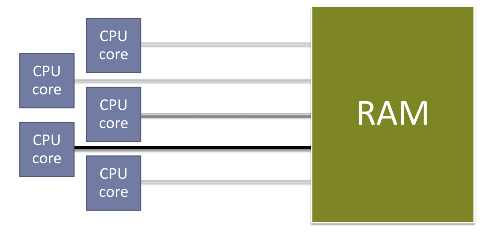

# 每个系统程序员都应该了解的并发知识

## 摘要

系统程序员熟悉互斥锁、信号量和条件变量等工具。但它们是如何工作的？当我们无法使用它们时，比如在操作系统之下的嵌入式环境中工作，或者由于严格的时间限制而不能阻塞时，我们如何编写并发代码？还有，由于编译器和硬件合谋将你的代码变成了你未写过的东西，按照你从未要求的顺序运行，多线程程序是如何工作的？并发性是一个复杂且直观的话题，但让我们尝试覆盖一些基础知识。

## 背景

现代计算机同时运行许多指令流。在单核机器上，它们轮流共享 CPU 的时间片。在多核机器上，可以同时运行多个指令流。我们可以用不同的名字称呼它们——进程、线程、任务、中断服务例程等——但大多数原则都适用。尽管计算机科学家构建了许多伟大的抽象，但这些指令流（为了简洁起见，我们统称为线程）最终通过共享状态位来交互。为此，我们需要理解线程读写内存的顺序。考虑一个简单的例子，线程 A 与其它线程共享一个整数。它将整数写入某个变量，然后设置一个标志，指示其他线程读取它刚刚存储的值。在代码中，可能类似于：

```cpp
int v;
bool v_ready = false;
void threadA() {
    // 写入值并设置就绪标志。
    v = 42;
    v_ready = true; 
}

void threadB() {
    // 等待值变化并读取它。
    while (!v_ready) { /* 等待 */ }
    const int my_v = v; // 用 my_v 做一些事情...
}
```

我们需要确保其他线程在 A 写入 v_ready 之后才观察到 A 对 v 的写入。（如果另一个线程能在看到 v_ready 变为 true 之前“看到”v 变为 42，这个简单的方案就不会起作用。）你可能认为保证这个顺序是微不足道的，但事情并非看上去那么简单。首先，任何优化编译器都会重写你的代码，使其在目标硬件上运行得更快。只要生成的指令对当前线程产生相同的效果，读写操作就可以移动以避免流水线停顿或提高局部性。如果它们从未同时使用，可以将变量分配到相同的内存位置。计算可以在分支采取之前进行推测，如果编译器猜测错误，则可以忽略。

即使编译器没有改变我们的代码，我们仍然会有麻烦，因为我们的硬件也这么做！现代 CPU 处理指令的方式比传统的流水线方法要复杂得多，如图 1 所示。它们包含许多数据路径，每条路径用于不同类型的指令，还有调度器，这些调度器重新排序并路由指令通过这些路径。


图 1：一个传统的五阶段 CPU 流水线，包括获取、解码、执行、内存访问和写回阶段。现代设计要复杂得多，经常在现场重新排序指令。图片来自 Wikipedia。

内存的工作原理也很容易做出天真的假设。如果我们想象一个多核处理器，我们可能会想到类似于图 2 的东西，其中每个核心轮流对系统的内存执行读写操作。



图 2：一个理想化的多核处理器，其中核心轮流访问一个共享的内存集合。

但世界并不那么简单。尽管过去几十年处理器速度呈指数级增长，但 RAM 并没有跟上，造成执行指令所需的时间与从内存中检索其数据所需的时间之间的差距不断扩大。硬件设计师通过在 CPU 芯片上直接放置越来越多的层次化的缓存来补偿。每个核心通常还有一个存储缓冲区，在执行后续指令时处理待定的写入。保持这个内存系统一致，使得一个核心所做的写入能够被其他核心观察到，即使这些核心使用不同的缓存，这是相当具有挑战性的。

> 大多数 CPU 设计通过并行执行多个指令的部分来增加吞吐量（见图 1）。当流水线中的一个指令的结果被管道中的后续指令需要时，CPU 可能需要暂停前进进度或暂停，直到该结果准备好。

> RAM 不是以单个字节读取的，而是以称为缓存行的块读取的。如果一起使用的变量可以放置在同一个缓存行上，它们将被一次性读取和写入。这通常提供了巨大的加速，但正如我们将在第 12 节中看到的，当一行必须在核心之间共享时，可能会伤害到我们。

> 这在进行配置文件引导优化时特别常见。


图 3：现代多核处理器的常见内存层次结构

所有这些复杂性意味着在多线程程序中，特别是在多核 CPU 上，没有一致的“现在”概念。在线程之间创建某种顺序是硬件、编译器、编程语言和你的应用程序的团队努力。让我们探索我们能做什么，以及我们需要什么工具。

## 维护秩序

创建多线程程序中的顺序需要在每个 CPU 架构上采取不同的方法。多年来，像 C 和 C++ 这样的系统语言没有并发的概念，迫使开发人员使用汇编或编译器扩展。这最终在 2011 年得到了解决，当时两种语言的 ISO 标准都添加了同步工具。只要你正确使用它们，编译器就会防止任何重排序——无论是由它自己的优化器还是由 CPU 引起的——导致数据竞争。

让我们再次尝试我们之前的例子。为了它的工作，"就绪"标志需要使用原子类型。

```cpp
int v = 0; std::atomic_bool v_ready(false);
void threadA() { v = 42; v_ready = true; }
void threadB() {
    while (!v_ready) { /* 等待 */ }
    const int my_v = v; // 用 my_v 做一些事情...
}
```

C 和 C++ 标准库分别在 <atomic.h> 和 <atomic> 中定义了这些类型。它们看起来和它们镜像的整型类型（例如，bool → atomic_bool，int → atomic_int 等）一样，但编译器确保其他变量的加载和存储不会围绕它们的重排序。

非正式地说，我们可以将原子变量视为线程的会合点。通过使 v_ready 原子化，现在在线程 A 中保证 v=42 发生在 v_ready=true 之前，就像在线程 B 中 my_v=v 必须在读取 v_ready 之后发生一样。正式地说，原子类型建立了一个单一的总修改顺序，其中，“[…]任何执行的结果都与如果读写发生在某个顺序中，并且每个单独处理器的操作按照其程序指定的顺序出现。”这个模型由 Leslie Lamport 在 1979 年定义，称为顺序一致性。

## 原子性

但顺序只是线程间通信的重要成分之一。另一个是原子类型所命名的原子性。如果某物是原子的，那么它就不能被分成更小的部分。如果线程不使用原子读写来共享数据，我们仍然会有麻烦。考虑一个程序，其中两个线程。一个处理文件列表，每次完成一个就递增计数器。另一个处理用户界面，定期读取计数器以更新进度条。如果计数器是一个 64 位整数，我们不能在 32 位机器上原子地访问它，因为我们需要两个加载或存储来读取或写入整个值。如果我们特别不幸，第一个线程可能在写计数器时中途，第二个线程读取它，接收到垃圾值。这些不幸的场合称为撕裂读和写。然而，如果对计数器的读写是原子的，我们的问题就消失了。我们可以看到，与建立正确顺序的困难相比，原子性相当直接：只要确保任何用于线程同步的变量不大于 CPU 字大小。


## 任意大小的“原子”类型

除了 atomic_int 和 friends，C++ 提供了模板 std::atomic 来定义任意原子类型。C 语言缺乏类似的语言特性，但想要提供相同的功能，增加了 _Atomic 关键字。如果 T 大于机器的字大小，编译器和语言运行时自动将锁围绕变量的读写。如果你想确保这不是发生的，你可以检查：

> ISO C11 标准几乎逐字地从 C++11 标准中提升了其并发设施。这里你看到的一切在两种语言中应该是相同的，除了 C++ 中更干净的语法。†……这通常是大多数时间，因为我们通常使用原子操作来避免锁。

```cpp
std::atomic bar; ASSERT(bar.is_lock_free());
```

在大多数情况下，* 这些信息在编译时是已知的。因此，C++17 添加了 is_always_lock_free：

```cpp
static_assert( std::atomic::is_always_lock_free);
```

## 读写修改

加载和存储都很好，但有时我们需要读取一个值，修改它，并作为单个原子步骤写回。有一些常见的读写修改（rmw）操作。在 C++ 中，它们作为 std::atomic 的成员函数表示。在 C 中，它们是自由函数。

### 交换

最简单的原子 rmw 操作是交换：读取当前值并用新值替换。为了看看这可能在哪里有用，让我们调整我们在 §3 中的例子：UI 可能想要显示每秒钟处理的文件总数，而不是显示处理的文件总数。我们可以通过让 UI 线程每秒读取计数器然后将它归零来实现这一点。但如果读取和归零是分开的步骤，我们可能会遇到以下竞争条件：

1. UI 线程读取计数器。
2. 在 UI 线程有机会将其归零之前，工作线程再次递增它。
3. UI线程现在将计数器归零，先前的递增丢失了。如果 UI 线程原子地用零交换当前值，竞争就消失了。

### 测试并设置

测试并设置在布尔值上工作：我们读取它，将其设置为 true，并提供它之前持有的值。C 和 C++ 为此目的提供了一种专用类型，称为 atomic_flag。我们可以用它来构建一个简单的自旋锁：

```cpp
std::atomic_flag af;
void lock() {
    while (af.test_and_set()) { /* 等待 */ }
}
void unlock() {
    af.clear();
}
```
如果我们调用 lock() 并且先前的值是 false，我们是第一个获取锁的人，可以继续对锁保护的资源进行独占访问。如果先前的值是 true，说明有人已经获取了锁，我们必须等待他们通过清除标志来释放它。

### 取值并...

我们还可以读取一个值，对其执行一些简单的操作（加法、减法、位与、或、异或），并返回其先前的值——全部作为一个原子操作。你可能已经注意到在交换示例中，工作线程的递增也必须是原子的，否则我们可能会遇到一个竞争条件，其中：

1. 工作线程加载当前计数器值并增加一。
2. 在那个线程可以存储值之前，UI 线程将计数器归零。
3. 工作线程现在执行其存储，就好像计数器从未被清零过一样。

### 比较并交换

最后，我们有比较并交换（cas），有时称为比较并交换。它允许我们在先前值与某个期望值匹配的情况下有条件地交换值。在 C 和 C++ 中，cas 看起来如下，如果它被原子执行：

```cpp
template <typename T> bool atomic<T>::compare_exchange_strong( T& expected, T desired) {
    if (*this == expected) {
        *this = desired; return true; }
    else { expected = *this; return false; }
}
```

你可能对 _strong 后缀感到困惑。有没有“弱” cas？是的，但先别急——我们将在 §8.1 中讨论。假设我们有一个可能想要取消的长时间运行的任务。我们将给它三个状态：空闲、运行中和已取消，并编写一个循环，当它被取消时退出。

> 语言标准允许原子类型有时是无锁的。这可能对于不保证未对齐读写原子性的架构是必要的。

```cpp
enum class TaskState : int8_t {
    Idle, Running, Cancelled
};

std::atomic<TaskState> ts;
void taskLoop()
{
    ts = TaskState::Running;
    while (ts == TaskState::Running) {
    // Do good work.
    }
}
```

如果我们想在任务正在运行时取消它，但在以下情况下什么都不做
它是空闲的，我们可以这样：

```cpp
bool cancel()
{
    auto expected = TaskState::Running;
    return ts.compare_exchange_strong(
    expected, TaskState::Cancelled);
}
```

## 原子操作

作为构建块 原子加载、存储和 rmw 操作是每一个并发工具的构建块。将这些工具分成两类是有用的：阻塞和无锁。阻塞同步方法通常更易于理解，但它们可以使线程暂停任意长的时间。例如，考虑一个互斥锁，它强制线程轮流访问共享数据。如果某个线程锁定了互斥锁，另一个线程尝试做同样的事情，第二个线程必须等待——或者阻塞——直到第一个线程释放锁，无论那可能需要多长时间。阻塞机制也容易受到死锁和活锁的影响——由于线程相互等待，整个系统“卡住”的错误。相比之下，无锁同步方法确保程序始终在向前发展。这些是非阻塞的，因为没有一个线程可以使另一个线程无限期地等待。考虑一个流式传输音频的程序，或者一个嵌入式系统，当新数据到达时，传感器触发中断服务例程（isr）。我们希望在这些情况下使用无锁算法和数据结构，因为阻塞可能会破坏它们。（在第一种情况下，如果声音数据没有以消费的比特率提供，用户的音频将开始卡顿。在第二种情况下，如果 isr 没有尽可能快地完成，可能会错过后续的传感器输入。）

重要的是指出，无锁算法并不在某种程度上比阻塞算法更好或更快——它们只是为不同工作设计的不同类型的工具。我们还应该注意，算法仅仅因为只使用原子操作而自动无锁——我们原始的自旋锁从 §5.2 仍然是一个阻塞算法，即使它没有使用任何操作系统提供的系统调用将阻塞线程置于睡眠状态。

当然，有些情况下阻塞或无锁方法都可以使用。† 当性能成为关注点时，进行性能分析！性能取决于许多因素，从参与的线程数量到你的 CPU 的具体情况。并且一如既往，考虑你在复杂性和性能之间做出的权衡——并发是一种危险的艺术。

## 在弱有序硬件上的顺序一致性

不同的硬件架构提供不同的顺序保证或内存模型。例如，x64 相对强有序，可以在大多数情况下被信任为保持加载和存储的某种系统范围顺序。像 arm 这样的其他架构是弱有序的，所以你不能假设除非 CPU 被给予特殊指令——称为内存屏障——否则加载和存储会按程序顺序执行。了解原子操作在弱有序系统中的工作原理是有帮助的，这既可以帮助我们了解硬件中发生了什么，也可以看到 C 和 C++ 并发模型为何如此设计。让我们来检查一下 arm，因为它既受欢迎又简单。考虑最简单的原子操作：加载和存储。给定某个 atomic_int foo，


```cpp
int getFoo() {
    return foo;
}
```

变成：

```assembly
getFoo:
    ldr r3, <&foo>
    dmb
    ldr r0, [r3, #0]
    dmb
    bx lr
```

```cpp
void setFoo(int i) { foo = i; }
```

变为

```assembly
setFoo:
    ldr r3, <&foo>
    dmb
    str r0, [r3, #0]
    dmb
    bx lr
```

我们加载我们的原子变量的地址到一个临时寄存器（r3），在内存屏障（dmb）之间夹住我们的加载或存储，然后返回。屏障为我们提供了顺序一致性——第一个确保之前的读写不能放在我们操作之后，第二个确保之后的读写不能放在它之前。

## 使用 LL/SC 指令实现原子读写修改操作

像许多其他 RISC* 架构一样，arm 缺少专用的 rmw 指令。由于处理器可以随时切换到另一个线程，我们不能从普通加载和存储构建 rmw 操作。相反，我们需要特殊指令：加载链接和存储条件（ll/sc）。两者协同工作：加载链接从地址读取一个值——像任何其他加载一样——但也指示处理器监视那个地址。存储条件仅在自相应的加载链接以来没有对该地址进行其他存储时才写入给定的值。让我们看看它们在原子获取和添加中的操作。在 arm 上，

```cpp
void incFoo() { ++foo; }
```

编译为：

```yaml
incFoo:
    ldr r3, <&foo>
    dmb
loop:
    ldrex r2, [r3] // LL foo
    add r2, r2, #1 // 递增
    strex r1, r2, [r3] // SC
    cmp r1, #0 // 检查 SC 结果。
    bne loop // 如果 SC 失败则循环。
    dmb
    bx lr
```
我们加载当前值，增加一，并立即尝试用 sc 将其存储回去。如果失败，可能是另一个线程自我们的 ll 以来写入了 foo，所以我们再试一次。通过这种方式，至少有一个线程始终在原子地修改 foo 方面取得进展，即使有好几个线程同时尝试这样做。

### 偶发的 LL/SC 失败

正如你所能想象的，要跟踪机器上每个字节的加载链接地址，对 CPU 硬件来说成本太高了。为了降低这个成本，许多处理器以更粗糙的粒度监视它们，例如缓存行。这意味着如果存储条件前面有任何地址的写入，而不仅仅是特定的加载链接地址，sc 就可能失败。

这对于比较和交换尤为麻烦，也是比较交换弱存在的原因。考虑一个以原子方式乘以一个值的函数，即使没有读取-乘法-写入的原子指令在任何常见的架构中。

```cpp
void atomicMultiply(int by) {
    int expected = foo; // 我们应该使用哪个 CAS？
    while (!foo.compare_exchange_?( expected, expected * by)) { // 空循环。
        // （失败时，expected 用 foo 的最新值更新。）
    }
}
```

许多无锁算法使用像这样的 cas 循环来原子地更新一个变量，当计算其新值不是原子的时候。它们：

1. 读取变量。
2. 对其值执行一些（非原子）操作。
3. 将新值与先前的值进行 cas。
4. 如果 cas 失败，另一个线程先于我们到达，所以重试。

如果我们为此类型的算法使用 compare_exchange_strong，则编译器必须发出嵌套循环：一个内部循环来保护我们免受偶发 sc 失败的影响，一个外部循环，重复执行我们的操作，直到没有其他线程中断我们。但与 _strong 版本不同，弱 cas 允许像实现它的 ll/sc 机制一样偶发失败。所以，使用 compare_exchange_weak，编译器可以自由地生成一个单一循环，因为我们不关心由于偶发 sc 失败和由于另一个线程修改我们的变量引起的重试之间的区别。

## 我们总是需要顺序一致的操作吗？

我们到目前为止的所有示例都是顺序一致的，以防止重排序破坏我们的代码。我们还看到像 arm 这样的弱有序架构如何使用内存屏障来创建顺序一致性。但正如你可能预料的那样，这些屏障可能对性能产生有显著影响。毕竟，它们抑制了编译器和硬件本可以进行的优化。如果我们能避免一些这种减速呢？考虑一个简单的例子，像 §5.2 中的自旋锁。在 lock() 和 unlock() 调用之间，我们有一个临界区，我们可以安全地修改受锁保护的共享状态。

```cpp
deepThought.calculate(); // 非共享
lock(); // 加锁；开始临界区
sharedState.subject = "Life, the universe and everything";
sharedState.answer = 42;
unlock(); // 解锁；结束临界区
demolishEarth(vogons); // 非共享
```

关键是要确保对共享内存的读写不会移出临界区。但反过来就不一定了！编译器和硬件可以在不引起任何麻烦的情况下将尽可能多的代码移入临界区。如果我们能以某种方式让这变得更快，我们不会有任何问题：

```cpp
lock(); // 加锁；开始临界区
deepThought.calculate(); // 非共享
sharedState.subject = "Life, the universe and everything";
sharedState.answer = 42;
demolishEarth(vogons); // 非共享
unlock(); // 解锁；结束临界区
```

那么，我们如何告诉编译器这些信息呢？

## 内存排序

默认情况下，所有原子操作（包括加载、存储和各种类型的 rmw）都是顺序一致的。但这只是我们可以给它们的几种排序之一。我们将检查每一种，但完整的列表以及 C 和 C++ API 使用的枚举如下：

- 顺序一致 (memory_order_seq_cst)
- 获得 (memory_order_acquire)
- 释放 (memory_order_release)
- 放松 (memory_order_relaxed)
- 获得-释放 (memory_order_acq_rel)
- 消费 (memory_order_consume)

为了选择一个排序，你作为一个可选参数提供，我们到目前为止狡猾地没有提到：

```cpp
void lock() {
    while (af.test_and_set( memory_order_acquire)) { /* 等待 */ }
}
void unlock() {
    af.clear(memory_order_release);
}
```

非顺序一致的加载和存储也使用 `std::atomic<>` 的成员函数：

```cpp
int i = foo.load(memory_order_acquire);
```

比较并交换操作有点奇怪，因为它们有两种排序：一种是当 cas 成功时，另一种是当它失败时：

```cpp
while (!foo.compare_exchange_weak( expected, expected * by, memory_order_seq_cst, // 成功时
                                    memory_order_relaxed)) // 失败时 { /* 空循环 */ }
```

有了这些语法，让我们看看这些排序是什么以及如何使用它们。事实证明，我们到目前为止看到的所有示例实际上并不需要顺序一致的操作。

### 获得和释放

我们在 §9 的锁示例中刚刚看到了获得和释放的作用。你可以将它们想象成“单向”屏障：获得允许其他读写操作过去，但只有在 before → after 的方向上。释放则以相反的方式工作，让事情在 after → before 的方向上移动。在 arm 和其他弱有序架构上，这允许我们在每个操作中减少一个内存屏障，使得

```cpp
int acquireFoo() {
    return foo.load(memory_order_acquire);
}
void releaseFoo(int i) {
    foo.store(i, memory_order_release);
}
```

变为：

```yaml
acquireFoo:
    ldr r3, <&foo>
    ldr r0, [r3, #0]
    dmb
    bx lr

releaseFoo:
    ldr r3, <&foo>
    dmb
    str r0, [r3, #0]
    bx lr
```

它们一起提供写者 → 读者同步：如果线程 W 用释放语义存储一个值，并且线程 R 用获得语义加载那个值，那么 W 在其存储释放之前所做的所有写入对 R 在其加载获得之后都是可观察的。如果这听起来很熟悉，这正是我们在 §1 和 §2 中尝试实现的：

```cpp
int v; std::atomic_bool v_ready(false);
void threadA() {
    v = 42;
    v_ready.store(true, memory_order_release);
}
void threadB() {
    while (!v_ready.load(memory_order_acquire)) {
        // 等待
    }
    assert(v == 42); // 必须为真
}
```

### 放松

放松的原子操作用于当变量在线程之间共享，但不需要特定顺序时。虽然这看起来可能很少见，但实际上它是令人惊讶的常见。

回想一下我们在 §3 和 §5 中的例子，其中一个工作线程正在递增一个计数器，然后由 UI 线程读取。

那个计数器可以用 fetch_add(1, memory_order_relaxed) 来递增，因为我们所需要的只是原子性——计数器没有同步任何东西。放松的读写也用于在线程之间共享标志。考虑某个线程循环直到被告知退出：

```cpp
atomic_bool stop(false);
void worker() {
    while (!stop.load(memory_order_relaxed)) {
        // 做好工作
    }
}
int main() {
    launchWorker(); // 等待一些... 
    stop = true; // 顺序一致 连接Worker();
}
```

我们不在乎循环的内容是否围绕加载重新排列。只要 stop 只用于告诉工作线程退出，而不是用于“宣布”任何新数据，就什么坏事都不会发生。最后，放松的加载通常与 cas 循环一起使用。回到我们的无锁乘法：

```
void atomicMultiply(int by) {
    int expected = foo.load(memory_order_relaxed);
    while (!foo.compare_exchange_weak( expected, expected * by, memory_order_release, memory_order_relaxed)) {
        // 空循环
    }
}
```

所有的加载都可以是放松的——在我们成功修改我们的值之前，我们不需要强制任何顺序。expected 的初始加载甚至不是严格必要的。如果 foo 在 cas 之前没有被其他线程修改，它只会节省我们一次循环迭代。

### 获得-释放

memory_order_acq_rel 用于需要同时加载-获得和存储-释放一个值的原子 rmw 操作。一个典型的例子涉及线程安全的引用计数，如 C++ 的 shared_ptr 中：

```cpp
atomic_int refCount;
void inc() {
    refCount.fetch_add(1, memory_order_relaxed);
}
void dec() {
    if (refCount.fetch_sub(1, memory_order_acq_rel) == 1) {
        // 没有更多的引用，删除数据。
    }
}
```

增加引用计数时顺序不重要，因为不会产生任何操作结果。但是，当我们减少计数时，我们必须确保：

1. 所有对引用对象的访问都发生在计数达到零之前。
2. 删除发生在引用计数达到零之后。

好奇的读者可能想知道获得-释放和顺序一致操作之间的区别。引用 ISO C++ 并发研究小组主席 Hans Boehm 的话:

> 获得-释放和 seq_cst 之间的区别通常是操作是否需要参与到顺序一致操作的全局顺序中。

换句话说，获得-释放提供了与被加载-获得和存储-释放的变量相关的顺序，而顺序一致的操作提供了整个程序的某种全局顺序。如果这种区别仍然看起来模糊，你并不孤单。Boehm 接着说:

> 这具有微妙和不直观的效果。当前标准中的 [屏障] 可能是我们语言中最具专家性质的结构。

### 消费

最后但同样重要的是，我们有 memory_order_consume。考虑一种场景，数据很少改变，但经常被许多线程读取。也许我们正在编写一个内核，我们正在跟踪插入到机器中的外围设备。这个信息很少改变——只有在有人插入或拔出东西时才会改变——所以优化读取操作是有意义的。根据我们目前所知道的，我们最好的做法是：

```cpp
std::atomic<PeripheralData*> peripherals;
// 写者：PeripheralData* p = kAllocate(sizeof(*p)); populateWithNewDeviceData(p); peripherals.store(p, memory_order_release);
// 读者：PeripheralData* p = peripherals.load(memory_order_acquire);
if (p != nullptr) { doSomethingWith(p->keyboards); }
```

为了进一步优化读者，如果加载可以避免在弱有序系统上进行内存屏障就好了。事实证明，它们通常可以。由于我们检查的数据（p->keyboards）依赖于 p 的值，即使是弱有序的平台也不能将初始加载（p = peripherals）重排到其使用之后（p->keyboards）。只要我们说服编译器不要进行类似的推测，我们就清楚了。这就是 memory_order_consume 的用途。将读者改为：

```cpp
PeripheralData* p = peripherals.load(memory_order_consume);
if (p != nullptr) { doSomethingWith(p->keyboards); }
```

并且一个 arm 编译器可以发出：

```yaml
ldr r3, &peripherals
ldr r3, [r3] // 看哪，没有屏障！
cbz r3, was_null // 检查空值
ldr r0, [r3, #4] // 加载 p->keyboards
b doSomethingWith(Keyboards*)
was_null: ...
```

遗憾的是，这里的强调是“可以”。弄清楚什么构成了表达式之间的“依赖性”并不像人们希望的那样简单，所以所有编译器当前都将消费操作转换为获得。

### 龙出没

非顺序一致的排序有很多微妙之处，一点小错误就可能导致难以捉摸的海森堡bug，这些bug只在某些时候、某些平台上出现。在求助于它们之前，扪心自问：

- 我是否在使用众所周知并被理解的模式（如上文所示）？
- 这些操作是否在一个紧密循环中？
- 这里的每一微秒都至关重要吗？ 如果这些问题的答案不是多个“是”的，坚持使用顺序一致的操作。否则，请确保给你的代码额外的审查和测试。

## 硬件融合

那些熟悉 ARM 的人可能已经注意到，这里展示的所有汇编代码都是针对该架构的第七版。令人兴奋的是，第八代提供了对无锁代码的巨大改进。由于大多数编程语言都已收敛到我们所探讨的内存模型，ARMv8 处理器提供了专用的加载-获得和存储-释放指令：lda 和 stl。希望未来的 CPU 架构将跟进。

## 缓存效应和伪共享

如果这些还不够让你头疼，现代硬件又给我们带来了一个难题。回想一下，内存是以称为缓存行的块在主 RAM 和 CPU 之间传输的。这些行也是核心和它们各自的缓存之间传输的最小单位——如果一个核心写入一个值，另一个核心读取它，那么包含该值的整个行必须从第一个核心的缓存传输到第二个核心的缓存，以保持它们对内存的“视图”一致性。这可能会对性能产生惊人的影响。考虑一个读写锁，它通过确保共享数据有一个写入者或任意数量的读取者，但永远不会同时存在来避免竞争。从本质上讲，它类似于以下内容：

```cpp
struct RWLock {
    int readers;
    bool hasWriter; // 零个或一个写入者
};
```

写入者必须阻塞，直到 readers 达到零，但读取者可以在 hasWriter 为 false 时使用原子 rmw 操作获取锁。天真地看，这似乎为我们比排他锁（例如，互斥锁、自旋锁等）提供了巨大的性能提升，特别是在我们比写入更频繁地读取共享数据的情况下，但这没有考虑到缓存效应。如果有多个读取者——每个都在不同的核心上运行——同时获取锁，它的缓存行将在这些核心的缓存之间“来回传递”。除非关键部分非常大，否则解决这种争用可能比关键部分本身花费的时间更长，即使算法没有阻塞。当这种情况发生在碰巧被放置在同一个缓存行上的不相关变量之间时，这种减速更加隐蔽。在设计并发数据结构或算法时，必须考虑到这种伪共享。避免它的一种方法是用未共享数据的缓存行填充原子变量，但这显然是一个巨大的空间-时间权衡。

## 如果并发是问题，volatile 并不是答案

在我们继续之前，我们应该消除围绕 volatile 关键字的一个常见误解。也许是因为它在旧编译器和硬件中的工作方式，或者是由于它在 Java 和 C# 等语言中的不同含义，一些人认为该关键字对于构建并发工具很有用。除了一个特定情况（见 §14），这是不正确的。volatile 的目的是告知编译器一个值可能被我们正在执行的程序之外的某些东西改变。这对于内存映射 I/O（MMIO）很有用，硬件将对某些地址的读写转换为连接到 CPU 的设备的指令。（这是大多数机器最终与外部世界交互的方式。）volatile 意味着两个保证：

编译器不会省略那些看起来“不必要”的加载和存储。例如，如果我有一个函数：

```cpp
void write(int* t) {
    *t = 2; *t = 42; 
}
```

编译器通常会将其优化为：

```cpp
void write(int* t) {
    *t = 42; 
}
```

*t = 2 通常被认为是一个无效存储，什么也不做。但是，如果 t 指向某个 MMIO 寄存器，就不应该这样假设——每次写入都可能对它交互的硬件产生一些影响。

出于类似的原因，编译器不会重新排序 volatile 读写操作相对于其他 volatile 操作的顺序。

这些规则并没有为我们提供线程间安全通信所需的原子性或顺序。注意，第二个保证只防止 volatile 操作相对于彼此重新排序——编译器仍然可以自由地围绕它们重新排序所有其他“正常”的加载和存储。即使我们把这个问题放在一边，volatile 也没有在弱有序硬件上发出内存屏障。这个关键字只有在你的编译器和硬件都不重新排序的情况下才作为同步机制起作用。不要依赖于此。

## 原子融合

最后，应该意识到，尽管原子操作确实防止了某些优化，但它们并没有对所有优化免疫。优化器可以做相当平凡的事情，比如用 foo = 0 替换 foo.fetch_and(0)，它也可以产生令人惊讶的结果。考虑：

```cpp
while (tmp = foo.load(memory_order_relaxed)) {
    doSomething(tmp);
}
```

由于 relaxed 加载不提供任何顺序保证，编译器可以随意展开循环，比如：

```cpp
while (tmp = foo.load(memory_order_relaxed)) {
    doSomething(tmp);
    doSomething(tmp);
    doSomething(tmp);
    doSomething(tmp);
}
```

如果像这样“融合”读取或写入是不可接受的，我们必须用 volatile 强制转换或像 asm volatile("") 这样的咒语来防止它。* Linux 内核为此提供了 READ_ONCE() 和 WRITE_ONCE() 宏。

## 要点
我们在这里只是浅尝辄止，但希望你现在知道了：

- 为什么编译器和 CPU 硬件会重新排序加载和存储。
- 为什么我们需要特殊的工具来防止这些重新排序以便在线程之间通信。
- 如何在我们的程序中保证顺序一致性。
- 原子读写修改操作。
- 在弱有序硬件上如何实现原子操作，以及这可能对语言级 API 产生的影响。
- 如何使用非顺序一致的内存排序来仔细优化无锁代码。
- 伪共享如何影响并发内存访问的性能。
- volatile 是线程间通信的不适当工具。
- 如何防止编译器以不理想的方式融合原子操作。

要了解更多信息，请参见下面的其他资源，或检查无锁数据结构和算法，例如单生产者/单消费者 (SP/SC) 队列或读写更新 (RCU)。

祝你好运！

## 其他资源

- Fedor Pikus 关于 [C++ 原子性的演讲，从基础到高级。他们到底做了什么？](https://www.youtube.com/watch?v=ZQFzMfHIxng) 这是一个关于这个话题的一小时演讲。
- Herb Sutter 的 "[atomic<>：C++11 内存模型和现代硬件](https://channel9.msdn.com/- Shows/Going+Deep/Cpp-and-Beyond-2012-Herb-Sutter-atomic-Weapons-1-of-2)"，这是一个三小时的深入讲解。图 2 和图 3 的来源。
- Ulrich Drepper 的论文 "[Futexes 是棘手的](https://www.akkadia.org/drepper/futex.pdf)"，讲述了如何在 Linux 中使用原子操作和系统调用构建互斥锁和其他同步原语。
- Paul E. McKenney 的 "[并行编程难吗，如果是的话，你能做些什么？](https://www.kernel.org/pub/linux/kernel/people/paulmck/perfbook/perfbook.html)"，一本难以置信的全面书籍，涵盖了并行数据结构和算法、事务内存、缓存一致性协议、CPU 架构细节等。
- "[内存屏障：软件黑客的硬件视角](http://www.rdrop.com/~paulmck/scalability/paper/whymb.2010.06.07c.pdf)"，McKenney 的一个较旧但较短的文章，解释了 Linux 内核在各种架构上如何实现内存屏障。
- [Preshing 关于编程的博客](http://preshing.com/archives/)，有许多关于无锁并发的优秀文章。
- "没有理智的编译器会优化原子性"，讨论了当前优化器如何处理原子操作。可用作书面材料，[n4455](http://www.open-std.org/jtc1/sc22/wg21/docs/papers/2015/n4455.html)，也可以作为 [CppCon 演讲](https://www.youtube.com/watch?v=IB57wIf9W1k)。
- [cppreference.com](http://en.cppreference.com/)，一个关于 C 和 C++ 内存模型和原子 API 的极好参考资料。
- [Matt Godbolt 的编译器探索器](https://godbolt.org/)，一个在线工具，提供使用您选择的编译器和标志的生活、彩色汇编。非常适合检查不同架构上各种原子操作的编译器发射内容。

## 贡献

欢迎贡献！源代码和历史记录可在 [Gitlab](https://gitlab.com/mrkline/concurrency-primer) 和 [Github](https://github.com/mrkline/concurrency-primer) 上获得。本文是用 LaTeX 准备的——如果你不熟悉它，可以通过电子邮件、开启问题等方式联系作者（而不是拉取请求）。

本文根据创作共用署名-相同方式共享 4.0 国际许可发布。法律条款可以通过 https://creativecommons.org/licenses/by-sa/4.0/ 获得，简而言之，你可以自由复制、重新分发、翻译或以其他方式转换本文，只要你给予适当的信用，指出是否进行了更改，并在相同的许可下发布你的版本。

## 尾声

本指南使用 Matthew Butterick 的 [Equity](https://typographyforlawyers.com/equity.html) 字体，由 LuaLATEX 排版，代码使用 Matthias Tellen 的 [mononoki](https://madmalik.github.io/mononoki/) 字体。标题设置为 Christian Schwartz 恢复的 Helvetica，即 [Neue Haas Grotesk](http://www.fontbureau.com/NHG/)。